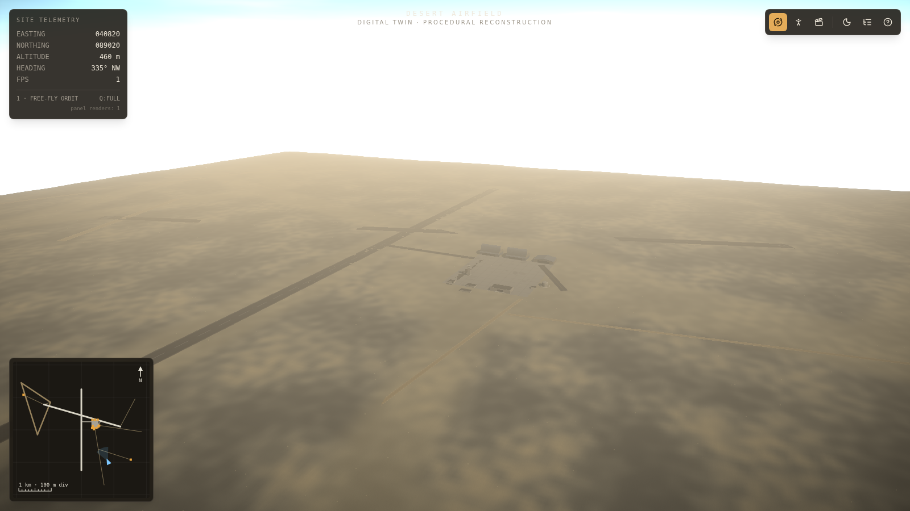
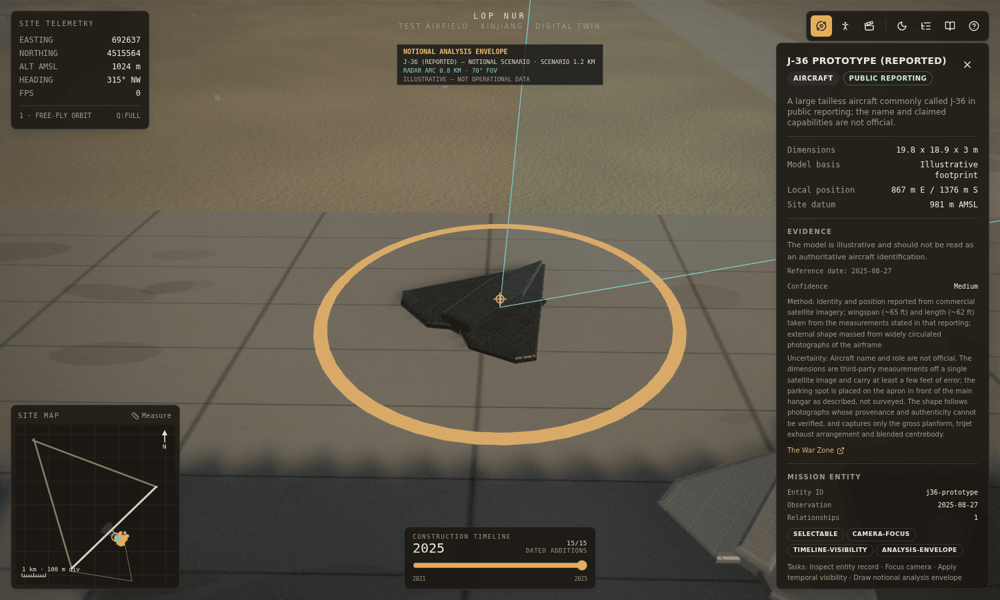

# Lop Nur Twin

A public-source analytical reconstruction of a remote desert
airfield near Lop Nur (~40.77° N, 89.28° E), where every claim carries an
evidence classification, an uncertainty envelope, and a citation.

> **Public sources only.** This is a modeled
> reconstruction built from cited open Earth-observation products and published
> reporting.
> [`docs/GOVERNMENT_EVALUATION.md`](docs/GOVERNMENT_EVALUATION.md).



**Live demo:** <https://lop-nur-twin.vercel.app/>

## Routes

| Route           | What it is                                                                                                                                                   |
| :-------------- | :----------------------------------------------------------------------------------------------------------------------------------------------------------- |
| **`/`**         | The analytical twin. Orbit it, walk it, click any structure for its sourced dossier, measure distances and grid bearings, filter by evidence mode.           |
| **`/analysis`** | The same model without the 3D scene, and an equal front door rather than a fallback: every analytical capability in a semantic, screen-reader-friendly form. |
| **`/compare`**  | Model-manifest comparison. Diff two builds and see what changed, grouped so a reworded description is visibly not the same event as a moved footprint.       |
| **`/play`**     | **Blacksite** — an optional, illustrative first-person game on the same geometry. Not analysis, and labelled as such throughout. Nothing is real, it's all BS.                       |

`/` and `/analysis` are the research product. `/compare` is a verification tool.
`/play` is a scale-and-environment demonstration and contributes nothing to any
analytical conclusion.



## PROVE IT

A convincing 3D model of a place nobody can visit is persuasive in proportion to
how much of it was invented. Press **PROVE IT** (or `P`) and the reconstruction
is stripped to the geometry a cited public source actually defends:

| Figure                                        | Value                  |
| --------------------------------------------- | ---------------------- |
| Subjects keeping any defensible geometry      | **1 of 68**            |
| Modeled built volume retained                 | **0 m³ of 569,812 m³** |
| Rendered assertions carried by a cited source | **14 of 612**          |

Forty-five buildings erode away and one runway centreline is left, with a ±40 m
envelope at each end. The built-volume figure is zero because no source in the
register states the height of anything at this site — every roofline in the model
is a modeling decision — and the build refuses a height tolerance that no source
states, so that figure cannot quietly stop being true.

None of those numbers is written down. They are counted over the evidence ledger
and move on their own when the data does. Full method:
[`docs/FORENSIC_ENGINE.md`](docs/FORENSIC_ENGINE.md).

## Analytical capabilities

- **One derived evidence ledger.** Every claim — a structure footprint, a runway
  measurement, an aircraft identification, an environmental input, a piece of
  scenery — is a record derived from the layout and the source register rather
  than written by hand, so a claim cannot outlive the thing it describes.
- **Evidence viewing modes.** Four nested thresholds on how much of the
  reconstruction is admitted, applied identically by the scene, the minimap, the
  structure index, the dossier, the measurement ruler and `/analysis`.
- **Evidence X-ray.** Support rendered as appearance: weaker claims ghost and
  dissolve rather than standing as finished buildings, and the four evidence
  layers separate vertically into an exploded diagram with drop lines to the
  ground.
- **A provenance chain on every claim.** Claim, evidence, source, date,
  uncertainty, model decision — six links in order, with the ones this project
  holds nothing for drawn as gaps rather than omitted.
- **A cinematic evidence timeline.** A continuous day axis over the dated ledger:
  structures appear, stay ghosted as not-yet-evidenced, or remain permanently
  uncertain where no date exists at all.
- **Uncertainty drawn in space.** Halos at the documented positional radius,
  bands at the extent tolerance, and open-ended dashed columns above every roof
  where a height was never stated.
- **A three-channel forensic diff.** Geometry, evidence and interpretation
  changes reported separately, in the scene and across two builds, because a
  rewording and a moved hangar are not the same event.
- **Registered reference imagery.** The exact `EPSG:32645` window and the cited
  scene to crop, so a reviewer can bring their own copy and swipe between source
  and model. Nothing is bundled, fetched or uploaded.
- **Structured uncertainty.** A machine-readable envelope per claim, drawn only
  where the project documents a figure.
- **Temporal snapshots and change comparison.** Read the model at a date, and
  diff two dates.
- **Measurement.** Snap to modeled vertices, read distances and grid bearings in
  EPSG:32645, and copy out a citable plain-text summary.
- **A release manifest.** SHA-256 over canonicalised model data, per-subject
  digests, and an explicit statement of what the model does not know.
- **Local bookmarks.** A saved analytical position carrying the hashes of the
  model it was taken against.

Everything is procedural, deterministic, and offline. No binary assets, no
runtime downloads, no telemetry. The one network request the analytical view
makes is for its own manifest, from the origin that served the page.

## Evidence classifications

Shown everywhere as a symbol **and** a word, never by colour alone.

|     | Status           | Means                                                                                      |
| :-- | :--------------- | :----------------------------------------------------------------------------------------- |
| ◆   | **Observed**     | Visible in the cited public imagery. Presence and extent — never function or interior use. |
| ■   | **Reported**     | A cited publication states it exists. Placement and dimensions here are still modeled.     |
| ▲   | **Interpreted**  | This project assigned an identity, dimension or function no source states.                 |
| ○   | **Illustrative** | Modeled scenery or motion, not resolved in any source.                                     |

An **evidence mode** is a threshold across these, and each mode adds one weaker
class to the one before it:

| Mode                    | Draws                                                                          |
| :---------------------- | :----------------------------------------------------------------------------- |
| **Observed only**       | Only what a cited scene shows directly, plus the measurements taken from it.   |
| **Observed + reported** | Adds features a cited publication states are there.                            |
| **+ interpreted**       | Adds identities, functions and dimensions this project assigned.               |
| **Full simulation**     | The complete reconstruction, including illustrative infrastructure and motion. |

Observed mode currently draws **one** of the model's 68 filterable subjects. That
number is the feature: it is the most direct statement this project can make
about how much of a reconstruction is reconstruction. Terrain and atmosphere are
never filtered — they are the canvas the analysis is drawn on rather than claims
about the site, and they carry their own classification everywhere it is
published.

## Uncertainty and time

**Unknown stays unknown.** An absent figure is printed as "not stated", never as
zero and never as an omitted row. Height and orientation tolerances are absent
from every envelope in the model because no cited source states one.

A number is only allowed from three places, and every envelope names which:
stated by the cited source, documented by this project (the ±40 m runway
endpoint uncertainty), or a resolution floor derived from the cited scene's
ground sample distance. The build fails on a number with no method, no basis, a
reversed date range, or an `observed` claim that bounds no position at all.

Three dates are kept apart throughout, because collapsing them is how a
publication date becomes a construction date:

1. **When something happened at the site.** Rarely known — a first
   appearance bounds when a building existed _by_, so the interface says
   "existed by 2025-09-13; earliest date unknown".
2. **When the evidence became public.** Precisely known, and the date that
   decides what an analyst could have concluded at a given moment.
3. **When the change entered this model.** A fact about this repository, which it
   does not currently record, and says so.

Full method: [`docs/UNCERTAINTY_MODEL.md`](docs/UNCERTAINTY_MODEL.md) and
[`docs/TEMPORAL_MODEL.md`](docs/TEMPORAL_MODEL.md).

## Quick start

```sh
bun install
bun run dev      # dev server on :5173 (regenerates the manifest first)
bun run build    # validate → manifest → production build → strict typecheck
bun run preview  # serve the build with the deployed security headers, on :4173
```

`npm install && npm run dev` works too. The TypeScript build scripts run under
either runtime — Bun natively, or **Node ≥ 22.18** through `scripts/run-ts.mjs` —
and both produce byte-identical manifests.

## Validation and testing

```sh
bun run check        # format:check → lint → test:run → test:evidence → build
bun run test:run     # 198 unit tests over the deterministic modules
bun run test:evidence # proves all 35 evidence-validator rules still fire
bun run validate:data # sources, geometry, bounds, geodesy, evidence ledger
bun run a11y         # axe-core + CSP checks, against the preview build
bun run routes       # 52 checks: deep links, hostile parameters, keyboard, mobile
bun run smoke        # 22 Blacksite simulation checks
bun run gait         # 15 walk-cycle checks
bun run audio        # renders each sound offline and measures it
```

`bun run build` is the authoritative integration gate. Full details, including
what each check does and does not prove:
[`docs/VALIDATION.md`](docs/VALIDATION.md).

## Documentation

| Document                                                         | What it covers                                                                            |
| :--------------------------------------------------------------- | :---------------------------------------------------------------------------------------- |
| [`CONTRIBUTING.md`](CONTRIBUTING.md)                             | Setup, the rules a change has to hold to, and what a pull request needs                   |
| [`docs/VALIDATION.md`](docs/VALIDATION.md)                       | Every check, what it proves, and the repository settings code cannot configure            |
| [`docs/DATA_PROVENANCE.md`](docs/DATA_PROVENANCE.md)             | Source registration, classification, confidence, hashing, reproducing a release           |
| [`docs/FORENSIC_ENGINE.md`](docs/FORENSIC_ENGINE.md)             | PROVE IT, evidence X-ray, provenance chains, the time scrubber and the three-channel diff |
| [`docs/UNCERTAINTY_MODEL.md`](docs/UNCERTAINTY_MODEL.md)         | The envelope schema, where a number may come from, and what the build refuses             |
| [`docs/TEMPORAL_MODEL.md`](docs/TEMPORAL_MODEL.md)               | The three dates, the event ledger, snapshots and change comparison                        |
| [`docs/MODEL_COMPARISON.md`](docs/MODEL_COMPARISON.md)           | Manifest schema 1.1, the four per-subject hashes, and what a diff cannot see              |
| [`docs/SITE_MODEL.md`](docs/SITE_MODEL.md)                       | What the reconstruction contains and how it is put together                               |
| [`docs/SYSTEM_ARCHITECTURE.md`](docs/SYSTEM_ARCHITECTURE.md)     | Frontend, scene, routes, stores, validation pipeline, build and trust boundaries          |
| [`docs/ACCESSIBILITY.md`](docs/ACCESSIBILITY.md)                 | What is implemented, what the axe run covers, and the manual checks that remain           |
| [`docs/CONTROLS.md`](docs/CONTROLS.md)                           | Keyboard, pointer and URL parameters for every route                                      |
| [`docs/BLACKSITE.md`](docs/BLACKSITE.md)                         | The optional simulation, and the wall between it and the analysis                         |
| [`SECURITY.md`](SECURITY.md)                                     | Supported versions, vulnerability reporting, and the limits of a browser demo             |
| [`docs/THREAT_MODEL.md`](docs/THREAT_MODEL.md)                   | Assets, trust boundaries, threats and residual risk                                       |
| [`docs/GOVERNMENT_EVALUATION.md`](docs/GOVERNMENT_EVALUATION.md) | What this is, what it is not, and a 30-minute evaluation path                             |
| [`docs/DEPLOYMENT.md`](docs/DEPLOYMENT.md)                       | Vercel settings, the container image, and verifying a deployment matches a commit         |
| [`docs/FUTURE_BACKEND.md`](docs/FUTURE_BACKEND.md)               | PostGIS, STAC, OIDC and audit logging — split into implemented, scaffolded, and not       |
| [`docs/WHITE_PAPER.md`](docs/WHITE_PAPER.md)                     | The long-form argument, also as [HTML](docs/white-paper.html)                             |
| [`AGENTS.md`](AGENTS.md)                                         | Extending the twin: house rules and recipes                                               |
| [`experiments/README.md`](experiments/README.md)                 | Unfinished subsystems kept outside `src/`, and why                                        |

## Known limitations

The authoritative list is `KNOWN_LIMITATIONS` in `src/lib/evidence.ts`, published
in the release manifest and rendered on `/analysis`, so a downstream consumer of
the data receives it with the data. In summary:

- **It is a reconstruction.** Facility functions are interpretations. Names such
  as "assembly hangar" and "operations block" are model hypotheses; public
  overhead imagery does not establish interiors, occupants or use.
- **Terrain is a seeded procedural proxy** around an approximate ~981 m EGM2008
  datum. No DEM tile is redistributed, and the surface must not be used for
  survey-grade elevation, slope or sightline analysis.
- **Modeled runway endpoints carry roughly 40 m of uncertainty.** The 10 m source
  imagery supports site-scale measurement, not detailed interior or function
  claims.
- **Base-support systems are illustrative** — power, water, sanitation,
  communications, sensors and security are none of them resolved in the cited
  imagery.
- **Confidence values are project-assigned ordinal ranks** published on a 0–1
  scale, not measured probabilities.
- **No source artifact is retrieved at build time**, so no source content hashes
  are recorded; provenance is pinned by citation, access date and reviewed data
  change.
- **Temporal coverage is partial.** Five of the ten event categories the schema
  defines hold no evidence, and `/analysis` shows the gaps rather than filling
  them.
- **Deferred from this release:** local reference-image registration, GeoTIFF
  processing, automated imagery-difference detection, relationship-graph
  visualisation, a report builder, PDF generation, and a spatial ghost rendering
  of an earlier state in 3D. Temporal comparison is complete semantically on
  `/analysis`; only its 3D rendering is absent.

## License

The original source code, procedural models, and original documentation in this
repository are licensed under the **Apache License 2.0** — see
[`LICENSE`](LICENSE).

That grant covers this repository's own work and nothing else.
[`NOTICE`](NOTICE) states the boundary: cited satellite imagery, digital
elevation models, climate products, journalism and academic publications are
**referenced, not relicensed**, and no provider data file is redistributed here.
Product names, aircraft designations and organisation names are used
descriptively; Apache-2.0 section 6 grants no trademark licence, including for
the Vers3Dynamics name and branding.

Attribution required by cited providers — Copernicus, ESA, DLR, Airbus Defence
and Space, and NASA POWER — is reproduced in `NOTICE`, and the authoritative,
machine-readable register is `src/lib/siteData.ts`.
