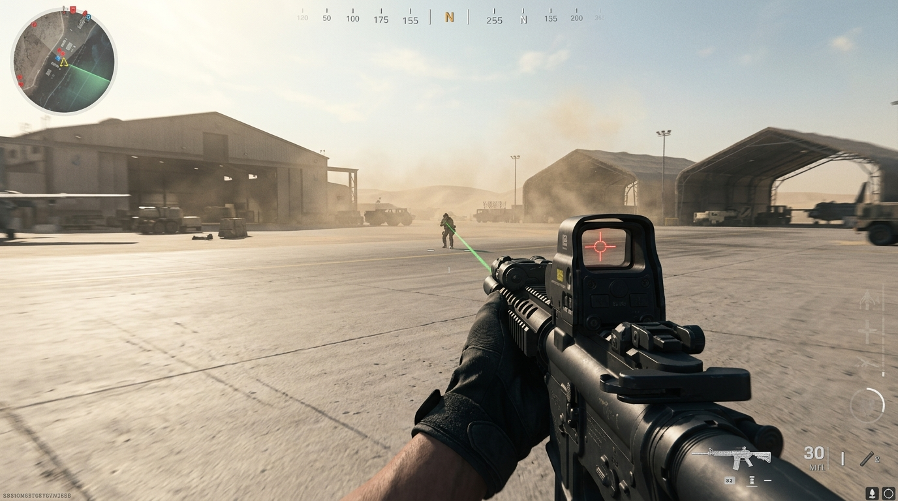

# Lop Nur Geospatial Simulation Testbed

> An unclassified, public-source analytical reconstruction of a remote desert
> airfield near Lop Nur (~40.77° N, 89.28° E): a 6.8 km local frame in
> EPSG:32645 built from public Earth-observation data and cited open reporting,
> with every claim carrying an evidence classification, a confidence rank and a
> citation — plus **Blacksite**, a first-person simulator that plays on the same
> measured ground. The geometry is measurable; structure functions and simulated
> activity remain interpretations.
>
> **Not operational data. Not government-certified. Not FedRAMP authorized, not
> CMMC certified, and not approved for classified or Controlled Unclassified
> Information.** See [`docs/GOVERNMENT_EVALUATION.md`](docs/GOVERNMENT_EVALUATION.md).

**What's inside the wire:** A triangular airfield in empty desert. A single ~5 km (16,400+ ft) paved runway (05/23, modeled on a ~046°/226° grid bearing) forms one leg; two long graded-earth strips meet at a north-west apex. A spur taxiway reaches a compound of imagery-derived footprints. Names such as "assembly hangar," "operations block," and "service court" are functional interpretations, not verified interior uses. The compound reflects the 2025 build-out described in open reporting — three western fighter shelters, a north-east apron hangar, an expanded fuel-storage area and new utility construction — with plausible base-support systems (power, water, comms, sensors, security) added as clearly-labelled illustrative context. The two parked J-36 and J-XDS models correspond to publicly reported 2025 sightings; the animated flying-wing demonstrator and all simulated operations are illustrative.


**Three ways in.**

| Route           | What it is                                                                                                                                                                                                                                                                                                                        |
| :-------------- | :-------------------------------------------------------------------------------------------------------------------------------------------------------------------------------------------------------------------------------------------------------------------------------------------------------------------------------- |
| **`/`**         | The analytical twin: orbit it, walk it, click any structure for its sourced dossier, measure distances and grid bearings, read the evidence legend and the release manifest.                                                                                                                                                      |
| **`/analysis`** | The same model without the 3D scene — a searchable, screen-reader-friendly table of every structure with its evidence classification, confidence, modeled coordinates, dimensions, sources, uncertainty and analyst notes. Every row links back into the 3D dossier.                                                              |
| **`/play`**     | **Blacksite**, a first-person engagement simulator running on the same reconstruction — the same terrain, the same buildings, the same measured layout, with collision baked out of the rendered scene graph so the map and the twin can never drift apart. Labelled _illustrative simulation — not operational data_ throughout. |

### Evidence, not atmosphere

Every analytical claim — a structure footprint, a runway measurement, an
aircraft identification, an environmental input, a piece of scenery — is an
`EvidenceRecord` in one derived ledger (`src/lib/evidence.ts`): classification,
0–1 confidence, source title, publisher, publication and access dates, CRS, and
a stated measurement uncertainty where the project documents one. **129 records
across 11 public sources.**

The four classifications are visible everywhere, always as a symbol _and_ a word:

|     | Status           | Means                                                                                      |
| :-- | :--------------- | :----------------------------------------------------------------------------------------- |
| ◆   | **Observed**     | Visible in the cited public imagery. Presence and extent — never function or interior use. |
| ■   | **Reported**     | A cited publication states it exists. Placement and dimensions here are still modeled.     |
| ▲   | **Interpreted**  | This project assigned an identity, dimension or function no source states.                 |
| ○   | **Illustrative** | Modeled scenery or motion, not resolved in any source.                                     |

`bun run validate:data` **fails the build** if an illustrative feature is
labelled observed, if an interpreted feature is described as verified, if a
confidence falls outside `[0, 1]`, if a record cites an unknown source or
subject, or if a measurement uses an unsupported coordinate reference system.
`bun run test:evidence` then feeds twenty deliberately broken records through
the validator and asserts every rule still fires — because a validator that
never fires is indistinguishable from one that has been quietly disabled.

Full method: [`docs/DATA_PROVENANCE.md`](docs/DATA_PROVENANCE.md).

### A release you can identify

`bun run manifest` writes `public/model-manifest.json` before every build:
model version, CRS, record and source counts, SHA-256 hashes of the
canonicalised geometry and evidence ledger, validation status, an explicit
`assurance` block of what this system is _not_ certified for, and the
known-limitations list. Hash inputs are key-sorted, so repeated builds agree;
set `SOURCE_DATE_EPOCH` and the file is byte-reproducible — verified identical
under both Bun 1.3 and Node 22. The manifest is downloadable from the research
panel (`R`) and from `/analysis`.

## Blacksite



A team deathmatch on the airfield. It exists because the most direct way to
understand a place's scale is to have to cross it under fire: the assembly
hangar is 126 m of wall you have to run the length of, and the apron is
genuinely as exposed as it looks from 400 m up.

|                         |                                                                                                                                                                                                                                                                                                                                                                                                                                                                                       |
| :---------------------- | :------------------------------------------------------------------------------------------------------------------------------------------------------------------------------------------------------------------------------------------------------------------------------------------------------------------------------------------------------------------------------------------------------------------------------------------------------------------------------------ |
| **Ballistics**          | Rounds walk through up to four surfaces, spending a penetration budget per material and losing damage as they go — sheet-metal cladding is defeatable, a concrete revetment is not. Shallow hits on hard materials ricochet. Heavy calibres fly a simulated projectile with drag and drop instead of hitscanning.                                                                                                                                                                     |
| **Recoil is a pattern** | Each weapon derives a fixed spray sequence from its seed, so it can be learned and pulled down, exactly as in the games this is modelled on. Random jitter is layered on top but stays small.                                                                                                                                                                                                                                                                                         |
| **Sixteen weapons**     | Assault, SMG, LMG, marksman, sniper, shotgun, pistol, launcher, melee — balanced to the genre's numbers: a 3–4 shot kill inside 30 m for a rifle, 200–500 ms time-to-kill for every automatic at 10/25/50 m. `ttkTable()` in `weapons/arsenal.ts` prints the whole matrix.                                                                                                                                                                                                            |
| **Bots that fight you** | A small explicit state machine, not a behaviour tree. What makes them fair rather than robotic is three numbers that scale with skill: a reaction delay before a spotted target may be shot at, an aim-error cone that _converges_ the longer they hold you rather than snapping to zero, and burst discipline that leaves gaps to move in. They share contacts across the squad, investigate gunfire through walls, and turn toward rounds that come from somewhere they cannot see. |
| **Procedural soldiers** | No clip data. Legs are _placed_, not rotated: each foot follows an explicit trajectory and two-bone IK solves the hip and knee to reach it, so stride length is tied to measured speed and a planted foot never slides. Aim twists the spine, the off hand is solved onto the weapon's handguard, and hits, recoil and suppression are additive layers on top.                                                                                                                        |
| **Synthesised audio**   | Every sound is generated at runtime — no samples. Weapon reports, impacts by surface, ricochets, rounds cracking past your ear, footsteps that read the material underfoot.                                                                                                                                                                                                                                                                                                           |

**Controls**

| Input                       | Action                                                     |
| :-------------------------- | :--------------------------------------------------------- |
| `W` `A` `S` `D`             | Move; `Shift` sprints, `Ctrl`/`C` crouches, `Z` goes prone |
| `Space`                     | Jump, and mantle onto anything shoulder-height             |
| Mouse                       | Look; left fires, right aims down sights                   |
| `R` · `1`/`2` · `V` · `B`   | Reload · swap weapon · melee · cycle fire mode             |
| `Q` / `E` · `G` · `T` · `F` | Lean left / right · lethal · tactical · interact           |
| `Tab` · `Esc`               | Scoreboard · pause and release the mouse                   |

`/play?autoplay=1` skips the menus. `?quality=0..3` pins a quality tier,
`?at=<x>,<z>` and `?look=<deg>` place and aim the opening spawn, and
`?mode=tdm|ffa|domination|hardpoint|gunfight` picks the ruleset.

## white paper

[](docs/white-paper.html)

<details>
<summary><b>Read the white paper as text</b></summary>

<br>

<sup>**VERS3DYNAMICS** · R.A.I.N. LAB — IMMERSIVE DIGITAL TWIN</sup>

## Lop Nur Twin Base

**A 1:1 horizontal-scale, explorable reconstruction of a remote desert airfield near
Lop Nur — built from public Earth-observation data, cited open reporting, and
clearly labelled interpretation.**

|                       |                          |                        |                       |
| :-------------------- | :----------------------- | :--------------------- | :-------------------- |
| **40.77°N**           | **~5 km**                | **6.8 km**             | **Public OSINT**      |
| 89.28°E · approximate | Runway 05/23 · 16,400 ft | Local simulation frame | Cited, offline inputs |


<sup>**Fig. 1 — Aerial overview.** The triangular airfield in empty desert, with the compound on the south side of the paved runway. This is a procedural render of a layout interpreted from public Earth-observation data, not satellite imagery.</sup>

### 01 · A map, not an answer

The airfield near Lop Nur sits alone in the Xinjiang Gobi. Open reporting has
associated it with [likely reusable-spacecraft landings](https://www.swfound.org/publications-and-reports/chinese-reusable-experimental-spacecraft-fact-sheet)
and [2025 sightings of aircraft commonly called the J-36 and J-XDS](https://www.twz.com/air/chinas-6th-generation-stealth-fighters-both-appear-at-secretive-test-base).
Those are reported associations, not conclusions produced by this twin. The
place is too large to grasp from a single overhead frame, which makes a
spatially consistent model useful even when many labels remain uncertain.

This reconstruction does not claim to reveal what happens there. Its value is
different, and in some ways more useful: it turns scattered pixels into a space
you can _move through_. Walk the flight line, stand under the assembly hangar
door, follow the spur taxiway to the apron — and the questions you didn't know
to ask begin to surface on their own.

The twin is best understood as a structured instrument for discovery. Every
building, road and runway leg is a projection of one source-of-truth layout, so
the model is falsifiable: measure it, disagree with it, correct it. That is the
point. It is a foundation others are meant to build upon — not a verdict, but a
shared frame of reference for a place that has never had one.

### 02 · Inside the wire — the site anatomy

The 6.8 × 6.8 km airfield frame is driven by a single layout file. Add a
structure there and it appears in the world, the minimap, and the site index at
once. What follows is the current census of what has been represented.

| Zone                            | What's there                                                                                                                                                                                                                                                                                                                                                                                                                                 |
| :------------------------------ | :------------------------------------------------------------------------------------------------------------------------------------------------------------------------------------------------------------------------------------------------------------------------------------------------------------------------------------------------------------------------------------------------------------------------------------------- |
| **The airfield**                | A single ~5 km pale-concrete runway (05/23, modeled grid bearing ~046°) with two ~5.5 km graded-earth strips completing the triangle out to a north-west apex.                                                                                                                                                                                                                                                                               |
| **The compound**                | Reached by a spur taxiway from mid-runway: three concrete aprons, paved internal streets, and dirt access tracks along the perimeter, now extended with frontage roads to the crew, south-east and fuel-area additions.                                                                                                                                                                                                                      |
| **Structures (43)**             | Public imagery informs footprints and roof forms for service and storage halls, a large assembly-hall interpretation, an arched shed, a tower, an operations block, and walled service courts. The 2025 build-out adds **reported** western fighter shelters, a north-east apron hangar, an expanded fuel farm and south-east construction, plus **interpreted** crew blocks. These names describe model hypotheses, not verified functions. |
| **Base support (illustrative)** | Power (photovoltaic field, switchyard), water (elevated tank), sanitation (wastewater plant), sensors (air-search radome, comms shelter) and security (perimeter towers, gate guardhouse) complete a base of this class. None is resolved in the cited 10 m imagery; all are labelled **illustrative**.                                                                                                                                      |
| **The flight line**             | Two parked models represent the J-36 and J-XDS aircraft reported in August and September 2025 imagery. Both are clickable and evidence-labelled; the separate animated flying-wing demonstrator is illustrative and not part of the structure catalog.                                                                                                                                                                                       |
| **Terrain**                     | 6.8 × 6.8 km of seeded, procedural dried-lakebed terrain. A nearby Copernicus GLO-30 sample supplies an approximate ~981 m EGM2008 elevation datum; the rendered relief is a proxy, not a DEM-derived surface.                                                                                                                                                                                                                               |
| **A living base**               | The flight circuit, radar-like prop, service vehicle, windsock, beacons and day/night cycle are illustrative systems that make scale and environmental conditions legible; they do not claim observed operations.                                                                                                                                                                                                                            |


<sup>**Fig. 2 — Structure dossier.** Click any building or aircraft for its details and a "fly to structure" jump.</sup>

### 03 · Methodology — from public evidence to 3D world

The pipeline is deliberately reproducible. Nothing here depends on classified
data, leaked plans, or private access. Public Earth-observation products,
published analysis and open reporting are cited according to the role each one
plays; interpretation and simulation are kept separate from source observations.

| Step   |                                |                                                                                                                                                                                                                                                                             |
| :----- | :----------------------------- | :-------------------------------------------------------------------------------------------------------------------------------------------------------------------------------------------------------------------------------------------------------------------------- |
| **01** | **Register public references** | Use Sentinel-2 as repeatable optical context, Copernicus GLO-30 as a coarse elevation reference, and cited reporting as event context. Approximate coordinates (40.77°N, 89.28°E), the ~5 km 05/23 runway and its modeled ~046° grid bearing anchor the 6.8 km local frame. |
| **02** | **Trace and classify**         | Encode visible runway, road and structure footprints once, in metric units, then label each claim as **observed**, **reported**, **interpreted**, or **illustrative**. A visible footprint does not establish a building's use.                                             |
| **03** | **Generate scenarios**         | A seeded procedural heightfield builds the plain; procedural geometry raises structures; embedded NASA POWER monthly climatology supplies broad regional weather scenarios. Neither source is presented as surveyed terrain or live site weather.                           |
| **04** | **Ship an offline snapshot**   | The browser makes no runtime imagery, DEM, reporting or climate requests. Source values and citations are reviewed ahead of release, then the self-contained scene and minimap render from the same deterministic layout.                                                   |

> **Determinism is the guarantee.** Noise is seeded, textures are generated
> locally, and structures are placed from one metric layout, so the same inputs
> produce the same world. Determinism makes the model auditable; it does not turn
> an interpretation into an observation.

**Geographic boundary.** The Northern Tunnel Test Area is not part of this
airfield frame. Published coordinates place it about 127 km away; it is retained
only as offsite context and no tunnel portals or support facilities are rendered.

**Terrain and climate boundary.** A nearby Copernicus GLO-30 sample is about
981 m above the EGM2008 geoid. It is a reference datum only: the current
heightfield is a procedural proxy, not a redistributed GLO-30 tile, and must not
be used for survey-grade elevation, slope or sightline analysis. NASA POWER
2001–2020 monthly means are coarse regional scenario inputs, not a local weather
station, forecast or record of conditions during any reported event.

### 04 · Who it's for

- **For OSINT researchers** — A measurable, walkable frame of reference. Compare
  the twin against fresh imagery, test spatial hypotheses about sightlines and
  dimensions, and cite a shared model instead of describing pixels in prose. The
  minimap ruler (`M`) reads distances and grid bearings straight off the model —
  clicks snap to modeled runway, strip and compound vertices, and the reading
  copies out as public EPSG:32645 coordinates.
- **For game developers** — A production-grade, real-world level: procedural
  terrain and structures, adaptive quality that sheds effects under load, and a
  clean layout-driven data model to fork, restyle, or drop straight into a scene.
- **For VR / XR enthusiasts** — An immersive place to be. First-person walk,
  free-fly orbit, and a cinematic flythrough turn a remote coordinate into
  somewhere you can stand — the sense of scale that no flat map delivers.

**How to explore**

| Key             | Action                                                                                                     |
| :-------------- | :--------------------------------------------------------------------------------------------------------- |
| `1` / `2` / `3` | Free-fly orbit · first-person walk (WASD, Shift sprints) · cinematic flythrough                            |
| `N`             | Toggle day / night                                                                                         |
| `I` / `H`       | Site index (grouped outliner) · help overlay                                                               |
| `M`             | Measure distances and grid bearings on the minimap (clicks snap to modeled vertices; copy the reading out) |
| `Click`         | Open a structure's dossier and fly to it · click the minimap to jump the orbit camera                      |

On phones and tablets, orbit responds to one-finger drag, pinch-zoom and
two-finger pan; first-person mode shows on-screen thumb-stick and look controls.

### 05 · Ethics & sourcing

- **Public, attributable inputs.** The reconstruction uses openly accessible
  Earth-observation products, public analysis and cited reporting. It uses no
  classified material, leaked plans or private access. Sentinel-2 is one input,
  not a sole or structure-resolving source.
- **Evidence status, clearly labelled.** **Observed** means visible in cited
  public imagery; **reported** means stated by a cited publisher; **interpreted**
  means the model assigns a dimension, identity or function; **illustrative**
  means procedural scenery, vehicles, aircraft detail, animation or atmosphere.
  These labels do not imply certainty beyond their stated source.
- **Separate sites stay separate.** The Northern Tunnel Test Area is roughly
  127 km from the airfield reference point and is not rendered in the 6.8 km
  scene. [CSIS found no significant visible change](https://nuclearnetwork.csis.org/satellite-imagery-analysis-of-chinas-alleged-2020-nuclear-test-at-lop-nur/)
  between its March 26 and June 25, 2020 comparison images and described the
  open-source evidence as inconclusive; this project does not infer tunnel
  activity or facility functions from that analysis.
- **Offline by design.** The deployed simulator does not fetch imagery, DEM,
  climate or reporting data at runtime. Updating a source is an explicit,
  reviewable data change rather than a hidden live dependency.
- **A model, not a target.** This is a scaled analytical reconstruction for
  research, education and creative work. It is not operational intelligence and
  confers no capability that public imagery does not already provide.
- **Correctable by design.** Because every element is a projection of one
  documented layout, errors are visible and fixable in the open. Disagreement is a
  feature: the honest response to a wrong wall is a pull request, not a footnote.

### Public-data ledger

| Source                                                                                                                                                                                                                                                                                                                         | Role in the twin                                                                                                                                                                                                                   | Important limit                                                                                                                         |
| :----------------------------------------------------------------------------------------------------------------------------------------------------------------------------------------------------------------------------------------------------------------------------------------------------------------------------- | :--------------------------------------------------------------------------------------------------------------------------------------------------------------------------------------------------------------------------------- | :-------------------------------------------------------------------------------------------------------------------------------------- |
| [Sentinel-2 L2A scene T45TXF, 2025-09-28](https://stac.dataspace.copernicus.eu/v1/collections/sentinel-2-l2a/items/S2A_MSIL2A_20250928T050231_N0511_R119_T45TXF_20250928T074723)                                                                                                                                               | The pinned public scene used to measure the runway and interpret the current footprint layout.                                                                                                                                     | The 10 m imagery supports site-scale measurement, not detailed interior or function claims; modeled endpoints retain ~40 m uncertainty. |
| [ESA Sentinel-2 User Handbook](https://sentinels.copernicus.eu/documents/247904/685211/Sentinel-2_User_Handbook)                                                                                                                                                                                                               | Repeatable multispectral optical context and registration conventions.                                                                                                                                                             | Native bands are 10, 20 or 60 m; Sentinel-2 alone cannot verify detailed building functions.                                            |
| [Copernicus DEM GLO-30](https://dataspace.copernicus.eu/explore-data/data-collections/copernicus-contributing-missions/collections-description/COP-DEM)                                                                                                                                                                        | An approximate sample near the public runway-center coordinate (~981 m, EGM2008; sampled 2026-07-19) anchors local altitude.                                                                                                       | The link identifies the collection rather than a pinned tile. The rendered relief is procedural and no DEM tile is redistributed.       |
| [NASA POWER climatology API](https://power.larc.nasa.gov/docs/services/api/temporal/climatology/) · [embedded point query](https://power.larc.nasa.gov/api/temporal/climatology/point?parameters=T2M%2CWS10M%2CPRECTOTCORR%2CALLSKY_SFC_SW_DWN%2CRH2M%2CWD10M&community=RE&longitude=89.281218&latitude=40.772521&format=JSON) | Monthly 2001–2020 temperature, humidity, precipitation, solar and wind means shape regional scenarios.                                                                                                                             | Modelled grid climatology, not local observations, a forecast or event-time weather.                                                    |
| [The War Zone, 2025](https://www.twz.com/air/chinas-6th-generation-stealth-fighters-both-appear-at-secretive-test-base)                                                                                                                                                                                                        | Public reporting for the J-36 and J-XDS sightings, the runway-length context, and the mid-2025 build-out (western fighter shelters, a >300 ft main hangar, expanded fuel storage, new utility buildings, south-east construction). | A secondary report; aircraft labels, facility functions and dimensions remain attributed reporting.                                     |
| [National Security Journal, 2025](https://nationalsecurityjournal.org/new-stealth-j-36-and-j-xds-fighters-might-be-undergoing-testing-at-chinas-area-51/)                                                                                                                                                                      | Corroborates the >16,400 ft runway, three western fighter-sized hangars, the large main hangar, and expanded fuel/utility/taxiway construction from commercial imagery.                                                            | A secondary report; identities and dimensions remain attributed reporting, not official records.                                        |
| [Secure World Foundation, 2026](https://www.swfound.org/publications-and-reports/chinese-reusable-experimental-spacecraft-fact-sheet)                                                                                                                                                                                          | Context for likely reusable experimental spacecraft landings.                                                                                                                                                                      | "Likely" is retained; the simulator does not independently verify a landing.                                                            |
| [CSIS PONI, 2026](https://nuclearnetwork.csis.org/satellite-imagery-analysis-of-chinas-alleged-2020-nuclear-test-at-lop-nur/) · [published tunnel-area coordinates](https://doi.org/10.1080/10736700.2025.2497201)                                                                                                             | Offsite context and the ~127 km separation from the airfield.                                                                                                                                                                      | The tunnel area is not rendered; CSIS's 2020 comparison was inconclusive and found no significant visible change.                       |

Copernicus DEM attribution: © DLR e.V. 2010–2014 and © Airbus Defence and
Space GmbH 2014–2018, provided under COPERNICUS by the European Union and ESA.
Climate data attribution: NASA Langley Research Center POWER Project.

### 06 · A foundation to build on

The reconstruction is open source and designed to be extended. The single-source
layout means the world, the minimap and the site index stay in sync
automatically — so contribution is low-friction by construction.

- **Refine the layout** — Correct a footprint, add a newly-visible structure, or
  re-measure a strip against fresh imagery — one file, and it propagates
  everywhere.
- **Fork for your medium** — Restyle it as a game level, export it for a VR
  headset, or substitute reviewed public datasets while keeping the runtime
  self-contained and non-operational.
- **Extend the dossiers** — Attach sourced annotations, measurements and
  citations to each structure so the twin doubles as a shared evidence base.
- **Reproduce the method** — Apply the same imagery-to-world pipeline to another
  site. The value compounds the moment a second reconstruction exists.

> ### The most valuable map is the one other people keep redrawing.
>
> _Explore it · Fork it · Correct it_
>
> **Live demo** — [lop-nur-twin.vercel.app](https://lop-nur-twin.vercel.app/) ·
> **Source** — [github.com/topherchris420/lop-nur-twin](https://github.com/topherchris420/lop-nur-twin) ·
> **Studio** — [vers3dynamics.com](https://vers3dynamics.com/)
>
> Created by Christopher Woodyard / Vers3Dynamics. Built from public data and
> cited open reporting, with procedural interpretation clearly separated from
> source observations. Special thanks to Kimi K3 Max.

</details>

## Run it

```sh
bun install
bun run dev            # dev server (regenerates the manifest first)
bun run validate:data  # sources, geometry, bounds, geodesy, flight path, evidence ledger
bun run test:evidence  # proves the evidence validator still rejects bad records
bun run manifest       # writes public/model-manifest.json
bun run build          # validate → manifest → production build → strict typecheck
bun run preview        # serve the production build with the deployed security headers
bun run a11y           # axe-core + CSP checks against the preview build
bun run routes         # direct loads, refreshes, hostile parameters, keyboard order, mobile
```

`npm install && npm run dev` works too. The TypeScript build scripts run under
either runtime — Bun natively, or **Node ≥ 22.18** via `scripts/run-ts.mjs`,
which uses Node's built-in type stripping plus a small resolver — and both
produce byte-identical manifests. On a Bun-only machine, call the scripts
directly: `bun scripts/validate-data.ts`, `bun scripts/generate-manifest.ts`.

## Security, accessibility and evaluation

| Document                                                         | What it covers                                                                                                                                                                  |
| :--------------------------------------------------------------- | :------------------------------------------------------------------------------------------------------------------------------------------------------------------------------ |
| [`SECURITY.md`](SECURITY.md)                                     | Supported versions, private vulnerability reporting, dependency and secret policy, and the security limits of a browser-hosted public demo                                      |
| [`docs/THREAT_MODEL.md`](docs/THREAT_MODEL.md)                   | Assets, trust boundaries, actors, eleven threats with mitigations and residual risk — starting with the biggest one: simulated content being mistaken for verified intelligence |
| [`docs/SYSTEM_ARCHITECTURE.md`](docs/SYSTEM_ARCHITECTURE.md)     | Frontend, scene, routes, stores, shared layout, simulation layer, validation pipeline, ledger, manifest, build, deployment and browser trust boundaries                         |
| [`docs/DATA_PROVENANCE.md`](docs/DATA_PROVENANCE.md)             | How sources are registered, claims classified, confidence recorded, uncertainty represented, hashes generated, and a release reproduced                                         |
| [`docs/ACCESSIBILITY.md`](docs/ACCESSIBILITY.md)                 | What `/analysis` implements, what the automated axe run covers and found, and the manual checks that remain untested                                                            |
| [`docs/GOVERNMENT_EVALUATION.md`](docs/GOVERNMENT_EVALUATION.md) | What this is, what it explicitly is not, evaluation areas, and a 30-minute evaluation path                                                                                      |
| [`docs/FUTURE_BACKEND.md`](docs/FUTURE_BACKEND.md)               | PostGIS, STAC, object storage, OpenAPI, OIDC/CAC-PIV, RBAC and audit logging — clearly split into implemented, scaffolded and recommended-only                                  |
| [`docs/DEPLOYMENT.md`](docs/DEPLOYMENT.md)                       | Vercel build settings and redeploy steps, the container image, and how to verify a deployment matches a commit                                                                  |

Every pull request runs data validation, the evidence negative tests, a
production build, a strict typecheck, the simulation and gait and audio
harnesses, the accessibility and CSP checks, CodeQL, Gitleaks, Trivy,
`npm audit`, GitHub dependency review, and CycloneDX + SPDX SBOM generation —
with `permissions: contents: read` and no repository secrets, so a fork's pull
request gets the same treatment and has nothing to steal.

## Deploy

The public demo runs on Vercel (`vercel.json`: SPA rewrites, security headers,
cache policy). For an evaluation deployment on your own infrastructure:

```sh
docker build -t lop-nur-twin .
docker run --rm -p 8080:8080 lop-nur-twin
curl -f http://localhost:8080/healthz
```

Multi-stage build, `nginx-unprivileged` runtime as uid 101, no Node or source
in the final image, SPA fallback so `/analysis` and `/play` survive a refresh,
a documented health path, and the same security headers as the hosted demo.
Details and the reproducible-build flag in [`docs/DEPLOYMENT.md`](docs/DEPLOYMENT.md).

### Visual verification

Shader and layout work is checked against captured frames rather than by eye,
using a headless-browser probe:

```sh
bun run dev &
node tools/probe.mjs                    # → render_output.png
```

It prints mean luma, clipped and crushed percentages, saturation and a
luminance histogram, so exposure and bloom can be tuned against numbers. Day
and night frames currently clip 0% of pixels, and the night frame crushes
2.6% — down from 17.2% before the AgX pass was added.

```sh
# close-ups worth judging panel lines and seams against
node tools/probe.mjs --focus "Main assembly hangar" --no-hud
node tools/probe.mjs --keys n --focus "Fuel tank A" --no-hud

# a scale-accurate plan view, for comparing the layout against imagery
node tools/probe.mjs --plan 700 --center "-20,-40" \
  --width 1000 --height 1000 --no-hud
```

`--plan` puts the camera straight overhead at the altitude that makes the
frame cover exactly the requested ground width and reports the resulting
metres-per-pixel, so a render and a satellite crop can be scaled to the same
m/px and overlaid. Comparing an oblique render against a nadir image proves
nothing about whether a building is in the right place. `--help` lists every
flag. Authoring rules for this loop live in
[`.claude/skills/blender-hardsurface`](.claude/skills/blender-hardsurface/SKILL.md).

### Simulation verification

For Blacksite the look is only half of it, and the half a screenshot cannot
answer. These drive the real subsystems and assert numbers:

```sh
bun run smoke        # 22 checks: colliders baked, spawns clear, hits resolve
bun run engagement   # 13 checks: the opposing force actually fights you
bun run gait         # 15 checks on the walk cycle
bun run audio        # renders each sound offline and measures peak + crest
bun run shots        # regenerate the screenshots this README embeds
```

Each exists because a still frame reported something false.
`tools/gait.mjs` steps one actor's animator across several stride cycles,
because a headless capture advances a handful of frames and a stride takes
sixty — a knee that bends backwards looks like a bent knee in a photograph,
which is how it survived several visual reviews. `tools/engagement.mjs` runs a
minute of match time at a fixed delta and measures how close the enemy got,
how long contact lasted, how many rounds landed on the player and where a
killed body's head ends up. It was written after a build in which every check
in `smoke.mjs` passed and the game was still unplayable: the player was the one
actor in the match with no hitboxes, so bots acquired, aimed and fired
perfectly correctly and every round resolved against the concrete behind you.

## What's Inside the Wire

- **6.8 km × 6.8 km desert terrain** — seeded simplex heightfield tuned for a
  flat dried-lakebed/gobi plain: broad low relief, vertex-color mottling
  across tan base, darker desert-pavement gravel fields, pale playa and
  braided dry-wash channels, a generated tiling normal map for grain, and
  automatic flattening under every runway, road and building pad. A nearby
  GLO-30 sample provides an approximate ~981 m EGM2008 datum, but the mesh's
  relief is illustrative rather than a DEM reconstruction. A large distant
  floor keeps the plain reading as endless at the horizon.
- **The full triangular airfield**, interpreted from public references: a single
  ~5 km (16,400+ ft) pale concrete runway (05/23) at a modeled grid bearing of
  ~046°, and two ~5.5 km graded-earth strips completing the
  triangle out to a north-west apex, overshooting the corners just like the
  real gradings. Centerline dashes, painted **05/23** designators, threshold
  piano keys, chevrons, expansion joints and tire rubber are all painted into
  `CanvasTexture`s at runtime.
- **A compound on the south side of the runway**, reached by a spur taxiway
  from mid-runway: expanded concrete apron, paved internal streets, and dirt
  tracks along the perimeter.
- **43 interpreted structures**: footprints and roof forms follow the layout.
  The catalog includes service and storage halls, a large assembly-hall
  interpretation, an arched shed, a tower, an operations block, and walled
  service courts. The 2025 build-out reported from commercial imagery adds
  three western fighter shelters, a north-east apron hangar, an expanded
  fuel-storage farm and south-east construction; plausible base-support
  systems — a photovoltaic field, switchyard, elevated water tank, wastewater
  plant, air-search radome, comms shelter, perimeter guard towers and a gate
  guardhouse — are included as clearly-labelled illustrative context. Public
  overhead imagery does not establish interiors, occupants or functions.
- **Two parked aircraft** on the flight line: J-36 and J-XDS models correspond
  to reported August and September 2025 sightings, both parked outside the
  main hangar as described. Their dimensions are the figures stated in that
  reporting — ~65 ft span by ~62 ft length for the J-36, ~50 ft span for the
  J-XDS — and the planforms are normalised so the geometry actually measures
  what the dossier reports. External shape follows widely circulated
  photographs of the airframes, which fixes the gross planform, the J-36's
  trijet exhaust arrangement and both blended centrebodies; provenance of
  those photographs is not verifiable and the dossiers say so. Both are
  clickable, with evidence-labelled dossiers, minimap markers and site-index
  entries. The animated flying-wing demonstrator is separate, illustrative
  scene dressing.
- **Northern Tunnel Test Area — offsite context only.** Published coordinates
  place this separate site about 127 km from the airfield, well outside the
  6.8 km frame, so no tunnel portals or associated facilities are rendered.
  CSIS's March–June 2020 comparison found no significant visible change and no
  conclusive open-source indicator of a test; the simulator makes no activity or
  function claim about the tunnel area.
- **Atmosphere**: sandy `FogExp2` haze, analytic sky, soft cascaded sun
  shadows, a drifting ground-level dust layer, soft **cloud shadows** sweeping
  the plain, and an animated day/night cycle (`N`) with stars, moonlight and
  lit windows at night.
- **An illustrative living scene** (`src/components/scene/LivingScene.tsx`): a resident
  demonstrator flies the **runway pattern** — a low high-speed pass up 05→23,
  climb-out and a downwind teardrop back onto final, with red/green navigation
  lights and an anti-collision strobe; a radar-like dish turns on its
  mast; a **service vehicle** follows an illustrative route (headlights on at night);
  a **windsock** reads the breeze by the apron; and red **obstruction beacons**
  wink on every tall structure after dark. These animations demonstrate scale
  and interaction; they are not observations of site operations.
- **A custom GLSL post-processing stack** (`src/gfx/postfx.ts`): the scene
  renders un-tonemapped into a half-float buffer, then N8AO ambient occlusion
  and a mipmap (dual-filter) bloom run while the image is still HDR, followed
  by hand-written **AgX** tone mapping with an exposed ASC-CDL look, a
  multi-pass **anamorphic streak** pass (bright pass at quarter res, then four
  horizontal blur ping-pongs at exponentially growing stride), SMAA on the
  display-referred image, and a final lens pass adding chromatic aberration,
  radial blur and 24 fps film grain that all scale toward the frame edge.
  Tone mapping happens in exactly one place — the renderer stays linear while
  the stack is mounted and applies AgX itself on the lower tiers, so every
  quality tier shares one look. Shed automatically under load (see below).
- **Procedural hard-surface detailing** (`src/gfx/greeble.ts`): shared
  materials are patched through `onBeforeCompile` with panel lines and plate
  seams derived from object-space cells, per-plate roughness and albedo
  variation, dust weighted by world-up, downward grime streaks, oxidisation
  and a grazing rim term that keeps geometric edges legible against a dark
  sky. Roof clutter — ducts, vents, cable trays, exhaust stacks — is generated
  seeded and merged into a single draw call per deck. Panel lines are injected
  in the shader rather than baked into textures so they follow arbitrary
  geometry and fade out before they can shimmer at distance.
- **Logarithmic depth buffer**: the site spans ~26 km of camera range while
  pavement decals sit 5 cm apart, so the canvas runs with
  `logarithmicDepthBuffer` and custom shader materials are built through a
  helper that cannot omit the log-depth chunks.
- **First-run polish**: a branded boot overlay covers texture generation and
  the first frame, and the cinematic pass captions each site feature as it
  comes into frame.
- **Measurement ruler** (`M`): drop points on the minimap to read leg and total
  distances, straight-line range and grid bearings. Clicks snap to modeled
  runway thresholds, strip ends and compound vertices, every vertex reports its
  public EPSG:32645 easting/northing, and the whole reading copies to the
  clipboard as a citable, offline summary. The reading is deterministic — the
  ruler measures the same source layout the scene is drawn from, so the runway
  reads its documented ~5 km at ~046°.

## Controls — How to Explore

| Key            | Action                                                 |
| -------------- | ------------------------------------------------------ |
| `1`            | Free-fly orbit camera (damped, terrain-clamped)        |
| `2`            | First-person walk — WASD + mouse, Shift sprints        |
| `3`            | Cinematic spline flythrough                            |
| `N`            | Toggle day / night                                     |
| `I`            | Site index (grouped outliner of structures)            |
| `R`            | Research, sources, and climate panel                   |
| `M`            | Measurement ruler on the minimap (snap, bearing, copy) |
| `H`            | Help overlay                                           |
| `Esc`          | Close panels / clear measurement / release the mouse   |
| Click building | Open its dossier, with a "Fly to structure"            |
| Click minimap  | Fly the orbit camera to that point                     |

**On phones and tablets**, orbit mode responds to the usual one-finger drag,
pinch-zoom and two-finger pan. First-person mode shows on-screen controls: a
left thumb-stick to walk (push it to the edge to sprint) and the right half of
the screen to look around.

The top-left HUD shows live grid easting/northing, altitude and heading. It is
updated imperatively with a `requestAnimationFrame` loop writing into DOM refs,
so telemetry does not drive React renders every frame.

## Adaptive quality

`src/components/scene/AdaptiveQuality.tsx` tracks a rolling FPS estimate.
Below 50 FPS for more than a second it steps down, and after two seconds above
55 FPS it steps back up. The four profiles scale terrain density, dust count,
device pixel ratio, shadow resolution, postprocessing, and the illustrative
flight circuit. Terrain LODs are cached and warmed during idle time so a tier
change does not normally rebuild the heightfield in the transition frame. Pin a
tier with `?quality=0..3`. Reduced-motion preference freezes automatic 3D scene
motion, makes camera jumps immediate, and disables adaptive promotion.

## Under the Hood

```
src/
  lib/
    layout.ts        ← single source of truth: runways, roads, structures, waypoints
    siteData.ts      ← public source register, CRS, datum, climatology
    evidence.ts      ← evidence schema + the derived ledger (129 records)
    evidenceValidation.ts ← the rules that fail a build on a false claim
    params.ts        ← validated, clamped URL query parameters
    safeUrl.ts       ← HTTPS-only external hrefs + noopener/noreferrer
    modelManifest.ts ← reads public/model-manifest.json for the UI panels
    terrain.ts       ← analytic heightfield (mesh, walking collision, placement)
    textures.ts      ← all CanvasTexture generators (asphalt, dirt, concrete…)
    noise.ts         ← seeded, deterministic noise
    store.ts         ← zustand app state (camera mode, selection, quality…)
    telemetry.ts     ← mutable frame-rate channel scene → HUD (no React state)
  gfx/
    postfx.ts        ← custom GLSL post stack: AgX, anamorphic streaks, lens artifacts
    greeble.ts       ← hard-surface material patching + procedural greeble geometry
  components/
    scene/           ← R3F: Terrain, Pavements, Structures, LivingScene, Atmosphere, rigs, effects
    hud/             ← DOM overlays: HUD, minimap, dossier, site index, evidence legend, research, help
    evidence/        ← shared badge, confidence, legend and provenance footer
    ui/              ← shadcn-style primitives (button, card, badge, separator)
  game/              ← Blacksite: the combat layer over the same reconstruction
    core/            ← shared vocabulary, the per-frame mutable singleton, damage
    physics/         ← oriented boxes in a uniform grid, capsule collide-and-slide
    weapons/         ← arsenal data, fire control, terminal ballistics, viewmodel
    characters/      ← procedural rig, IK, gait, hitboxes
    ai/              ← bot state machine, perception, shared contacts, spawn scoring
    player/ fx/ render/ hud/ modes/ audio/
  routes/            ← TanStack Router: / (twin), /play (Blacksite), /analysis (table)
scripts/
  run-ts.mjs         ← runs the TS build scripts under Bun or Node ≥ 22.18
  validate-data.ts   ← geometry, geodesy, sources, timeline, quality, evidence
  generate-manifest.ts ← public/model-manifest.json, canonical SHA-256 hashes
  test-evidence-validation.ts ← twenty malformed records; asserts each rule fires
tools/
  probe.mjs          ← headless-browser capture + exposure report + plan view
  frames.mjs         ← the canonical six-view frame set, with A/B statistics
  smoke.mjs          ← Blacksite plumbing: colliders, spawns, hit resolution
  engagement.mjs     ← a minute of match time, stepped; measures whether it plays
  gait.mjs           ← one animator, several stride cycles, five assertions
  a11y.mjs           ← axe-core + CSP violations across all three routes
  routes.mjs         ← deep links, refreshes, hostile parameters, keyboard, mobile
  shots.mjs          ← regenerates the screenshots in this README
deploy/nginx.conf    ← container runtime: SPA fallback, /healthz, security headers
```

The 3D scene and the 2D minimap are both projections of `lib/layout.ts`; add a
structure there and it appears in the world, the minimap, and the site index —
and, because Blacksite bakes its collision out of the rendered scene graph,
in the combat map too. See [AGENTS.md](AGENTS.md) for extension recipes.

## Built With

Vite 8 · TypeScript (strict) · React 19 · TanStack Router · React Three Fiber ·
drei · @react-three/postprocessing (with hand-written GLSL effects and passes) ·
Tailwind CSS 4 · zustand · simplex-noise · leva and puppeteer (dev only)

No binary assets. Every texture, every mesh, every sound and every animation in
both experiences is generated at runtime from seeded noise, so the repository
holds no imagery, no models, no audio files and no motion capture — and the
same seed always produces the same world.

## License

The original source code, procedural models, and original documentation in
this repository are licensed under the Apache License 2.0.

Third-party data, reporting, trademarks, source imagery, and referenced
materials remain subject to their respective licenses and terms.

The Apache License does not grant permission to use the Vers3Dynamics name,
logos, or branding except to identify the origin of the project.
