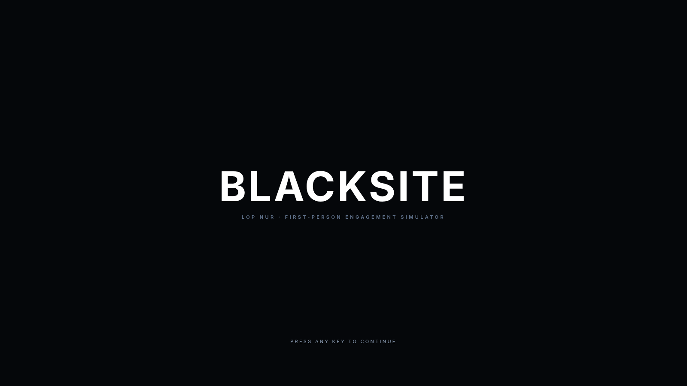
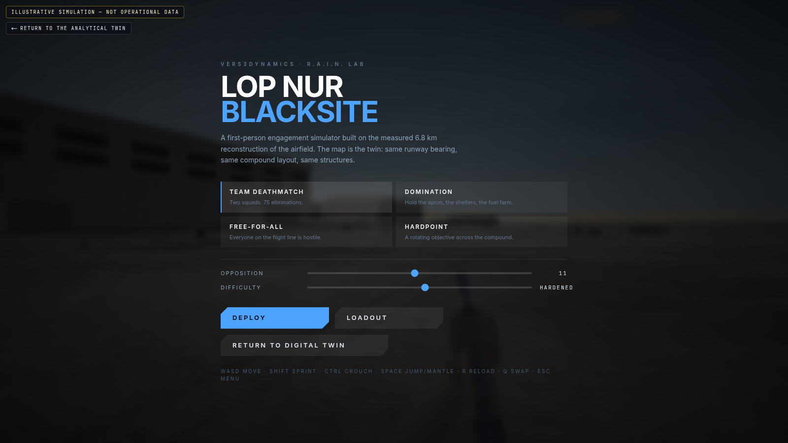
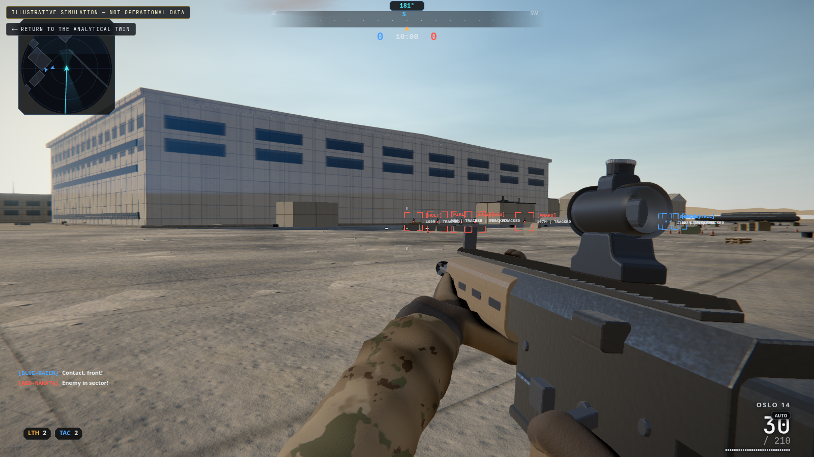
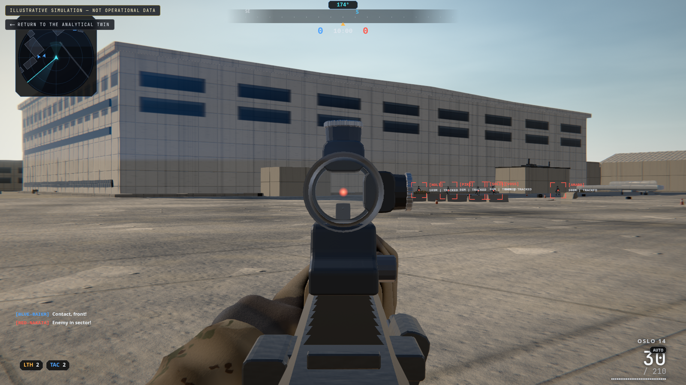
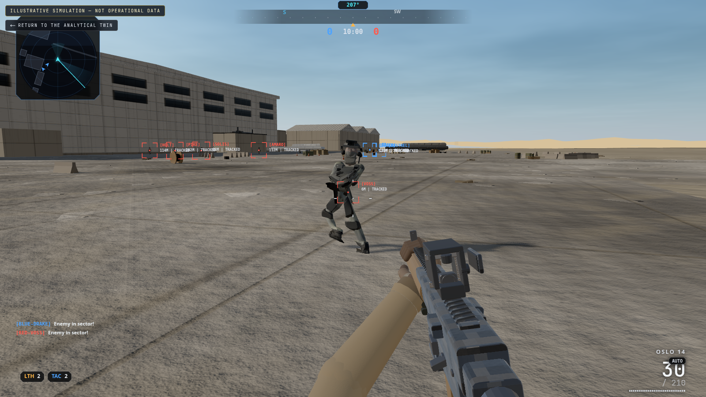

# Lop Nur Twin: Desert Airfield Digital Twin & Tactical Simulator

> **An open-source 3D interactive reconstruction and browser-based tactical simulation of a remote desert airfield near Lop Nur (~40.77° N, 89.28° E).**

[](https://lop-nur-twin.vercel.app/)
[](LICENSE)

---

> ⚠️ **Public sources only. Not operational data.** This project is an analytical reconstruction built strictly from cited open Earth-observation products (Sentinel-2, Landsat, public satellite imagery, and open climatology). It is not a claim of access to classified information.

---

## 🎯 What is Lop Nur Twin?

**Lop Nur Twin** bridges the gap between **Open-Source Intelligence (OSINT)** and **real-time 3D web graphics**. Located deep in China's Xinjiang desert, the Lop Nur facility has attracted global interest due to its remote location and association with aerospace and defense testing.

This repository transforms public satellite data into an **interactive 3D spatial model** you can explore in your browser, alongside an optional **tactical first-person shooter (`/play`)** running on the same deterministic site geometry.

### Why You'll Love This:

- 🎮 **For Gamers:** Jump straight into **Blacksite** (`/play`), a fast-paced first-person combat game running directly inside your browser. Experience procedural weapon grip solvers, custom shaders, and tactical AI.
- 🕵️ **For OSINT Researchers & Analysts:** Explore a mathematically rigorous 3D spatial model. Every runway, building, and taxiway is tagged with public satellite citations, confidence scores, and uncertainty envelopes.
- 🌍 **For Everyday Explorers & Tech Enthusiasts:** Orbit, walk across, and measure a real-world remote facility. Learn how satellite pixels are turned into 3D geometry, filter buildings by evidence type, and inspect the full source ledger.

---

## 🗺️ Choose Your Experience (Routes)

The application offers four distinct modes tailored to different workflows and devices:

| Route               | What It Is                                                                                                                                                                                                 |
| :------------------ | :--------------------------------------------------------------------------------------------------------------------------------------------------------------------------------------------------------- |
| **`/`** _(Default)_ | **Interactive 3D Digital Twin**<br>Fly around or walk through the 3D airfield. Click buildings to open evidence dossiers, measure ground distances, and adjust time or confidence filters.                 |
| **`/play`**         | **Blacksite First-Person Simulator**<br>An action tactical match on the reconstructed airfield. Battle AI soldiers across realistic terrain with custom procedural weapons. **Illustrative fiction only.** |
| **`/analysis`**     | **Semantic Analytical Ledger**<br>The complete intelligence model in a screen-reader friendly, WebGL-free table view. Perfect for low-bandwidth, mobile, or text-first investigation.                      |
| **`/compare`**      | **Manifest & Version Diff**<br>Cryptographically compare two model releases to see exactly what geometry, evidence, or citations changed between builds.                                                   |

---

## 🎮 The Blacksite Simulator (`/play`)

`/play` turns the reconstructed Lop Nur runway and hangar compound into an interactive, browser-based tactical arena.

> _Note: Blacksite is an illustrative game mode for testing character movement, spatial scale, and graphics. Its combat and military units are completely fictional and contribute nothing to the analytical model._

### Visual Tour of Blacksite

| Screen                                             | Overview                                                                                                                                                        |
| :------------------------------------------------- | :-------------------------------------------------------------------------------------------------------------------------------------------------------------- |
|         | **Instant Access:** Boot screen leads directly into game setup. Runs on WebGL with adaptive quality tiers for smooth performance on laptops and mobile devices. |
|             | **Game Modes & Loadouts:** Choose Team Deathmatch, Domination, Free-for-All, or Hardpoint. Customize AI difficulty, bot counts, and weapon loadouts.            |
|          | **Tactical Combat:** Full combat HUD featuring dynamic minimap, compass, health, ammo counters, and responsive first-person controls.                           |
|        | **Procedural Weapon Mechanics:** Weapon gloves and hands are sculpted dynamically using Signed Distance Fields (SDF) and inverse kinematics.                    |
|  | **Procedural Soldier AI:** Character meshes and combat animations are generated entirely in code—no heavy 3D character downloads.                               |

_For full control mappings, game modes, and physics details, see [`docs/BLACKSITE.md`](docs/BLACKSITE.md)._

### Jev Plays Blacksite

Blacksite can optionally place the player under a bounded
[TypeSafe](https://docs.typesafe.ai/) Jev controller. Jev receives a compact
structured observation — what the player can see, the HUD, the weapon — and picks
a movement, a view rotation and a weapon action from a host-defined set, plus,
under **precision control**, which visible enemy to engage and where on it.

**Jev decides what it wants to do. A deterministic local motor controller
executes those decisions at frame rate. Blacksite alone decides what actually
happened.** Remote inference answers in 130–260 ms — enough to choose, too slow
to hold a crosshair through recoil — so the aiming, recoil control and trigger
discipline run locally, every frame, through the same mouse-style input a person
uses. Neither Jev nor the controller can touch physics, damage, hit
registration, hitboxes, score or any authoritative state, and a test fails if
control code ever tries. The original stepped interface stays available as
`?jevControl=direct` for comparison, and every result says which mode produced it.

```sh
cp .env.example .env.local     # set TYPESAFE_API_KEY (server-side only)
bun run dev                    # then open /play?brain=jev
```

The credential stays on the server (`/api/jev/decision`); the browser bundle is
scanned for it on every build. Press **H** at any time to take control back.
`/play?brain=random&seed=42` runs a seeded random baseline through the same
controls, and `/play?playerProfile=elite` gives a human **Elite Operator** —
console-style aim friction and recoil help that never fires and always yields to
the mouse.

In a matched benchmark — three two-minute team-deathmatch episodes per
configuration on the same seeds, live TypeSafe calls — Jev under direct control
hit 6.1 % of its rounds and went 15 kills to 4 deaths (emptying all 240 rounds
every episode); under precision control it hit 77.1 %, needed 2.2 rounds per
kill and went 148 to 0, while the random brain through the same controller went
4 to 4. That last figure is far past "usually wins": Jev plays as a stationary
long-range marksman the bots cannot answer. The method, all twelve episodes and
the caveats are in [`docs/JEV_BLACKSITE.md`](docs/JEV_BLACKSITE.md).

---

## 🕵️ The OSINT Analytical Model

For OSINT researchers, defense analysts, and data scientists, **Lop Nur Twin** is a deterministic, audit-ready spatial database.


_Aerial overview of the reconstructed runway and south hangar compound._


_Detailed structure dossier showing evidence ratings, public source citations, and spatial measurements._

### 1. Evidence Classification Hierarchy

Every structure and feature in the model carries an explicit evidence tag so you always know what is proven and what is inferred:

- ◆ **Observed:** Directly visible in cited public satellite imagery (e.g., runway dimensions, hangar outlines).
- ■ **Reported:** Stated by a cited open publication or news report, with placement modeled from context.
- ▲ **Interpreted:** Facility identity or function assigned by this project where no direct public source states one.
- ○ **Illustrative:** Scenery, vehicles, or decorative elements added to complete the simulation.

You can filter the entire 3D scene using **4 Evidence Modes**:

1. **Observed only** _(Shows only raw satellite-confirmed structures)_
2. **Observed + reported**
3. **+ interpreted**
4. **Full simulation** _(All scenery & illustrative props)_

### 2. Structured Uncertainty & Time Tracking

- **Explicit Tolerances:** Uncertainty is tracked per claim (e.g. runway endpoints carry a ±40m uncertainty margin based on satellite ground sample distance). Unknown fields are printed as _"not stated"_, never silently converted to zero.
- **Three Independent Dates:** To prevent misinterpreting publication dates as construction dates, the model tracks:
  1. _Site Event Date_ (when something physically existed on ground)
  2. _Evidence Publication Date_ (when satellite/report became public)
  3. _Model Entry Date_ (when data was added to this repository)

### 3. Precision Measurement & Geo Exports

- **Local CRS (EPSG:32645):** Measure distances, perimeter lengths, and grid bearings directly in meters.
- **Data Exports:** Filter subjects by confidence, area, or proximity, then export standard **GeoJSON (WGS84)**, **CSV**, or **JSON** for use in ArcGIS, QGIS, or Python analysis pipelines.

---

## 🚀 Quick Start (Run It Locally)

Want to run the app on your computer, inspect the source code, or contribute?

### Prerequisites

- [Bun](https://bun.sh) (recommended) or **Node.js 22.18+**
- A modern browser with WebGL enabled (Chrome, Firefox, Edge, Safari)

### Installation & Launch

```sh
# Clone the repository
git clone https://github.com/vers3dynamics/lop-nur-twin.git
cd lop-nur-twin

# Install dependencies
bun install

# Start local development server (runs on http://localhost:5173)
bun run dev

# Build for production with strict type-checking
bun run build

# Preview production build locally (http://localhost:4173)
bun run preview
```

_(Note: `npm install && npm run dev` works identically on Node.js 22.18+)._

---

## 💻 Code Map & Developer Guide

```text
src/
├── lib/           # Layout definitions, evidence ledger, CRS, and URL params
├── components/    # 3D WebGL scene (Three.js/React Three Fiber) & analytical UI
├── game/          # Blacksite FPS engine (physics, weapons, bot AI, audio)
├── gfx/           # Custom GLSL shaders, AgX tone mapping, and greeble textures
scripts/           # Data validation & release manifest generators
tools/             # Automated test suite (accessibility, audio, gameplay smoke tests)
docs/              # In-depth architectural, spatial, and methodological documentation
```

### Automated Quality & Validation Checks

Run all validation checks before submitting changes:

```sh
bun run check
```

Or run individual sub-check commands:

```sh
bun run test:run      # Run unit tests
bun run test:evidence # Validate all 35 OSINT evidence rules
bun run validate:data # Validate geometry, coordinates, and citations
bun run a11y          # Run axe-core accessibility check against production build
bun run routes        # Test deep links, URL parameters, and mobile navigation
bun run smoke         # Run Blacksite simulation smoke tests
bun run gait          # Test character walk cycle IK math
bun run audio         # Verify procedural audio peak and crest factors
bun run test:jev      # Jev pilot and decision-endpoint unit tests (no API calls)
bun run jev           # Jev pilot browser checks against a fake endpoint (no API calls)
```

---

## 📚 Technical Documentation Index

Deep dive into the underlying math, intelligence methodologies, and architecture:

| Document                                                                      | Topic                                                                              |
| :---------------------------------------------------------------------------- | :--------------------------------------------------------------------------------- |
| [`CONTRIBUTING.md`](CONTRIBUTING.md)                                          | Setup guidelines, coding conventions, and pull request rules                       |
| [`docs/VALIDATION.md`](docs/VALIDATION.md)                                    | Complete guide to data, geometry, and simulation verification                      |
| [`docs/DATA_PROVENANCE.md`](docs/DATA_PROVENANCE.md)                          | Satellite source registration, classification, and confidence scoring              |
| [`docs/SPATIAL_ANALYSIS.md`](docs/SPATIAL_ANALYSIS.md)                        | Coordinates (EPSG:32645), footprint derivation, and GeoJSON exports                |
| [`docs/UNCERTAINTY_MODEL.md`](docs/UNCERTAINTY_MODEL.md)                      | Machine-readable uncertainty envelopes and resolution bounds                       |
| [`docs/TEMPORAL_MODEL.md`](docs/TEMPORAL_MODEL.md)                            | Event ledgers, 3-date temporal tracking, and change comparisons                    |
| [`docs/MODEL_COMPARISON.md`](docs/MODEL_COMPARISON.md)                        | SHA-256 release manifests and schema diffing                                       |
| [`docs/SITE_MODEL.md`](docs/SITE_MODEL.md)                                    | Airfield reconstruction details and procedural assembly                            |
| [`docs/SYSTEM_ARCHITECTURE.md`](docs/SYSTEM_ARCHITECTURE.md)                  | React Three Fiber frontend, state stores, and rendering pipeline                   |
| [`docs/BLACKSITE.md`](docs/BLACKSITE.md)                                      | First-person combat simulation architecture and HUD design                         |
| [`docs/JEV_BLACKSITE.md`](docs/JEV_BLACKSITE.md)                              | Jev Plays Blacksite: the bounded model controller, its boundaries and measurements |
| [`docs/CONTROLS.md`](docs/CONTROLS.md)                                        | Full keyboard, mouse, touch, and URL parameter references                          |
| [`docs/ACCESSIBILITY.md`](docs/ACCESSIBILITY.md)                              | WCAG compliance, axe-core testing, and screen reader support                       |
| [`docs/GOVERNMENT_EVALUATION.md`](docs/GOVERNMENT_EVALUATION.md)              | Compliance evaluation guide for government / public sector reviewers               |
| [`docs/THREAT_MODEL.md`](docs/THREAT_MODEL.md) & [`SECURITY.md`](SECURITY.md) | Security posture, trust boundaries, and vulnerability reporting                    |
| [`docs/DEPLOYMENT.md`](docs/DEPLOYMENT.md)                                    | Vercel deployment, Docker builds, and commit verification                          |
| [`docs/WHITE_PAPER.md`](docs/WHITE_PAPER.md)                                  | Comprehensive project white paper ([HTML version](docs/white-paper.html))          |
| [`AGENTS.md`](AGENTS.md)                                                      | AI coding agent instructions and project recipes                                   |

---

## ⚠️ Known Limitations

The complete list of limitations is maintained in `src/lib/evidence.ts` and rendered on `/analysis`:

1. **Interpretive Facility Names:** Names like "assembly hangar" or "operations block" are model hypotheses. Public overhead imagery cannot verify interior use or building occupants.
2. **Procedural Elevation Floor:** Terrain uses a seeded procedural proxy (~981 m EGM2008 datum). It is not suitable for survey-grade sightline or elevation engineering.
3. **Runway Endpoint Uncertainty:** Modeled runway endpoints carry ~40m uncertainty due to source imagery resolution (10m ground sample distance).
4. **Illustrative Utilities:** Power, water, radar, and security fencing are illustrative recreations not resolved in public satellite frames.
5. **Ordinal Confidence Scores:** Confidence ratings (0.0 to 1.0) are project-assigned ordinal ranks, not statistical probabilities.

---

## 📄 License & Attribution

- **Source Code & Documentation:** Licensed under the **[Apache License 2.0](LICENSE)**.
- **Data & Satellite Imagery:** Public satellite products (Copernicus, ESA, DLR, Airbus Defence and Space, NASA POWER) are referenced under fair use and attributed in [`NOTICE`](NOTICE). No third-party imagery is bundled in this repository.
