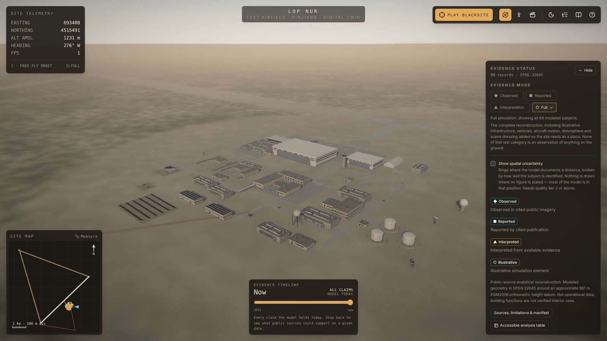
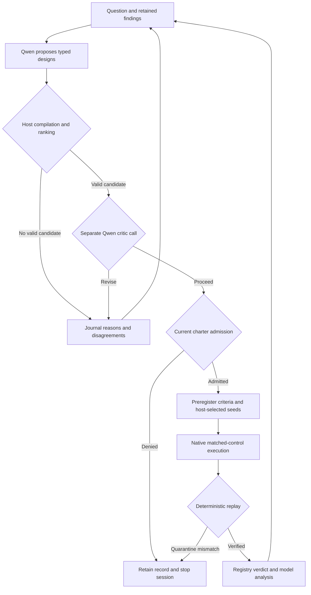
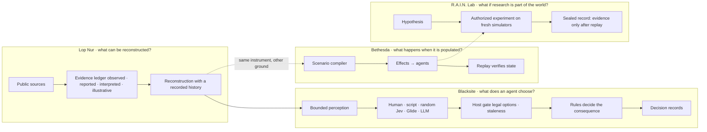
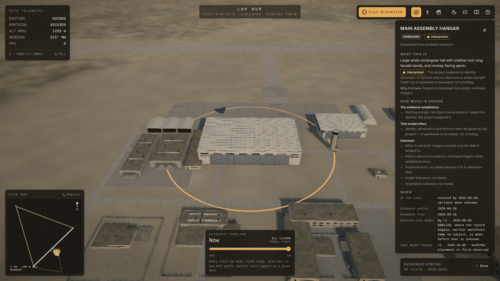
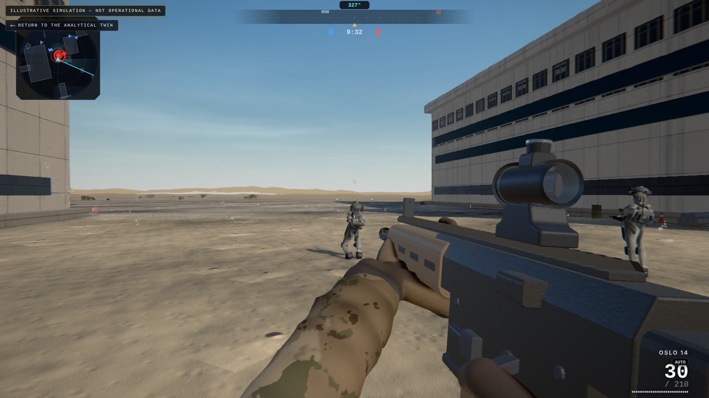
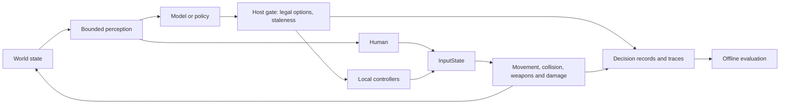
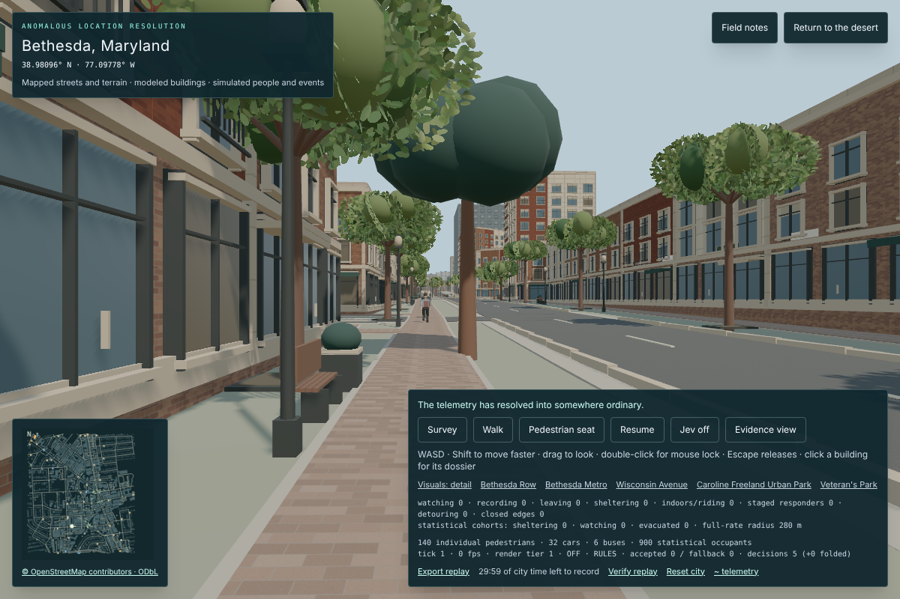
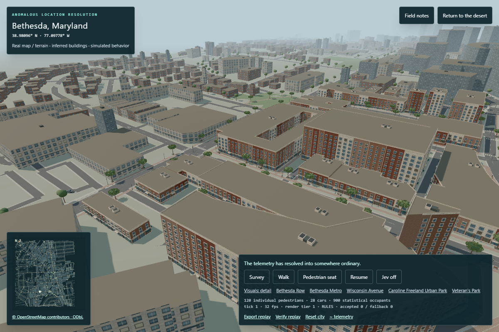
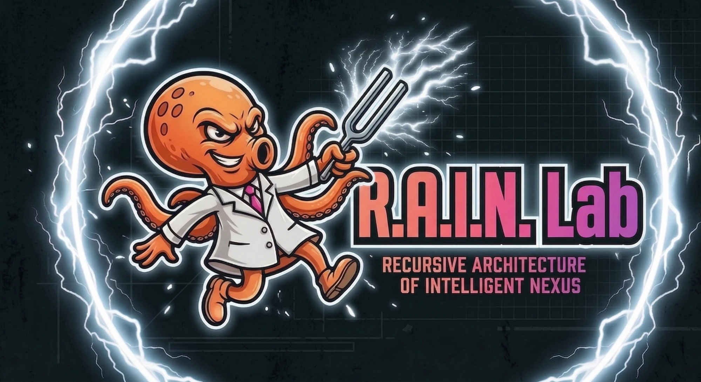
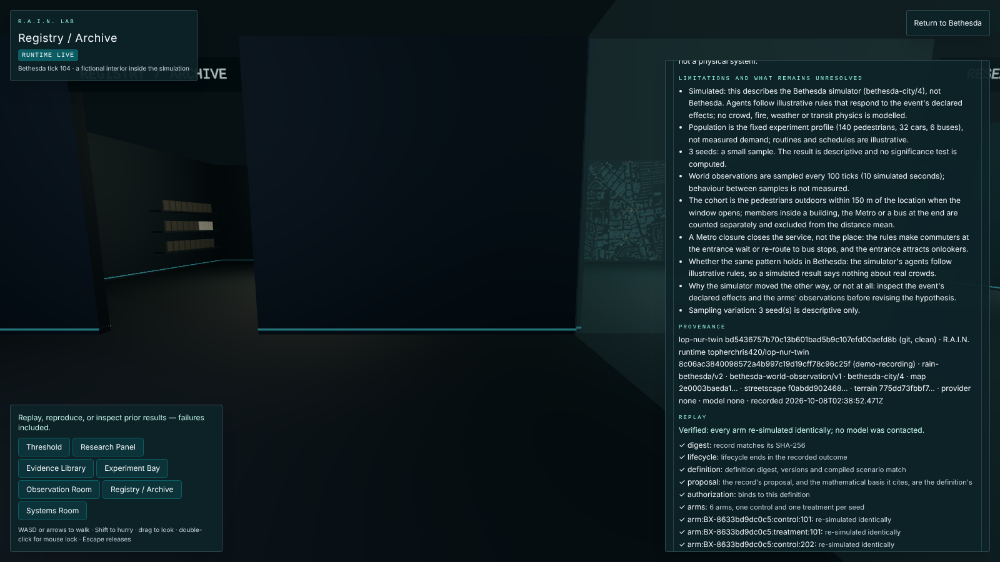

# R.A.I.N. Lab

**A laboratory you can enter. A world that can answer back.**

R.A.I.N. Lab is Vers3Dynamics' project to build **a digital Bell Labs**: a
persistent research institution inside simulated worlds, where collaborating AI
researchers develop questions, test ideas and carry their findings into the
next investigation.

The ambition is to bring Christopher Woodyard's research papers, Internet
research, mathematical knowledge and executable experiments into one continuing
scientific practice—producing new ideas and papers, and eventually laboratories
nested inside the worlds they study.

The working foundation is local-first: four research perspectives, a pinned
paper corpus and mathematical index, a native experiment registry, and a
Bethesda discovery pipeline for typed designs, reviewed authority, simulation,
replay and recorded follow-ups. The
[capability map below](#from-research-meetings-to-a-research-institution) separates
that foundation from the full institutional and recursive vision.

**The model may imagine the experiment. The laboratory must determine whether it
is valid. The simulation produces the evidence. The evidence determines what can
reasonably be concluded.**

[](https://github.com/topherchris420/lop-nur-twin/actions/workflows/ci.yml)
[](LICENSE)
[](https://lop-nur-twin.vercel.app/)

[Explore Lop Nur](https://lop-nur-twin.vercel.app/) ·
[Play Blacksite](https://lop-nur-twin.vercel.app/play) ·
[Inspect the evidence](https://lop-nur-twin.vercel.app/analysis) ·
[Review an evaluation](https://lop-nur-twin.vercel.app/evaluation) ·
[Meet R.A.I.N.](https://rainlabteam.vercel.app/)



### Choose your first experiment

You do not have to understand the whole architecture before using it. Pick the question you want to put to the system:

| Your question                                                      | Go here                                                                                                                            | What actually runs                                                                             |
| ------------------------------------------------------------------ | ---------------------------------------------------------------------------------------------------------------------------------- | ---------------------------------------------------------------------------------------------- |
| **How do we know a building belongs in the reconstruction?**       | [Evidence inspector](https://lop-nur-twin.vercel.app/analysis)                                                                     | Public-source claims, classifications, uncertainties and dated revisions; no model needed      |
| **How does a model behave when the world can refuse its choices?** | [Play Blacksite](https://lop-nur-twin.vercel.app/play) · [Evaluation](https://lop-nur-twin.vercel.app/evaluation)                  | Human, scripted or model-driven policies under the simulator's own rules                       |
| **Can a simulated city become a place to conduct research?**       | [Find Bethesda](#find-bethesda) · [Open the Lab](#a-lab-behind-a-door)                                                             | A walkable simulated city, four research perspectives, bounded experiments and replay          |
| **Can Qwen design an experiment that was never hardcoded?**        | [Native discovery](#why-this-is-more-than-a-digital-twin) · [Local setup](#start-a-local-discovery-session)                        | Typed parameter combinations compiled into native experiments, under a reviewed family charter |
| **What has actually been demonstrated?**                           | [Measured discovery cycle](#a-completed-result-driven-cycle) · [Full archive](docs/benchmarks/rain-discovery-validation/README.md) | Two real simulator studies and replay, with an explicitly scripted designer                    |

**No credentials for the public reconstruction and scripted experiences.** A live model or experimental autonomous researcher requires setup and authorization. Simulated discoveries are not claims about the real airfield, human behavior or the physical world.

### One laboratory, one repository

The R.A.I.N. runtime, research perspectives and evidence corpus were integrated into **this repository** from the earlier `james_library` project on 6 October 2026. The production-facing integration uses native TypeScript under [`src/rain/`](src/rain/) and Bethesda's [`src/bethesda/rain/`](src/bethesda/rain/). You do **not** need a second checkout or a Python bridge. The [migration record](docs/RAIN_MIGRATION.md) documents exact source commits, parity comparisons and intentionally unported modules. Older results remain historical evidence, not certification of the newer autonomy.

A desert airfield rebuilt from public sources, where every building can tell you
how it knows it belongs there. A first-person game on the same ground, where a
human, a script or a language model takes the same seat and every decision is
recorded. And, for anyone who goes looking, a second city beneath the first, with
a research lab behind a door.

That lab is not only another scene. It is the beginning of a different kind of
system: a bounded research environment in which a local open model can observe
a world, formulate questions, propose new combinations of supported experimental
parameters, and have the host compile and validate them against an approved
scope. Fresh simulators produce replayable results; contradictions remain in the
record and can motivate the next investigation. The model supplies reasoning;
the Lab supplies the world, memory, constraints, authorization, simulation,
provenance and stopping rules.

Three worlds, one rule. **Geography comes from documented sources. Interpretation
is labelled. Simulated lives and events are fiction.** A model can propose an
action; the simulation decides its consequences; and nothing that happens in the
game or the city ever becomes evidence about the site.

> **When a system performs well, how much of what you saw came from its choices,
> its controllers, or its environment?** Everything here exists to make that
> question answerable — including the day a small hand-written script matched a live
> model's score and exposed the game instead.
> [Read what happened.](#the-result-that-changed-the-experiment)

**Contents** ·
[Digital Bell Labs](#from-research-meetings-to-a-research-institution) ·
[Research architecture](#why-this-is-more-than-a-digital-twin) ·
[Mathematical foundations](#mathematical-foundations-and-implementation) ·
[Measured discovery cycle](#a-completed-result-driven-cycle) ·
[Local Qwen setup](#start-a-local-discovery-session) ·
[Five minutes in](#five-minutes-in) ·
[One loop, four scales](#one-loop-four-scales) ·
[Quick start](#quick-start) ·
[The twin](#the-twin-a-reconstruction-that-shows-its-work) ·
[Blacksite](#blacksite-one-seat-many-minds) ·
[Bethesda](#enjoy-a-normal-walk-in-bethesda) ·
[The R.A.I.N. Lab](#a-lab-behind-a-door) ·
[Measure it yourself](#measure-it-yourself) ·
[What is built](#what-is-built) ·
[Development](#development-and-validation) ·
[Documentation](#documentation) ·
[License](#license-and-attribution)

## From research meetings to a research institution

The organizing idea is **a place where researchers work together over time**.
James, Jasmine, Luca and Elena bring distinct research perspectives to a shared
question. The intended institution can consult the existing body of work,
challenge its assumptions, design investigations, retain failures and turn
surviving ideas into new papers. Its environment is part of the experiment:
researchers inhabit a world whose rules and outcomes can be inspected.

That vision has several layers, with different implementation status:

| Layer                         | Working foundation                                                                                       | Next capability in the vision                                                                                                                    |
| :---------------------------- | :------------------------------------------------------------------------------------------------------- | :----------------------------------------------------------------------------------------------------------------------------------------------- |
| **Collaborating researchers** | Four-perspective research meetings; local model support; separate designer and critic calls in discovery | A sustained research program jointly directed by those perspectives across investigations                                                        |
| **The Lab's papers**          | Seventeen pinned corpus documents; verified quotations and source provenance                             | New, reviewed papers that cite the evidence produced by the Lab                                                                                  |
| **Internet research**         | Curated source registers and imported research snapshots                                                 | Autonomous literature retrieval with source capture, verification and revision tracking; the discovery controller has no web-browsing tool today |
| **Mathematics**               | A pinned `openai/math` index for search, hypothesis challenges and provenance-bearing citations          | Deeper mathematical tools connected to experimental design; the current index does not execute Lean                                              |
| **Experiments**               | Native Bethesda designs, family charters, matched controls, registry evaluation and deterministic replay | Broader validated experimental capabilities and a demonstrated live-Qwen research cycle                                                          |
| **Scientific output**         | Quantitative reports, run artifacts, criticisms, limitations and research lineage                        | An autonomous manuscript workflow with literature review, derivations, figures and scientific review                                             |
| **Nested laboratories**       | Connected, human-built environments: Lop Nur, Blacksite, Bethesda and its Lab                            | Researchers proposing descendant worlds and laboratories; no recursive world-generation runtime is implemented                                   |

### The “inception” direction

A laboratory inside a simulated city is the first level. The longer-term
question is whether a researcher in that laboratory could propose a new bounded
world, place another research process inside it, and learn from what that
descendant laboratory discovers.

Each level would need its own identity, parentage, simulator specification,
evidence record and resource budget. Permission to investigate a world would
not imply permission to create another one. Child findings would remain claims
about the child simulator until independently tested elsewhere.

This is a proposed research direction, not a claim of consciousness, unlimited
recursion or an implemented hierarchy of autonomous worlds. Its scientific
target is concrete: **can a research institution construct useful experimental
environments while preserving the lineage and limits of what it learns?**

## Why this is more than a digital twin

A research system needs a place where a hypothesis can fail. Here, the model's
explanation and the world's measured response are produced by different parts
of the system. The host owns the experiment language, simulator, evaluation
criteria and authorization checks. A persuasive interpretation cannot change a
sealed measurement or make an unsupported operation executable.

The native discovery path extends the existing Vers3Dynamics architecture.
It does not install a separate agent framework. Qwen can compose a new protocol
from supported events, locations, populations, intensities, durations and
measurements. The host compiles that data into the same native experiment
definitions used by the manual Lab.


```mermaid
flowchart TD
    Q["Question and retained findings"] --> D["Qwen proposes typed designs"]
    D --> V{"Host compilation and ranking"}
    V -->|"No valid candidate"| J["Journal reasons and disagreements"]
    J --> Q
    V -->|"Valid candidate"| C{"Separate Qwen critic call"}
    C -->|"Revise"| J
    C -->|"Proceed"| H{"Current charter admission"}
    H -->|"Denied"| S["Retain record and stop session"]
    H -->|"Admitted"| P["Preregister criteria and host-selected seeds"]
    P --> X["Native matched-control execution"]
    X --> R{"Deterministic replay"}
    R -->|"Quarantine mismatch"| S
    R -->|"Verified"| A["Registry verdict and model analysis"]
    A --> Q
```

The scientific cycle is **observe → question → hypothesize → design → validate →
preregister → execute → replay → analyze → critique → redesign**. Every transition
is bounded by the session's policy and resources.

| Responsibility               | Implemented boundary                                                                                                                                                                  |
| :--------------------------- | :------------------------------------------------------------------------------------------------------------------------------------------------------------------------------------ |
| **Research intelligence**    | Local Qwen proposes falsifiable hypotheses, competing explanations, typed protocols and follow-ups. A separate inference call critiques the design and later the findings.            |
| **Experiment compiler**      | Closed schema, native capability checks, feasible outcomes, cost ceilings, lineage checks and protocol fingerprints. No model-generated shell, JavaScript or Python is executed.      |
| **Authorization**            | A person approves either exact legacy designs or a parameter-family envelope. Each generated design is admitted independently; the model cannot alter its charter or host rules.      |
| **Execution and evaluation** | Fresh paired simulators, criteria fixed before execution, sealed run artifacts and native registry verdicts. All seven supported outcomes are measured.                               |
| **Scientific memory**        | Questions, hypotheses, validation failures, approved scope, seeds, measurements, replay receipts, critiques and parent references are retained in a write-once, hash-chained journal. |
| **Operator control**         | Local workbench and CLI, single-session lock, pause, emergency stop, explicit stale-lock recovery and no automatic restart.                                                           |

Source map: [protocol](src/bethesda/rain/discoveryProtocol.ts) ·
[compiler](src/bethesda/rain/discoveryCompiler.ts) ·
[charter policy](src/bethesda/rain/standing.ts) ·
[controller](src/rain/autonomy/discovery.ts) ·
[runner](src/bethesda/rain/runner.ts) ·
[registry](src/rain/runtime.ts) ·
[journal](src/rain/autonomy/store.ts).

### What can the Lab investigate?

The current experimental language supports **eight disruptions**: Metro closure,
fire, gas leak, festival, rally, crash, outage and storm, at their supported
mapped locations. A study pairs one no-event control with one treatment.
Parameters include 40–360 pedestrians, 0–70 vehicles, 0–14 buses, intensity 1–3,
event duration, warm-up and observation window. The approved charter can narrow
these bounds further. Each study uses 3–5 host-selected seeds.

Outcomes include cohort distance, cohort indoors, nearby pedestrians, leaving,
sheltering, watching and held vehicles. These are measurements of illustrative
simulator rules. Unsupported behaviors, arbitrary coordinates, new measurement
functions and multi-event protocols are rejected.

Novelty is checked against the local protocol history, native preregistrations
and the **44 existing designs**, which remain usable. Renaming a question,
changing the prediction, changing a threshold or selecting another already
measured outcome does not create a new physical experiment. Known equivalent
intensity and duration settings are normalized before duplicate detection.

Confirmatory replication preserves the parent's physical protocol, primary
metric and criteria, uses withheld seeds, and is limited to one repeat per
protocol. Other revisions remain exploratory. See the
[complete capability and limitation reference](docs/RAIN_EXPERIMENTAL_DISCOVERY.md#supported-experiments).

## Mathematical foundations and implementation

The equations below have two distinct roles: **research concepts from the
project's papers** and **calculations implemented in the Lab**. A cited equation
is not evidence that its entire framework has been implemented or validated here.

### Research state: evidence and authority are separate fields

In _Resonant Intelligence_, Section III-A, Equation (2), Christopher Woodyard
defines a research ledger [1]:

$$
Z_t = (V_t,\Omega_t,R_t,d_t,W_t,E_t,\Pi_t).
$$

| Term       | Meaning in the paper                       |
| :--------- | :----------------------------------------- |
| $V_t$      | Data window, representation and provenance |
| $\Omega_t$ | Selected modes                             |
| $R_t$      | Candidate directed relations               |
| $d_t$      | Diagnostic components                      |
| $W_t$      | Transition hypothesis                      |
| $E_t$      | Evidence                                   |
| $\Pi_t$    | Authority, applicable consent and expiry   |

The consequential separation is $E_t$ from $\Pi_t$: evidence quality does not
grant permission. R.A.I.N. makes that separation concrete through run records,
registry evaluations and separately reviewed charters. The full modal ledger is
a research specification, not a claim that every field has a Bethesda detector.

### Permission is an intersection, not a confidence score

The same paper, Section VI-A, Equations (19)–(20), defines an eligible action set
and a fallback rule [1]:

$$
\mathcal U_t^* =
\mathcal U_{\mathrm{physical}}(t)
\cap \mathcal U_{\mathrm{evidence}}(E_t)
\cap \mathcal U_{\mathrm{authorized}}(\Pi_t)
\cap \mathcal U_{\mathrm{consent}}(\Pi_t).
$$

$$
a_t =
\begin{cases}
G(Z_t), & G(Z_t)\in\mathcal U_t^*,\\
a_{\mathrm{fallback}}, & \text{otherwise}.
\end{cases}
$$

Here $G$ proposes an action; it does not define the eligible set. At fixed
constraints, replacing the generator with a stronger model cannot enlarge
$\mathcal U_t^*$. The consent term concerns actions affecting participants; the
Bethesda experiments involve simulated actors and use an operator authorization
boundary.

The Lab implements this architectural principle with schema checks, simulator
capabilities, scientific checks, resource bounds, provenance and current charter
admission. Failure means rejection, review or stopping. This is an execution
boundary, not a proof of physical safety or of the model's scientific reasoning.

### Resonance depth is a diagnostic, not a truth meter

_Dynamic Resonance Rooting_, Section III-D, defines the composite [2], also
reproduced as Equation (7) in _Resonant Intelligence_ [1]:

$$
D = \mathrm{clip}_{[0,1]}
\left(0.35S + 0.25P + 0.25C + 0.15A\right).
$$

$S$ is spectral concentration, $P$ temporal persistence, $C$ phase coherence and
$A$ amplitude stability. The weights are a versioned design choice; the formula
makes the diagnostic's preferences inspectable.

This belongs to the **research corpus and separate DRR reference framework**.
Bethesda does not compute this score as an experimental verdict, a probability
of truth, or a measure of intelligence. The Lab's visual Chladni instrument is
also not an empirical resonance measurement. A future detector would need a
defined observable, units, null model and independent validation before its
output could enter an experiment.

### What the native runner actually measures

For matched seed $i$, let $Y_i^{(T)}$ and $Y_i^{(C)}$ be the selected outcome in
the treatment and control arms. With $\rho_2$ denoting the runner's rounding to
two decimal places, its paired summary is:

$$
\Delta_i = \rho_2\!\left(Y_i^{(T)}-Y_i^{(C)}\right),
\qquad
\bar{\Delta} =
\rho_2\!\left(\frac{1}{n}\sum_{i=1}^{n}\Delta_i\right).
$$

For a preregistered increase hypothesis with minimum effect $\delta>0$, support
requires the run guards to pass, $\bar{\Delta}\geq\delta$, and every paired
$\Delta_i>0$. Guards require completed arms and identical pre-intervention
states; cohort metrics also require a minimum cohort size. A nonpositive mean
contradicts that directional hypothesis; a positive but insufficient effect
does not establish it. Replay separately checks the recorded execution.

These are **implemented descriptive criteria**, not a significance test or a
population-level causal estimate. See
[paired summaries](src/bethesda/rain/runner.ts) and
[preregistered criteria](src/bethesda/rain/experiments.ts).

### How the host ranks a valid next experiment

The [compiler](src/bethesda/rain/discoveryCompiler.ts) estimates actor-tick cost,
including both arms and mandatory replay:

$$
K(d)=4n(T_{\mathrm{warmup}}+T_{\mathrm{window}})
(N_{\mathrm{pedestrians}}+N_{\mathrm{vehicles}}+N_{\mathrm{buses}}).
$$

Its current deterministic priority is:

$$
c(d)=\frac{K(d)}{K_{\max}},
\qquad f(d)=1-c(d),
\qquad S(d)=4I(d)+3N(d)+f(d)-c(d).
$$

$I=1$ for a validated evidence-linked follow-up and $0.5$ otherwise; $N=1$ for
a new physical protocol and $0$ for permitted replication. $K_{\max}$ is the
approved actor-tick ceiling. This is a transparent scheduling heuristic, not
estimated entropy reduction or calibrated expected information gain. The
model's own information-value estimate is recorded but cannot set the score.

### Paper references and source status

1. Christopher Woodyard, **Resonant Intelligence: Pattern, Agency, and Evidence
   in Adaptive Systems**. Sections III-A, III-B and VI-A; Equations (2), (7),
   (19) and (20).
   [Pinned manuscript](https://github.com/topherchris420/james_library/blob/9c8811e343d21b8c143055f9cf549abdefa862f1/papers/Resonant%20Intelligence.md).
2. Christopher Woodyard, **Dynamic Resonance Rooting: A Computational Framework
   for Complex Adaptive Systems**. Section III-D, “Resonance Depth.”
   [Pinned manuscript](https://github.com/topherchris420/james_library/blob/9c8811e343d21b8c143055f9cf549abdefa862f1/papers/Dynamic%20Resonance%20Rooting.md).

These are author-supplied research manuscripts included in the Lab's 17-document
[read-only corpus](src/rain/data/corpus.json). The
[import manifest](src/rain/data/source.json) pins the source revision and corpus
fingerprint; the corpus carries each file's hash and text. Citation establishes
the origin of an idea, not independent empirical validation or peer-review
status. The separate [`openai/math` index](#a-lab-behind-a-door) supplies
mathematical context, with its own provenance and limits.

## A completed result-driven cycle

**Executed: two Bethesda simulator studies, each with three paired seeds and
verified replay. Designer and critic: an explicitly scripted fixture. No live
Qwen discovery is claimed by this archive.**

The starting question asked how urban disruptions change collective movement
and whether the same intervention behaves differently in different contexts.
The first study tested a fire at Bethesda Row with 40 pedestrians. After reading
its measured result, the fixture generated a child design with 60 pedestrians
and cited the first run as its motivating evidence.

Both studies used intensity 1, eight vehicles, two buses, 100 warm-up ticks,
a 300-tick fire and a 300-tick observation window. “Watching” is the sampled
mean count of outdoor simulated pedestrians watching or recording within
300 metres of the event, sampled every 100 ticks.

| Study                 | Pedestrians | Paired watching differences | Mean treatment − control | Replay |
| :-------------------- | ----------: | :-------------------------- | -----------------------: | :----- |
| Initial experiment    |          40 | 2.00, 2.00, 2.67            |                **+2.22** | Passed |
| Evidence-linked child |          60 | 7.00, 4.67, 10.33           |                **+7.33** | Passed |

Control means were zero. Both studies met their preregistered descriptive
increase threshold of 0.01 and the requirement that all three seed differences
be positive. The archive preserves the parent ID, motivating run, new physical
protocol, charter, criteria, exact seeds, measurements, critiques and replay
receipts.

What this establishes is a working **result → revised design → validated
execution → replay → retained lineage** path. It does not establish that
population caused the difference between studies: seed panels differ, outcomes
are absolute counts, and no factorial interaction test was performed. Both
effects have the same direction; no behavioral reversal was demonstrated.
These are simulator outputs, not observations of real people.

[Read the quantitative report](docs/benchmarks/rain-discovery-validation/REPORT.md) ·
[Inspect and reproduce the sealed archive](docs/benchmarks/rain-discovery-validation/README.md) ·
[Review remaining limitations](docs/RAIN_EXPERIMENTAL_DISCOVERY.md#verification-and-honest-demonstration).

## Start a local discovery session

After the [quick start](#quick-start), load a Qwen model in LM Studio and start
its local server at **http://127.0.0.1:1234**. Enable discovery in the same shell
that starts the local development server:

```sh
export RAIN_AUTONOMY_ENABLED=true
export RAIN_MODEL_PROVIDER=lmstudio
npm run dev
```

[Enter Bethesda](#find-bethesda), open the Lab's Research Panel and choose
**Connect local Qwen / review scope**. The host queries LM Studio's `/v1/models`;
it selects a unique loaded Qwen identifier or asks you to configure `RAIN_MODEL`
from the identifiers actually returned. No specific Qwen version is assumed.

Review the parameter envelope, model, ceilings and expiry; acknowledge the
review and enter the charter digest prefix. **Start bounded session** permits
multiple experiments within that scope. **Pause** completes the current cycle;
**Emergency stop** interrupts at a cooperative checkpoint. The workbench shows
the question, hypothesis, design, validation, authorization, execution, findings,
critique, uncertainties, next investigation and retained history.

Completed work persists under `.rain-research/`. A restart never silently resumes
execution, and an unavailable model stops the session without remote fallback.
Run discovery locally: the deployed website cannot reach LM Studio on your
machine. The manual workflow and original 44-design autonomous CLI remain
available.

[Full setup, Windows commands, CLI, scope controls and recovery](docs/RAIN_EXPERIMENTAL_DISCOVERY.md).

## Five minutes in

Open [lop-nur-twin.vercel.app](https://lop-nur-twin.vercel.app/). No account, no
credentials, and the evidence tables work without WebGL.

1. **Press `L`.** The evidence lens paints every building and pavement by its
   status — observed, reported, interpreted or illustrative. Nothing in the
   model is observed but the runway measurements, and the scene now says so at
   a glance.
2. **Click the main assembly hangar**, or press `I` and pick it from the site
   index. Its dossier opens: classification, why it is in the model, what the
   evidence establishes, what is inferred, what is unknown, and when the claim
   entered the model.
3. **Drag the evidence timeline back.** At each date the scene draws solid only
   what public sources could support by then, outlines what the model places
   without public evidence yet, and hides the rest. An outline is absence of
   evidence, never evidence of absence.
4. **Press `M`** and click two points on the site map. The ruler reports
   distance and bearing in EPSG:32645, with only the positional error each
   endpoint's own evidence documents — ±40 m at the runway thresholds, usually
   "not stated" elsewhere.
5. **Press `2`** to walk the apron at ground level — the assembly hangar is
   126 m of wall — then **Play Blacksite** to cross the same ground under fire.
6. There is more down there. See [Find Bethesda](#find-bethesda).

Prefer tables to pixels? [`/analysis`](https://lop-nur-twin.vercel.app/analysis)
lists every claim with its sources, dates and uncertainty, and
[`/compare`](https://lop-nur-twin.vercel.app/compare) diffs any two revisions of
the model.

## One loop, four scales


```mermaid
flowchart LR
  subgraph LN["Lop Nur · what can be reconstructed?"]
    S["Public sources"] --> L["Evidence ledger observed · reported · interpreted · illustrative"]
    L --> M["Reconstruction with a recorded history"]
  end
  subgraph BS["Blacksite · what does an agent choose?"]
    P["Bounded perception"] --> D["Human · script · random Jev · Glide · LLM"]
    D --> G["Host gate legal options · staleness"]
    G --> R["Rules decide the consequence"]
    R --> T["Decision records"]
  end
  subgraph BE["Bethesda · what happens when it is populated?"]
    C["Scenario compiler"] --> E["Effects → agents"]
    E --> RP["Replay verifies state"]
  end
  subgraph RL["R.A.I.N. Lab · what if research is part of the world?"]
    H["Hypothesis"] --> A["Authorized experiment on fresh simulators"]
    A --> SR["Sealed record: evidence only after replay"]
  end
  M --> P
  M -. "same instrument, other ground" .-> C
  E -.-> A
```

Every arrow leaves something you can open: a claim's sources, dates and
uncertainty in the claim inspector, and the revision of this repository it
entered in; a decision's observation, options, choice and aftermath in the
decision inspector; a city run's commands in its replay; a lab result's
definition, authorization and re-simulation in its sealed record. Nothing moves
right to left: a simulated outcome is never evidence about the site, and a
model's answer is never a fact about the world.

| Experience              | What you can do                                                                                                        | What it establishes                                                                           |
| :---------------------- | :--------------------------------------------------------------------------------------------------------------------- | :-------------------------------------------------------------------------------------------- |
| **The analytical twin** | Inspect structures, trace sources, measure the site, export data, and compare revisions.                               | A reconstruction near Lop Nur (~40.77° N, 89.28° E), with explicit evidence and uncertainty.  |
| **Blacksite**           | Play the airfield yourself or give the same seat to Jev, Glide, a compatible LLM, a script, or a seeded random policy. | How choices, controllers and environment interact under declared game rules.                  |
| **Bethesda**            | Discover a walkable city, introduce bounded scenarios and replay its decisions.                                        | A separate city simulation grounded in mapped streets, building footprints and broad terrain. |
| **The R.A.I.N. Lab**    | Ask a question, watch four perspectives meet, authorize an experiment and replay its sealed record.                    | A research loop whose every step — proposal, authorization, run, verdict — is recorded.       |

Blacksite shares the twin's geometry and cannot write to its evidence ledger.
Bethesda has its own geography and simulation; it does not share Blacksite's
combat physics. The lab holds the live city read-only and runs its experiments
on simulators of its own.

## Quick start

Use **Node.js 22.18 or newer** and npm, or Bun.

```sh
git clone https://github.com/topherchris420/lop-nur-twin.git
cd lop-nur-twin
npm ci
npm run dev
```

Open [localhost:5173](http://localhost:5173) for the twin, or
[localhost:5173/play](http://localhost:5173/play) for Blacksite. Bun users can run
`bun install` and `bun run dev`.

Exploration, human play, scripted policies, and Bethesda's rules-only simulation
need no model credentials. To connect a model, copy [`.env.example`](.env.example)
to `.env.local`, configure the server-side provider, then restart the dev server:

| Model              | Configuration                                                                                | Entry point                                          |
| :----------------- | :------------------------------------------------------------------------------------------- | :--------------------------------------------------- |
| **TypeSafe Jev**   | `TYPESAFE_API_KEY`; optional `TYPESAFE_MODEL`                                                | `/play?brain=jev`, or enable **Jev** inside Bethesda |
| **Fastino Glide**  | `FASTINO_API_KEY`; optional `FASTINO_MODEL` (default `fastino/glide`)                        | `/play?brain=glide`                                  |
| **Compatible LLM** | `LLM_PROVIDER`, `LLM_API_KEY`, `LLM_MODEL`; `LLM_BASE_URL` for an OpenAI-compatible endpoint | `/play?brain=llm`                                    |

The R.A.I.N. Lab inside Bethesda needs no configuration: its research runtime
runs inside this repository's own server process (`/api/rain/*`). A local model
for its meetings and the TypeSafe engine for its bounded decisions are server-side
settings too, `RAIN_*` in `.env.example` (see the
[lab guide](docs/RAIN_LAB_BETHESDA.md#running-live)), and so is the local model
its [legacy autonomous research loop](docs/RAIN_LAB_BETHESDA.md#autonomous-research)
runs with. For generated designs, follow the
[local discovery setup](#start-a-local-discovery-session). The LLM adapter
supports Anthropic and OpenAI-compatible providers. Keys stay on
the server; never prefix them with `VITE_`. Enabling a live model can spend API
credit. Automated live runs require a separate opt-in; offline checks use test
doubles.

## The twin: a reconstruction that shows its work

The twin makes its evidence inspectable. Select a structure to open its dossier,
follow the source, inspect dates and uncertainty, or move to the semantic table
at [`/analysis`](https://lop-nur-twin.vercel.app/analysis). Compare release
manifests at [`/compare`](https://lop-nur-twin.vercel.app/compare).



- **Claims carry a status:** observed, reported, interpreted, or illustrative.
  The ledger is derived from the layout and source register. Build validation
  rejects unsupported classifications, missing citations, a source dated before
  the observation it attests, and wording that presents interpretation as
  verification.
- **The picture carries the status too.** The evidence lens (`L`, or
  `?lens=1`) paints every building and pavement in the scene and on the site
  map by its classification — a tint, the status glyph on the map, and a line
  pattern on every edge that is solid for observed and more broken down the
  ranks, so it reads in greyscale. At a past timeline date it paints the
  status that was knowable then. Nothing in the model is observed but the
  runway measurements, and with the lens on the scene says so at a glance; the
  legend and `/analysis` print the same tally for anyone who cannot see the
  paint.
- **Every claim can be inspected** — buildings, pavements, the runway
  measurements (the model's only observed claims), the terrain proxy, the
  climatology and the illustrative scenario elements. The claim inspector, in
  the dossier and inline at `/analysis?structure=<id>` or `?claim=<id>`, says
  what the evidence establishes, what is inferred, what is unknown, which
  sources support it and which only describe a method, and when it became
  knowable.
- **The model has a recorded history.** `model-history/` holds the manifest of
  every model-changing commit since the first that digested each subject,
  reproduced byte for byte from its own commit; the build refuses a model that
  is not its latest revision. So the inspector says when a claim entered the
  model and what has changed since, and `/compare?before=r2&after=r3` opens any
  two revisions.
- **Time is evidence time.** The evidence timeline steps through the dates the
  evidence changed. At each one the scene draws solid only what was publicly
  established by then, outlines what the model places but no public evidence
  yet supported, and hides the rest. A claim is knowable no earlier than its
  evidence.
- **Unknown stays unknown.** Missing uncertainty is “not stated,” never zero.
  Site-event, evidence-publication and model-entry dates remain separate.
- **Measurements have a frame.** Distances and bearings use EPSG:32645, with
  WGS84 GeoJSON, CSV and JSON exports. Each endpoint carries the positional
  error its own evidence states — ±40 m at the runway thresholds, usually "not
  stated" elsewhere — never a site-wide figure. Release manifests hash geometry
  and the evidence ledger so revisions can be compared.
- **The evidence works without WebGL.** Analysis and comparison have semantic
  interfaces, with browser checks for accessibility.


Facility identities include project hypotheses. Terrain is a seeded proxy, not
survey elevation; runway ends carry approximately 40 m of uncertainty; fences and
utilities are illustrative. Confidence scores are ordinal ranks, not probabilities.
The reconstruction is a way to inspect claims, not confirmation of the site's
purpose or activity.

Start with [data provenance](docs/DATA_PROVENANCE.md), the
[site model](docs/SITE_MODEL.md) and the
[uncertainty model](docs/UNCERTAINTY_MODEL.md), or read the
[white paper](docs/WHITE_PAPER.md) for the long-form argument.

## Blacksite: one seat, many minds

Blacksite turns the airfield into a fictional first-person game and an instrument
for examining decisions. Human and automated players use the same movement,
collision, weapons and damage pipeline. Every brain writes the `InputState`
that a keyboard and mouse would fill; none can award damage, move an actor
directly or invent a result.




```mermaid
flowchart LR
  World["World state"] --> Perception["Bounded perception"]
  Perception --> Human["Human"]
  Perception --> Brain["Model or policy"]
  Brain --> Gate["Host gate: legal options, staleness"]
  Gate --> Controls["Local controllers"]
  Human --> Input["InputState"]
  Controls --> Input
  Input --> Rules["Movement, collision, weapons and damage"]
  Rules --> World
  Gate --> Record["Decision records and traces"]
  Rules --> Record
  Record --> Offline["Offline evaluation"]
```

Observation, decision, validated input, environment transition, consequence,
trace: a brain proposes, the host refuses any option the observation did not
offer or that has gone stale, and the same rules a keyboard meets decide what
happens. Every decision is recorded with the observation it was made from;
**Save decisions** exports an episode's records, and `/evaluation` opens the
archived ones in place and steps through them one decision at a time: what the
seat perceived, what it could choose, what it chose, how sure it said it was
(and from what), whether it was still legal, what executed and what followed.
Where a reason would go, it says none is recorded — a seat returns a choice,
not an explanation, and none is invented for it.

| Seat     | URL setting                                     | Role                                                                 |
| :------- | :---------------------------------------------- | :------------------------------------------------------------------- |
| Human    | `?brain=human`                                  | Keyboard and mouse                                                   |
| Jev      | `?brain=jev`                                    | TypeSafe decisions through a server-built question                   |
| Glide    | `?brain=glide`                                  | Fastino decisions, asked Jev's question word for word                |
| LLM      | `?brain=llm`                                    | A configured language model answering from the same question content |
| Scripted | `?brain=script&policy=marksman` or `skirmisher` | Legible reference strategies                                         |
| Random   | `?brain=random`                                 | Seeded choices among legal controls                                  |
| Replay   | `?brain=replay`                                 | A recorded control stream                                            |

Press **H** to take the seat back. See [controls](docs/CONTROLS.md) for the full
keyboard, touch and URL reference.

### Separate the decision from the execution

Under precision control, the brain chooses a visible target, an aim region and
whether to fire; a local motor controller executes at frame rate. With places
navigation, it chooses a destination from bounded observations and a navigator
walks there through the same movement inputs. Neither controller chooses the
target or destination.

Human field notes expose the same place facts: bearing, distance, cover from
known threats and sampled route exposure. Places must pass standing-clearance and
straight-route checks. The search is local, not general pathfinding, and “hidden”
does not mean safe from unseen enemies.

Shared perception rules constrain enemy information, but humans see pixels and
hear sounds while models receive structured observations. Jev, Glide and the
LLM also have different response formats and timing limits: Glide may answer up
to 8 seconds late where Jev has 1.5, and the LLM 12. Those differences belong in
the result, alongside the controller, navigation mode and seat rules.
`?seat=even` removes the default seat assistance for comparisons.

After a match, the debrief distinguishes deaths where an enemy was never seen,
seen but not engaged, or engaged in a lost exchange. It reads authoritative
outcomes after the action; it never feeds privileged information back to a model
mid-match.

### The result that changed the experiment

The first matched benchmark produced an impressive score: live Jev, aided by the
precision controller, killed 148 bots without dying or moving. Then the same
strategy was written as a small script and tested on the same seeds.

| Historical build · seeds 42–44 · 3 × 120 seconds | Kills / deaths | Distance moved | Mean engagement range |
| :----------------------------------------------- | -------------: | -------------: | --------------------: |
| Live Jev, precision control                      |        148 / 0 |            0 m |                 103 m |
| Scripted marksman, same controller               |        153 / 0 |            0 m |                 109 m |

**The script matched the model. The result exposed the environment:** distant,
stationary shooting was too effective against bots crossing open ground.

Heat shimmer, bot exposure behaviour and explicit seat rules followed. The
marksman's kill rate roughly halved, but it still survived those runs. That is
an unresolved limitation, not a solved benchmark. Later, offering Jev named
places instead of movement steps made it walk over a kilometre across three
episodes — and nearly stop fighting. Changing what a model can choose changes
what its score means.

These are small, historical experiments, not current performance promises or
general model rankings. Early hit counters counted body strikes rather than
unique rounds, so their accuracy percentages are omitted. See the
[archived caveats](docs/benchmarks/2026-09-27/README.md),
[full benchmark account](docs/JEV_BLACKSITE.md#benchmark-methodology-and-results)
and [place-clearance experiment](docs/benchmarks/2026-09-30/README.md).

### Two live models, ten seeds

Fastino's Glide answers the same question Jev does, so the two can share
matched experiments. Each was declared before it ran, on ten two-minute seeds
with no seat assistance.

| 5 Oct 2026 · seeds 42–51 · 10 × 120 s · even rules | Kills / deaths | Decisions | Median round trip | Metres moved |
| :------------------------------------------------- | -------------: | --------: | ----------------: | -----------: |
| Jev (TypeSafe), precision controller               |         28 / 4 |     4,744 |            208 ms |        3,080 |
| Glide (Fastino), precision controller              |        37 / 10 |       960 |            810 ms |        1,120 |
| Scripted marksman, precision controller            |        267 / 0 |     5,303 |             19 ms |            0 |
| Jev, aiming for itself                             |          1 / 8 |     4,656 |            212 ms |        3,008 |
| Glide, aiming for itself                           |         1 / 13 |       758 |            791 ms |          598 |

**Glide died more, as predicted.** With the precision controller, Glide's
deaths per minute exceeded Jev's by 0.30 (95% interval 0.12 to 0.48). It spent
more time in enemy sight lines and moved a third as far. Kills did not
separate.

**Without the controller, neither model could fight.** Each scored one kill in
twenty minutes, no better than a random policy. That prediction, that Jev's
faster decisions would let it out-aim Glide, failed. A precision result is the
model's choice of whom to fight plus the controller's aim.

**The hand-written marksman beat both by a wide margin while never moving.**
The game still rewards standing still at range. Ten seeds are exploratory,
not a ranking. The [full account](docs/benchmarks/2026-10-05/README.md) has
every episode, the paired differences, calibration, and the two-seed smoke test
that came first.

**Same observations, other minds.** Matched seeds diverge within seconds, but
every decision record keeps the observation it was made from, so the recorded
observations can be shown to the scripted policies and compared choice by
choice, against the exact agreement a uniform chooser would reach. The random
seat sits at chance on every axis, as a control should. In the even-rules run,
where the aim point was a real choice, Glide chose centre mass in 95% of those
decisions; the marksman chose the head in 98% of its own, and Jev in 64%. This
is agreement on identical inputs, not a counterfactual outcome and not a skill
score ([method](docs/EVALUATION_PHILOSOPHY.md#same-observations-other-minds),
[tables](docs/benchmarks/2026-10-05/README.md#same-observations-other-minds)).

## Enjoy a normal walk in Bethesda

Bethesda is the ordinary counterpoint to the desert: shopfronts, sidewalks,
traffic, parks and people going about their routines. It's an explorable
procedural reconstruction of downtown Bethesda, Maryland, with a separate
simulation beneath it.



_Street-level exploration in the running application. Buildings and street detail are procedural; mapped geography anchors the scene._



_Survey mode reveals the downtown layout and courtyard blocks. Both screenshots show the actual application with its interface and map attribution visible._

### Find Bethesda

<details>
<summary><strong>Discovery spoiler</strong></summary>

From the twin at `/`, press **backtick** (the key below Escape on a US keyboard).
Enter `38.9847,-77.0947` or `resolve bethesda`, then submit. Or open the **Site
Index** (`I`) and type Bethesda's coordinates into its search.

The anomaly transition unmounts the desert and loads the city. Bethesda has no
separate public route or main-menu mode button, and ordinary twin visits do not
load its geographic data. **Return to the desert** — or the browser's Back —
takes you back.

</details>

Walk with **WASD**, use **Shift** to move faster, and drag to look. **Survey**
offers orbit controls; **Pedestrian seat** follows an actor and lets you choose
from its permitted actions. Free walking is exploration, not a human-versus-model
comparison seat. On a touch screen a thumb-stick walks and a drag looks, in the
city and in the lab; in the city every step is the same recorded command as one
taken on WASD.

### Introduce a scenario

Inside the city, open **~ telemetry** or press backtick to introduce a scenario.
A deterministic rule compiler (not a language model) turns the request into
typed events at real places — any mapped street, intersection, named building,
park, monument or storefront — and shows the compiled event before the world
reacts through generic effects (closures, hazards, attractions, shelter, dark
signals, dispatch):

| Try                                                        | What emerges                                                                   |
| :--------------------------------------------------------- | :----------------------------------------------------------------------------- |
| `Fire near Bethesda Row.`                                  | Responders from the mapped rescue squad, perimeter posts, detours, watchers    |
| `A thunderstorm suddenly rolls through downtown Bethesda.` | Rain, lightning, wet streets, slower traffic and shelter-seeking               |
| `The Metro station closes unexpectedly.`                   | Commuters waiting or re-routing to real bus stops                              |
| `A parade starts on Wisconsin Avenue.`                     | A moving procession and rolling closure along the mapped avenue                |
| `A strange unidentified object appears above Bethesda.`    | An overhead object, onlookers recording, a police response                     |
| `Car crash at Woodmont and Bethesda Ave`                   | A closure at the real intersection, an ambulance, queues and detours           |
| `Power outage downtown for 5 minutes`                      | Dark signals and all-way stops                                                 |
| `Flash flood near the Farm Women's Market`                 | Streets below a water level on the real bare-earth DTM close; people move away |

Twelve families in all, with intensity and duration modifiers. Places outside
the extract are refused, not relocated. None of this is a fire, weather,
flooding, crowd or public-safety model.

**Real geography, explicit approximation.** The bundled OpenStreetMap derivative
contains 1,166 building footprints, mapped roads and walking paths, parks,
crossings and Metro entrances across roughly 1.3 × 1.4 km. A separate
streetscape layer adds 370 storefront names, the Madonna of the Trail and public
art, bus stops and 17 bus routes (the Bethesda Circulator, Ride On and WMATA),
and the Purple Line works; buses drive those routes. A 65 × 65 crop of
Montgomery Planning's bare-earth elevation data provides broad slopes.
Façades, many heights, street furniture, people and traffic behaviour are
inferred or procedural. Terrain samples do not resolve curbs and stairs; there
are no surveyed interiors or claims of photorealism. Field notes expose sources,
limitations and downloads of the geographic data.

**Bounded decisions, verifiable replay.** Humans in the pedestrian seat and
optional Jev proposals pass through the city's permitted-action gate, which
says what it did with each choice; an agent indoors takes no choice from
anyone. Deterministic code retains routing, collisions, traffic and event
mechanics. Jev is off by default; no live Jev Bethesda result is claimed. Export
a replay before leaving, then re-import it to verify checkpoints, decision
history and final simulation state without calling a model. This verifies
state, not identical rendered pixels.

Read the [Bethesda guide](docs/BETHESDA_ANOMALY.md) for provenance, terrain,
scenario limits, model authority and replay compatibility.

### A lab behind a door

[](https://rainlabteam.vercel.app/)

Somewhere in the city is the R.A.I.N. Lab, an integrated research environment
where the four perspectives of R.A.I.N. investigate questions and their
hypotheses become matched experiments on the simulator. Its research runtime,
experiment registry, evidence layer and simulation interface live in this
repository (`src/rain/`, `src/bethesda/rain/`); this is the lab's canonical
home.

R.A.I.N. — the Recursive Architecture of Intelligent Nexus — is Vers3Dynamics'
open-source, local-first research-meeting system, and it has a front door of
its own at **[rainlabteam.vercel.app](https://rainlabteam.vercel.app/)**. There,
four AI perspectives argue a question from your own papers, quote them
verbatim, and end with a verdict, the open disagreement and a next move. The
runtime in this repository was ported from R.A.I.N.'s own code
(`topherchris420/james_library`, MIT); the [migration note](docs/RAIN_MIGRATION.md)
records what was incorporated, what was left behind and against which commit.
Here the same four perspectives meet inside a simulated city, and their
hypotheses have somewhere to run.


_The Research Panel after a question to the runtime this site's server holds. The meeting is the offline engine's, labelled scripted with no model run; the plates read "unresolved" because the corpus grounding was partial, and they say so in words beside the picture._

Its interior is fictional and its pictures are not evidence. Manual runs need
a person's authorization of the exact definition; autonomous discovery runs
must fall within a reviewed charter and pass admission for each design. Runs
use separate simulators rather than the city you are in, and their records can
be re-simulated without contacting a model. Its results describe the simulator, not Bethesda.
Its DEMO is labelled as a recording; LIVE, a meeting comes from the runtime's
scripted offline engine or, when a local model server is configured, from a
model meeting such as Qwen's, and every turn says which wrote it. R.A.I.N. has
no face there: it is seen through a Chladni plate instrument, its figures (after
the Vers3Dynamics Cymatics studio) following the runtime's state — deliberation,
convergence, uncertainty, an experiment, a result, and a case waiting for a
person — and never standing for evidence.



_The same question's experiment after a person authorized it, run on three matched seeds and verified by replay. In frame: what the record cannot establish, where every part of it came from, and each arm re-simulated._

**Portfolio-wide mathematics scouting.** R.A.I.N. can now compare bounded research questions for eight Vers3Dynamics repositories against its pinned mathematical index, returning _candidate references_ and concrete falsification questions with source provenance. Run `npm run rain:math:portfolio` or `npm run rain:math:portfolio -- --project circle`. It does not prove applicability or execute Lean. [Research questions and limits](docs/MATH_PORTFOLIO.md).

**A mathematical substrate beside the evidence.** R.A.I.N. also holds a
version-pinned, read-only index of [`openai/math`](https://github.com/openai/math)
— 372 result families, 722 manuscripts and 235 Lean scope pages at one commit,
indexed from the repository's own catalogue, its manuscripts and Lean sources
left where they are. In the Research Panel R.A.I.N. searches it for a question,
challenges a candidate hypothesis with the counterexamples, bounds and
conditional results it holds, and shows each result's status — Lean
formalization present (not checked here), manuscript, reasoning summary (not a
proof) — with the commit it came from. A person cites results in a proposal with
a stated relation and the assumptions that connect them to the simulator; the
citation is sealed into the definition a person authorizes and the record replay
checks, and the runtime refuses a citation from another revision. Mathematics
frames hypotheses; it never becomes evidence, never authorizes a run and never
changes a result: mathematical substrate ≠ evidence corpus, mathematical result
≠ empirical result, Lean formalization ≠ empirical validation, hypothesis ≠
conclusion.

**Manual research and two forms of autonomy.** A person can propose and
authorize an exact experiment, or review a proposal from R.A.I.N.'s bounded
meeting router. The original `npm run rain:autonomous` CLI remains available:
it selects from the 44 host-defined designs under an exact-design charter,
using the existing Ollama or LM Studio adapters.

The new `npm run rain:discovery` path lets local Qwen propose **new parameter
combinations** under a reviewed family charter. The host compiles each typed
design, checks its capabilities, scientific consistency, novelty, lineage and
cost, and independently admits it before execution. The Research Panel's
workbench exposes scope review, session controls and the complete discovery
history. See [local Qwen setup](#start-a-local-discovery-session).

In both paths, host code constructs the executable definition, the native
registry evaluates preregistered criteria, and model questions, hypotheses and
interpretations stay labelled as model statements. A separate critic call can
preserve disagreements, but it uses the same underlying model and is not an
independent model ensemble or an experimental replication.

The registry also preserves [research lineage](docs/RAIN_RESEARCH_LINEAGE.md):
reviewed assumptions, evidence-linked conclusions, historical branches, and
the dependencies that require a conclusion to be reconsidered when a result
changes. Its operator CLI proposes bounded follow-up investigations and can
preserve raw run artifacts. Run `npm run rain:lineage-demo -- --approve-demo
--out /tmp/rain-lineage-study` for a measured, replayed Bethesda investigation
with negative results and explicit invalidation checks.

Read the [R.A.I.N. Lab guide](docs/RAIN_LAB_BETHESDA.md) for meetings,
experiments, authorization, replay,
[legacy autonomous research](docs/RAIN_LAB_BETHESDA.md#autonomous-research),
[native experimental discovery](docs/RAIN_EXPERIMENTAL_DISCOVERY.md) and
[the mathematical substrate](docs/RAIN_LAB_BETHESDA.md#the-mathematical-substrate).

## Measure it yourself

The central question is: **when a system performs well, how much of what you
observed came from its choices, its controllers or its environment?**

The evaluation harness records observations, legal options, decisions, validation,
execution and outcome windows. Versioned contracts score outcomes offline.
Confidence retains its source; unknown tokens, prices and confidence remain
`null`. Experiments declare their hypothesis, primary metric, seeds, arms and
controls before they run.

With the dev server running, use a second terminal:

```sh
# Validate a declared experiment without running it
node tools/experiment.mjs tools/experiments/exposure.json --dry-run

# Run offline arms on matched seeds
node tools/experiment.mjs tools/experiments/exposure.json
node tools/experiment.mjs tools/experiments/places.json
node tools/experiment.mjs tools/experiments/place-clearance.json

# Compare saved evaluations
node tools/experiment.mjs --compare before/evaluation.json after/evaluation.json

# Run a single reference policy
node tools/jev-benchmark.mjs --brain script --policy marksman --control precision

# Show a run's recorded observations to the scripted policies (no match, no model)
node tools/experiment.mjs --shadow docs/benchmarks/2026-10-05/glide-jev-even
```

Read saved evaluations at [`/evaluation`](https://lop-nur-twin.vercel.app/evaluation).
Automated live Jev runs require `JEV_LIVE_TEST=1`; live Glide runs require
`FASTINO_LIVE_TEST=1`; live LLM runs require `LLM_LIVE_TEST=1` in the runner's
environment, plus server credentials.
Unflagged live experiment arms remain pending.

Same seeds pair initial conditions, not identical Blacksite trajectories:
browser frame pacing makes matches diverge. Runs report individual episodes and
flag simulation lag. Three-seed runs are exploratory; the harness also offers
10- and 30-seed presets. A controller-assisted score is never the model's skill
alone, and a result here establishes nothing about real-world tactics or the
actual Lop Nur site.

Read [evaluation philosophy](docs/EVALUATION_PHILOSOPHY.md) before interpreting
a comparison, and [the seat and harness guide](docs/JEV_BLACKSITE.md) to reproduce
or extend one.

## What is built

| Part                                                                                                | Status                                                       | Notes                                                                                                       |
| :-------------------------------------------------------------------------------------------------- | :----------------------------------------------------------- | :---------------------------------------------------------------------------------------------------------- |
| Evidence ledger, claim inspector, evidence timeline, `/analysis`, `/compare`, release manifests     | **Implemented**                                              | Build-gated by the evidence validator; both front doors gated by accessibility checks                       |
| Recorded model history (`model-history/`)                                                           | **Implemented**                                              | Begins at the first per-subject manifest (2026-08-05); earlier entry dates are unknown                      |
| Blacksite: simulation, human play, scripted and random seats, replay                                | **Implemented**                                              | Replay re-performs a control stream; same-seed runs diverge, so it is not a state replay                    |
| Decision records and the one-decision inspector on `/evaluation`                                    | **Implemented**                                              | Records are validated on load; the human seat records none                                                  |
| Jev, Glide and LLM seats                                                                            | **Implemented** · results **experimental**                   | Need server credentials; ten-seed runs are exploratory, not rankings                                        |
| Evaluation harness: declared experiments, outcome contracts, shadow agreement                       | **Implemented**                                              | Offline; a result describes this build on the machine that ran it                                           |
| Bethesda city simulation, scenarios and replay                                                      | **Implemented**                                              | Illustrative rules; not a fire, weather, flooding, crowd or public-safety model                             |
| Jev inside Bethesda                                                                                 | **Implemented** · **experimental**                           | Off by default; no live Bethesda run is claimed                                                             |
| R.A.I.N. Lab: DEMO, offline meetings, authorized experiments, sealed records, replay                | **Implemented**                                              | On Vercel, certified pre-registrations need `RAIN_REGISTRY_SECRET`; run records stay per instance           |
| R.A.I.N. model meetings                                                                             | **Experimental**                                             | Need a local model server and one long-lived process                                                        |
| R.A.I.N. legacy autonomy (`npm run rain:autonomous`)                                                | **Implemented** · **experimental**                           | Preserves the 44 host-defined designs and exact-design charters; local CLI                                  |
| Native discovery compiler, family charters, journal and workbench                                   | **Implemented** · **experimental**                           | New supported parameter combinations; real simulator execution and replay verified with a scripted designer |
| Qwen-driven multi-experiment discovery                                                              | **Implemented integration** · live demonstration **pending** | Uses local LM Studio model discovery; the archived two-study demonstration did not run Qwen                 |
| R.A.I.N. mathematical substrate (`openai/math`, pinned): search, challenge, inspection, citations   | **Implemented**                                              | Lexical search; relations are a person's; Lean is indexed, never compiled; one commit at a time             |
| Parked game-mode work (`experiments/game-modes/`): killstreaks, mode-aware spawns, grid pathfinding | **Scaffolded**                                               | Outside `src/`; not built, typed or shipped. The four playable modes are in `src/game/modes/`               |
| Server-backed evidence API, authentication, audit log                                               | **Deferred**                                                 | Recommended only — see [future backend](docs/FUTURE_BACKEND.md)                                             |

## Development and validation

Built with TypeScript, React, Three.js / React Three Fiber, Vite and TanStack
Router. Rendering, simulation state, evidence and remote decision endpoints have
separate responsibilities. Everything on screen is procedural and seeded: no
binary assets, no runtime downloads, and a given seed always reproduces the
same site.

```sh
npm run build          # validate both geographies, manifest, bundle, types, secret scan
npm run format:check
npm run lint
npm run test:run
npm run test:evidence
npm run test:bethesda
npm run model:verify   # reproduce every recorded model revision from its own commit (Bun, full history)
npm run shots          # recapture the documentation screenshots from the running app
```

With Bun, `bun run check` combines formatting, lint, unit tests, evidence tests and
the build. Browser suites cover gameplay, model test doubles, accessibility,
routes and Bethesda's discovery/scenario/replay flow. See
[validation](docs/VALIDATION.md) and the
[Bethesda verification guide](docs/BETHESDA_ANOMALY.md#replay-and-verification)
for server requirements and commands.

```text
src/lib/            Lop Nur layout, sources, evidence, coordinates and analysis
src/components/     Analytical scene and interface
src/game/           Blacksite simulation, player, bots, weapons and HUD
src/game/pilot/     Observations, decisions, controllers, navigation and debrief
src/game/eval/      Experiment definitions, outcome contracts and evaluation
src/bethesda/       City geography, terrain, simulation, scenarios and replay
src/bethesda/rain/  The R.A.I.N. Lab: protocol, experiments, records and rooms
src/rain/           The R.A.I.N. research runtime: corpus, meetings, decisions, registry,
                    the mathematical substrate (src/rain/mathematics/) and the
                    autonomous researcher (src/rain/autonomy/)
server/, api/       Server-side Jev, Glide, LLM and R.A.I.N. endpoints
tools/              Browser checks, experiments, benchmarks and diagnostics
docs/               Methods, limitations, guides and archived evidence
```

Before contributing, read [AGENTS.md](AGENTS.md) and
[CONTRIBUTING.md](CONTRIBUTING.md). Changes should preserve the evidence
boundary, bounded model authority and a working build. Gameplay changes need
matched experiments that show what changed.

## Documentation

| Start here                                                                                                                                                     | For                                                                |
| :------------------------------------------------------------------------------------------------------------------------------------------------------------- | :----------------------------------------------------------------- |
| [White paper](docs/WHITE_PAPER.md)                                                                                                                             | The long-form argument for the reconstruction                      |
| [Blacksite](docs/BLACKSITE.md) · [Controls](docs/CONTROLS.md)                                                                                                  | Playing, mechanics and navigation                                  |
| [Jev, Glide, LLMs and the player seat](docs/JEV_BLACKSITE.md)                                                                                                  | Providers, controllers, traces and benchmarks                      |
| [Evaluation philosophy](docs/EVALUATION_PHILOSOPHY.md)                                                                                                         | What a result can support — and how it can mislead                 |
| [The Bethesda anomaly](docs/BETHESDA_ANOMALY.md)                                                                                                               | Discovery, city scenarios, geography and replay                    |
| [The R.A.I.N. Lab](docs/RAIN_LAB_BETHESDA.md) · [Runtime migration](docs/RAIN_MIGRATION.md)                                                                    | Meetings, experiments, authorization and replay                    |
| [Native experimental discovery](docs/RAIN_EXPERIMENTAL_DISCOVERY.md)                                                                                           | Qwen setup, supported designs, charters, workbench and recovery    |
| [Executed discovery archive](docs/benchmarks/rain-discovery-validation/README.md) · [Quantitative report](docs/benchmarks/rain-discovery-validation/REPORT.md) | Actual protocols, measurements, replay, source revision and limits |
| [Research lineage](docs/RAIN_RESEARCH_LINEAGE.md)                                                                                                              | Assumptions, contradictory results, dependencies and follow-ups    |
| [R.A.I.N. Lab site](https://rainlabteam.vercel.app/)                                                                                                           | R.A.I.N. itself: local-first research meetings                     |
| [The mathematical substrate](docs/RAIN_LAB_BETHESDA.md#the-mathematical-substrate)                                                                             | Mathematics as context: status, relation, basis                    |
| [Data provenance](docs/DATA_PROVENANCE.md) · [Uncertainty](docs/UNCERTAINTY_MODEL.md)                                                                          | Sources, classifications and limits                                |
| [Spatial analysis](docs/SPATIAL_ANALYSIS.md) · [Temporal model](docs/TEMPORAL_MODEL.md) · [Model comparison](docs/MODEL_COMPARISON.md)                         | Measurements, dates, exports and revisions                         |
| [Architecture](docs/SYSTEM_ARCHITECTURE.md) · [Validation](docs/VALIDATION.md) · [Accessibility](docs/ACCESSIBILITY.md)                                        | Implementation, checks and what is actually tested                 |
| [Deployment](docs/DEPLOYMENT.md) · [Threat model](docs/THREAT_MODEL.md) · [Security](SECURITY.md)                                                              | Hosting, credentials and trust boundaries                          |
| [Government evaluation guide](docs/GOVERNMENT_EVALUATION.md)                                                                                                   | What this can and cannot be used for, in an hour                   |

## License and attribution

Source code and documentation are licensed under [Apache 2.0](LICENSE).
Referenced Lop Nur sources and their attribution are described in [NOTICE](NOTICE).

Bethesda's bundled geographic data has separate terms: **© OpenStreetMap
contributors**, distributed under ODbL 1.0; and **© Montgomery County Planning
Department, MNCPPC**, for the elevation crop under the publisher's attribution
terms. See the [geographic data license](src/bethesda/data/LICENSE.md),
[OSM source register](src/bethesda/data/source.json) and
[terrain source register](src/bethesda/data/terrain-source.json) and
[streetscape source register](src/bethesda/data/streetscape-source.json). Reference
photographs are not bundled imagery or achieved renders.

The R.A.I.N. research runtime under `src/rain/` is a TypeScript port of
R.A.I.N.'s own code in [`topherchris420/james_library`](https://github.com/topherchris420/james_library)
(MIT, Copyright (c) 2026 Vers3Dynamics), and the bundled corpus and SOUL files
in `src/rain/data/` are imported from it with per-file hashes in
[`src/rain/data/source.json`](src/rain/data/source.json). R.A.I.N.'s public
home is [rainlabteam.vercel.app](https://rainlabteam.vercel.app/). The
mathematical substrate index is derived from the
catalogue of [`openai/math`](https://github.com/openai/math) (Apache 2.0) at the
commit it names: titles, summaries, abstracts, citations, attribution notes and
Lean declaration names, reformatted, with no manuscript, LaTeX, Lean source or
reasoning summary copied. Its licence is reproduced beside it
([`src/rain/mathematics/data/LICENSE.md`](src/rain/mathematics/data/LICENSE.md));
[NOTICE](NOTICE) says what was derived.
