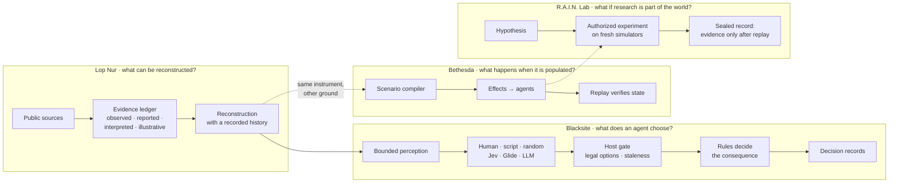
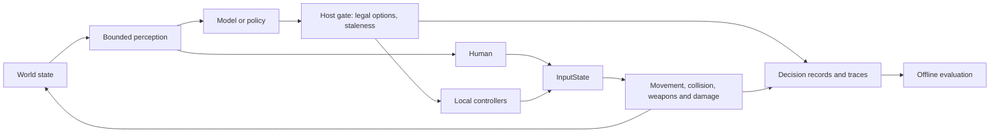

# Lop Nur Twin

**Explore the evidence. Take the controls. Follow the anomaly♟️.**

[](https://github.com/topherchris420/lop-nur-twin/actions/workflows/ci.yml)
[](LICENSE)
[](https://lop-nur-twin.vercel.app/)

[Explore Lop Nur](https://lop-nur-twin.vercel.app/) ·
[Play Blacksite](https://lop-nur-twin.vercel.app/play) ·
[Inspect the evidence](https://lop-nur-twin.vercel.app/analysis) ·
[Review an evaluation](https://lop-nur-twin.vercel.app/evaluation) ·
[Meet R.A.I.N.](https://rainlabteam.vercel.app/)


A desert airfield rebuilt from public sources, where every building can tell you
how it knows it belongs there. A first-person game on the same ground, where a
human, a script or a language model takes the same seat and every decision is
recorded. And, for anyone who goes looking, a second city beneath the first, with
a research lab behind a door.

That lab is not only another scene. It is the beginning of a different kind of
system: a bounded research environment in which a local open model can observe
a world, formulate questions, pick from experiments a person has pre-authorized,
have the host run them on fresh simulators, inspect replayable results,
preserve contradictions, and decide what to investigate next. The model supplies reasoning; the Lab supplies
the world, memory, constraints, authorization, simulation, provenance and
stopping rules.

Three worlds, one rule. **Geography comes from documented sources. Interpretation
is labelled. Simulated lives and events are fiction.** A model can propose an
action; the simulation decides its consequences; and nothing that happens in the
game or the city ever becomes evidence about the site.

> **When a system performs well, how much of what you saw came from its choices,
> its controllers, or its environment?** Everything here exists to make that
> question answerable — including the day a small hand-written script matched a live
> model's score and exposed the game instead.
> [Read what happened.](#the-result-that-changed-the-experiment)

**Contents** ·
[Why this matters](#why-this-is-more-than-a-digital-twin) ·
[Five minutes in](#five-minutes-in) ·
[One loop, four scales](#one-loop-four-scales) ·
[Quick start](#quick-start) ·
[The twin](#the-twin-a-reconstruction-that-shows-its-work) ·
[Blacksite](#blacksite-one-seat-many-minds) ·
[Bethesda](#enjoy-a-normal-walk-in-bethesda) ·
[The R.A.I.N. Lab](#a-lab-behind-a-door) ·
[Measure it yourself](#measure-it-yourself) ·
[What is built](#what-is-built) ·
[Development](#development-and-validation) ·
[Documentation](#documentation) ·
[License](#license-and-attribution)

## Why this is more than a digital twin

The interesting object here is not the model. **It is the loop around the model.**

Lop Nur Twin now contains an experimental research runtime in which a local
model can move through a bounded research cycle. It runs from the command line
(`npm run rain:autonomous`, not on the deployed site), needs a local
[Ollama](https://ollama.com) or [LM Studio](https://lmstudio.ai) server, and
runs only under a charter a person has authorized:

```text
observe
  ↓
ask what is unresolved
  ↓
form a hypothesis
  ↓
choose a permitted experiment
  ↓
host validates the proposal
  ↓
authorization policy admits it
  ↓
registry pre-registers its criteria
  ↓
fresh simulator runs it
  ↓
replay verifies what happened
  ↓
registry evaluates the result
  ↓
record the interpretation and uncertainty
  ↓
return to the research state
  ↓
ask the next question
```

This changes the role of the model. It is no longer only something the project
can ask a question. It can become a participant in an ongoing research process.
Its questions and hypotheses are kept as its own labelled words: the design that
runs, including the question and hypothesis it tests, is always one the host
wrote, and the host's experimenter seat, not the model, runs it.

But the autonomy is deliberately asymmetric:

| The model may                  | The Lab retains            |
| :----------------------------- | :------------------------- |
| Observe research state         | Definition of what can run |
| Form questions and hypotheses  | Authorization              |
| Rank permitted designs         | Simulation state           |
| Analyze sealed results         | Evidence provenance        |
| Recommend what to examine next | Registry verdicts          |
| Stop its own research session  | Budgets and termination    |

A charter binds the autonomous session to an exact set of experiment designs
(by digest), the model identity, the session ceilings and an expiry; the full
policy is described [with the lab](#a-lab-behind-a-door). The model cannot silently rewrite the
experiment, enlarge its own budget, change the simulator, promote an
interpretation into evidence, or grant itself new authority.

That distinction is the project's central wager:

> **Inference is not evidence. Evidence is not permission. Confidence is not authority.**

The result is deliberately closer to a laboratory than to an autonomous chatbot.
A researcher can be given room to explore without giving it the keys to the
building.

### Where the recursion could go (not implemented)

The current autonomous researcher is a single bounded lineage, and nothing in
the code creates new worlds. That lineage is the foundation for a more unusual
experiment the project has not built yet.

A future R.A.I.N. world could expose a typed, budgeted capability to instantiate a
descendant world:

```text
Researcher
   │
   ├── conducts experiments
   │
   └── proposes a new bounded world
             │
             ▼
        Child researcher
             │
             └── proposes another bounded world
```

Every generation would carry explicit identity, capabilities, parentage,
generation number, world constraints and provenance. A child would inherit a
capability envelope, not its parent's authority. The cycle could continue only
where the Lab explicitly permits the next generation to exist.

That is not a claim that intelligence becomes infinite. It is an experiment in
whether **research processes can generate new research environments while
remaining inspectable, reproducible and bounded**.

The hidden Lab in Bethesda is therefore more than an Easter egg. It is the
place where the project's different layers meet: evidence, simulation, models,
experiments, memory and agency, all under one provenance boundary.

The project can be explored as a game. It can be read as a digital twin. It can
be inspected as an evaluation harness. Increasingly, it can also be treated as
a small artificial research world.

## Five minutes in

Open [lop-nur-twin.vercel.app](https://lop-nur-twin.vercel.app/). No account, no
credentials, and the evidence tables work without WebGL.

1. **Press `L`.** The evidence lens paints every building and pavement by its
   status — observed, reported, interpreted or illustrative. Nothing in the
   model is observed but the runway measurements, and the scene now says so at
   a glance.
2. **Click the main assembly hangar**, or press `I` and pick it from the site
   index. Its dossier opens: classification, why it is in the model, what the
   evidence establishes, what is inferred, what is unknown, and when the claim
   entered the model.
3. **Drag the evidence timeline back.** At each date the scene draws solid only
   what public sources could support by then, outlines what the model places
   without public evidence yet, and hides the rest. An outline is absence of
   evidence, never evidence of absence.
4. **Press `M`** and click two points on the site map. The ruler reports
   distance and bearing in EPSG:32645, with only the positional error each
   endpoint's own evidence documents — ±40 m at the runway thresholds, usually
   "not stated" elsewhere.
5. **Press `2`** to walk the apron at ground level — the assembly hangar is
   126 m of wall — then **Play Blacksite** to cross the same ground under fire.
6. There is more down there. See [Find Bethesda](#find-bethesda).

Prefer tables to pixels? [`/analysis`](https://lop-nur-twin.vercel.app/analysis)
lists every claim with its sources, dates and uncertainty, and
[`/compare`](https://lop-nur-twin.vercel.app/compare) diffs any two revisions of
the model.

## One loop, four scales


```mermaid
flowchart LR
  subgraph LN["Lop Nur · what can be reconstructed?"]
    S["Public sources"] --> L["Evidence ledger<br/>observed · reported ·<br/>interpreted · illustrative"]
    L --> M["Reconstruction<br/>with a recorded history"]
  end
  subgraph BS["Blacksite · what does an agent choose?"]
    P["Bounded perception"] --> D["Human · script · random<br/>Jev · Glide · LLM"]
    D --> G["Host gate<br/>legal options · staleness"]
    G --> R["Rules decide<br/>the consequence"]
    R --> T["Decision records"]
  end
  subgraph BE["Bethesda · what happens when it is populated?"]
    C["Scenario compiler"] --> E["Effects → agents"]
    E --> RP["Replay verifies state"]
  end
  subgraph RL["R.A.I.N. Lab · what if research is part of the world?"]
    H["Hypothesis"] --> A["Authorized experiment<br/>on fresh simulators"]
    A --> SR["Sealed record:<br/>evidence only after replay"]
  end
  M --> P
  M -. "same instrument,<br/>other ground" .-> C
  E -.-> A
```

Every arrow leaves something you can open: a claim's sources, dates and
uncertainty in the claim inspector, and the revision of this repository it
entered in; a decision's observation, options, choice and aftermath in the
decision inspector; a city run's commands in its replay; a lab result's
definition, authorization and re-simulation in its sealed record. Nothing moves
right to left: a simulated outcome is never evidence about the site, and a
model's answer is never a fact about the world.

| Experience              | What you can do                                                                                                        | What it establishes                                                                           |
| :---------------------- | :--------------------------------------------------------------------------------------------------------------------- | :-------------------------------------------------------------------------------------------- |
| **The analytical twin** | Inspect structures, trace sources, measure the site, export data, and compare revisions.                               | A reconstruction near Lop Nur (~40.77° N, 89.28° E), with explicit evidence and uncertainty.  |
| **Blacksite**           | Play the airfield yourself or give the same seat to Jev, Glide, a compatible LLM, a script, or a seeded random policy. | How choices, controllers and environment interact under declared game rules.                  |
| **Bethesda**            | Discover a walkable city, introduce bounded scenarios and replay its decisions.                                        | A separate city simulation grounded in mapped streets, building footprints and broad terrain. |
| **The R.A.I.N. Lab**    | Ask a question, watch four perspectives meet, authorize an experiment and replay its sealed record.                    | A research loop whose every step — proposal, authorization, run, verdict — is recorded.       |

Blacksite shares the twin's geometry and cannot write to its evidence ledger.
Bethesda has its own geography and simulation; it does not share Blacksite's
combat physics. The lab holds the live city read-only and runs its experiments
on simulators of its own.

## Quick start

Use **Node.js 22.18 or newer** and npm, or Bun.

```sh
git clone https://github.com/topherchris420/lop-nur-twin.git
cd lop-nur-twin
npm ci
npm run dev
```

Open [localhost:5173](http://localhost:5173) for the twin, or
[localhost:5173/play](http://localhost:5173/play) for Blacksite. Bun users can run
`bun install` and `bun run dev`.

Exploration, human play, scripted policies, and Bethesda's rules-only simulation
need no model credentials. To connect a model, copy [`.env.example`](.env.example)
to `.env.local`, configure the server-side provider, then restart the dev server:

| Model              | Configuration                                                                                | Entry point                                          |
| :----------------- | :------------------------------------------------------------------------------------------- | :--------------------------------------------------- |
| **TypeSafe Jev**   | `TYPESAFE_API_KEY`; optional `TYPESAFE_MODEL`                                                | `/play?brain=jev`, or enable **Jev** inside Bethesda |
| **Fastino Glide**  | `FASTINO_API_KEY`; optional `FASTINO_MODEL` (default `fastino/glide`)                        | `/play?brain=glide`                                  |
| **Compatible LLM** | `LLM_PROVIDER`, `LLM_API_KEY`, `LLM_MODEL`; `LLM_BASE_URL` for an OpenAI-compatible endpoint | `/play?brain=llm`                                    |

The R.A.I.N. Lab inside Bethesda needs no configuration: its research runtime
runs inside this repository's own server process (`/api/rain/*`). A local model
for its meetings and the TypeSafe engine for its bounded decisions are server-side
settings too, `RAIN_*` in `.env.example` (see the
[lab guide](docs/RAIN_LAB_BETHESDA.md#running-live)), and so is the local model
its [autonomous research loop](docs/RAIN_LAB_BETHESDA.md#autonomous-research)
runs with. The LLM adapter
supports Anthropic and OpenAI-compatible providers. Keys stay on
the server; never prefix them with `VITE_`. Enabling a live model can spend API
credit. Automated live runs require a separate opt-in; offline checks use test
doubles.

## The twin: a reconstruction that shows its work

The twin makes its evidence inspectable. Select a structure to open its dossier,
follow the source, inspect dates and uncertainty, or move to the semantic table
at [`/analysis`](https://lop-nur-twin.vercel.app/analysis). Compare release
manifests at [`/compare`](https://lop-nur-twin.vercel.app/compare).


- **Claims carry a status:** observed, reported, interpreted, or illustrative.
  The ledger is derived from the layout and source register. Build validation
  rejects unsupported classifications, missing citations, a source dated before
  the observation it attests, and wording that presents interpretation as
  verification.
- **The picture carries the status too.** The evidence lens (`L`, or
  `?lens=1`) paints every building and pavement in the scene and on the site
  map by its classification — a tint, the status glyph on the map, and a line
  pattern on every edge that is solid for observed and more broken down the
  ranks, so it reads in greyscale. At a past timeline date it paints the
  status that was knowable then. Nothing in the model is observed but the
  runway measurements, and with the lens on the scene says so at a glance; the
  legend and `/analysis` print the same tally for anyone who cannot see the
  paint.
- **Every claim can be inspected** — buildings, pavements, the runway
  measurements (the model's only observed claims), the terrain proxy, the
  climatology and the illustrative scenario elements. The claim inspector, in
  the dossier and inline at `/analysis?structure=<id>` or `?claim=<id>`, says
  what the evidence establishes, what is inferred, what is unknown, which
  sources support it and which only describe a method, and when it became
  knowable.
- **The model has a recorded history.** `model-history/` holds the manifest of
  every model-changing commit since the first that digested each subject,
  reproduced byte for byte from its own commit; the build refuses a model that
  is not its latest revision. So the inspector says when a claim entered the
  model and what has changed since, and `/compare?before=r2&after=r3` opens any
  two revisions.
- **Time is evidence time.** The evidence timeline steps through the dates the
  evidence changed. At each one the scene draws solid only what was publicly
  established by then, outlines what the model places but no public evidence
  yet supported, and hides the rest. A claim is knowable no earlier than its
  evidence.
- **Unknown stays unknown.** Missing uncertainty is “not stated,” never zero.
  Site-event, evidence-publication and model-entry dates remain separate.
- **Measurements have a frame.** Distances and bearings use EPSG:32645, with
  WGS84 GeoJSON, CSV and JSON exports. Each endpoint carries the positional
  error its own evidence states — ±40 m at the runway thresholds, usually "not
  stated" elsewhere — never a site-wide figure. Release manifests hash geometry
  and the evidence ledger so revisions can be compared.
- **The evidence works without WebGL.** Analysis and comparison have semantic
  interfaces, with browser checks for accessibility.


Facility identities include project hypotheses. Terrain is a seeded proxy, not
survey elevation; runway ends carry approximately 40 m of uncertainty; fences and
utilities are illustrative. Confidence scores are ordinal ranks, not probabilities.
The reconstruction is a way to inspect claims, not confirmation of the site's
purpose or activity.

Start with [data provenance](docs/DATA_PROVENANCE.md), the
[site model](docs/SITE_MODEL.md) and the
[uncertainty model](docs/UNCERTAINTY_MODEL.md), or read the
[white paper](docs/WHITE_PAPER.md) for the long-form argument.

## Blacksite: one seat, many minds

Blacksite turns the airfield into a fictional first-person game and an instrument
for examining decisions. Human and automated players use the same movement,
collision, weapons and damage pipeline. Every brain writes the `InputState`
that a keyboard and mouse would fill; none can award damage, move an actor
directly or invent a result.



```mermaid
flowchart LR
  World["World state"] --> Perception["Bounded perception"]
  Perception --> Human["Human"]
  Perception --> Brain["Model or policy"]
  Brain --> Gate["Host gate: legal options, staleness"]
  Gate --> Controls["Local controllers"]
  Human --> Input["InputState"]
  Controls --> Input
  Input --> Rules["Movement, collision, weapons and damage"]
  Rules --> World
  Gate --> Record["Decision records and traces"]
  Rules --> Record
  Record --> Offline["Offline evaluation"]
```

Observation, decision, validated input, environment transition, consequence,
trace: a brain proposes, the host refuses any option the observation did not
offer or that has gone stale, and the same rules a keyboard meets decide what
happens. Every decision is recorded with the observation it was made from;
**Save decisions** exports an episode's records, and `/evaluation` opens the
archived ones in place and steps through them one decision at a time: what the
seat perceived, what it could choose, what it chose, how sure it said it was
(and from what), whether it was still legal, what executed and what followed.
Where a reason would go, it says none is recorded — a seat returns a choice,
not an explanation, and none is invented for it.

| Seat     | URL setting                                     | Role                                                                 |
| :------- | :---------------------------------------------- | :------------------------------------------------------------------- |
| Human    | `?brain=human`                                  | Keyboard and mouse                                                   |
| Jev      | `?brain=jev`                                    | TypeSafe decisions through a server-built question                   |
| Glide    | `?brain=glide`                                  | Fastino decisions, asked Jev's question word for word                |
| LLM      | `?brain=llm`                                    | A configured language model answering from the same question content |
| Scripted | `?brain=script&policy=marksman` or `skirmisher` | Legible reference strategies                                         |
| Random   | `?brain=random`                                 | Seeded choices among legal controls                                  |
| Replay   | `?brain=replay`                                 | A recorded control stream                                            |

Press **H** to take the seat back. See [controls](docs/CONTROLS.md) for the full
keyboard, touch and URL reference.

### Separate the decision from the execution

Under precision control, the brain chooses a visible target, an aim region and
whether to fire; a local motor controller executes at frame rate. With places
navigation, it chooses a destination from bounded observations and a navigator
walks there through the same movement inputs. Neither controller chooses the
target or destination.

Human field notes expose the same place facts: bearing, distance, cover from
known threats and sampled route exposure. Places must pass standing-clearance and
straight-route checks. The search is local, not general pathfinding, and “hidden”
does not mean safe from unseen enemies.

Shared perception rules constrain enemy information, but humans see pixels and
hear sounds while models receive structured observations. Jev, Glide and the
LLM also have different response formats and timing limits: Glide may answer up
to 8 seconds late where Jev has 1.5, and the LLM 12. Those differences belong in
the result, alongside the controller, navigation mode and seat rules.
`?seat=even` removes the default seat assistance for comparisons.

After a match, the debrief distinguishes deaths where an enemy was never seen,
seen but not engaged, or engaged in a lost exchange. It reads authoritative
outcomes after the action; it never feeds privileged information back to a model
mid-match.

### The result that changed the experiment

The first matched benchmark produced an impressive score: live Jev, aided by the
precision controller, killed 148 bots without dying or moving. Then the same
strategy was written as a small script and tested on the same seeds.

| Historical build · seeds 42–44 · 3 × 120 seconds | Kills / deaths | Distance moved | Mean engagement range |
| :----------------------------------------------- | -------------: | -------------: | --------------------: |
| Live Jev, precision control                      |        148 / 0 |            0 m |                 103 m |
| Scripted marksman, same controller               |        153 / 0 |            0 m |                 109 m |

**The script matched the model. The result exposed the environment:** distant,
stationary shooting was too effective against bots crossing open ground.

Heat shimmer, bot exposure behaviour and explicit seat rules followed. The
marksman's kill rate roughly halved, but it still survived those runs. That is
an unresolved limitation, not a solved benchmark. Later, offering Jev named
places instead of movement steps made it walk over a kilometre across three
episodes — and nearly stop fighting. Changing what a model can choose changes
what its score means.

These are small, historical experiments, not current performance promises or
general model rankings. Early hit counters counted body strikes rather than
unique rounds, so their accuracy percentages are omitted. See the
[archived caveats](docs/benchmarks/2026-09-27/README.md),
[full benchmark account](docs/JEV_BLACKSITE.md#benchmark-methodology-and-results)
and [place-clearance experiment](docs/benchmarks/2026-09-30/README.md).

### Two live models, ten seeds

Fastino's Glide answers the same question Jev does, so the two can share
matched experiments. Each was declared before it ran, on ten two-minute seeds
with no seat assistance.

| 5 Oct 2026 · seeds 42–51 · 10 × 120 s · even rules | Kills / deaths | Decisions | Median round trip | Metres moved |
| :------------------------------------------------- | -------------: | --------: | ----------------: | -----------: |
| Jev (TypeSafe), precision controller               |         28 / 4 |     4,744 |            208 ms |        3,080 |
| Glide (Fastino), precision controller              |        37 / 10 |       960 |            810 ms |        1,120 |
| Scripted marksman, precision controller            |        267 / 0 |     5,303 |             19 ms |            0 |
| Jev, aiming for itself                             |          1 / 8 |     4,656 |            212 ms |        3,008 |
| Glide, aiming for itself                           |         1 / 13 |       758 |            791 ms |          598 |

**Glide died more, as predicted.** With the precision controller, Glide's
deaths per minute exceeded Jev's by 0.30 (95% interval 0.12 to 0.48). It spent
more time in enemy sight lines and moved a third as far. Kills did not
separate.

**Without the controller, neither model could fight.** Each scored one kill in
twenty minutes, no better than a random policy. That prediction, that Jev's
faster decisions would let it out-aim Glide, failed. A precision result is the
model's choice of whom to fight plus the controller's aim.

**The hand-written marksman beat both by a wide margin while never moving.**
The game still rewards standing still at range. Ten seeds are exploratory,
not a ranking. The [full account](docs/benchmarks/2026-10-05/README.md) has
every episode, the paired differences, calibration, and the two-seed smoke test
that came first.

**Same observations, other minds.** Matched seeds diverge within seconds, but
every decision record keeps the observation it was made from, so the recorded
observations can be shown to the scripted policies and compared choice by
choice, against the exact agreement a uniform chooser would reach. The random
seat sits at chance on every axis, as a control should. In the even-rules run,
where the aim point was a real choice, Glide chose centre mass in 95% of those
decisions; the marksman chose the head in 98% of its own, and Jev in 64%. This
is agreement on identical inputs, not a counterfactual outcome and not a skill
score ([method](docs/EVALUATION_PHILOSOPHY.md#same-observations-other-minds),
[tables](docs/benchmarks/2026-10-05/README.md#same-observations-other-minds)).

## Enjoy a normal walk in Bethesda

Bethesda is the ordinary counterpoint to the desert: shopfronts, sidewalks,
traffic, parks and people going about their routines. It's an explorable
procedural reconstruction of downtown Bethesda, Maryland, with a separate
simulation beneath it.


_Street-level exploration in the running application. Buildings and street detail are procedural; mapped geography anchors the scene._


_Survey mode reveals the downtown layout and courtyard blocks. Both screenshots show the actual application with its interface and map attribution visible._

### Find Bethesda

<details>
<summary><strong>Discovery spoiler</strong></summary>

From the twin at `/`, press **backtick** (the key below Escape on a US keyboard).
Enter `38.9847,-77.0947` or `resolve bethesda`, then submit. Or open the **Site
Index** (`I`) and type Bethesda's coordinates into its search.

The anomaly transition unmounts the desert and loads the city. Bethesda has no
separate public route or main-menu mode button, and ordinary twin visits do not
load its geographic data. **Return to the desert** — or the browser's Back —
takes you back.

</details>

Walk with **WASD**, use **Shift** to move faster, and drag to look. **Survey**
offers orbit controls; **Pedestrian seat** follows an actor and lets you choose
from its permitted actions. Free walking is exploration, not a human-versus-model
comparison seat. On a touch screen a thumb-stick walks and a drag looks, in the
city and in the lab; in the city every step is the same recorded command as one
taken on WASD.

### Introduce a scenario

Inside the city, open **~ telemetry** or press backtick to introduce a scenario.
A deterministic rule compiler (not a language model) turns the request into
typed events at real places — any mapped street, intersection, named building,
park, monument or storefront — and shows the compiled event before the world
reacts through generic effects (closures, hazards, attractions, shelter, dark
signals, dispatch):

| Try                                                        | What emerges                                                                   |
| :--------------------------------------------------------- | :----------------------------------------------------------------------------- |
| `Fire near Bethesda Row.`                                  | Responders from the mapped rescue squad, perimeter posts, detours, watchers    |
| `A thunderstorm suddenly rolls through downtown Bethesda.` | Rain, lightning, wet streets, slower traffic and shelter-seeking               |
| `The Metro station closes unexpectedly.`                   | Commuters waiting or re-routing to real bus stops                              |
| `A parade starts on Wisconsin Avenue.`                     | A moving procession and rolling closure along the mapped avenue                |
| `A strange unidentified object appears above Bethesda.`    | An overhead object, onlookers recording, a police response                     |
| `Car crash at Woodmont and Bethesda Ave`                   | A closure at the real intersection, an ambulance, queues and detours           |
| `Power outage downtown for 5 minutes`                      | Dark signals and all-way stops                                                 |
| `Flash flood near the Farm Women's Market`                 | Streets below a water level on the real bare-earth DTM close; people move away |

Twelve families in all, with intensity and duration modifiers. Places outside
the extract are refused, not relocated. None of this is a fire, weather,
flooding, crowd or public-safety model.

**Real geography, explicit approximation.** The bundled OpenStreetMap derivative
contains 1,166 building footprints, mapped roads and walking paths, parks,
crossings and Metro entrances across roughly 1.3 × 1.4 km. A separate
streetscape layer adds 370 storefront names, the Madonna of the Trail and public
art, bus stops and 17 bus routes (the Bethesda Circulator, Ride On and WMATA),
and the Purple Line works; buses drive those routes. A 65 × 65 crop of
Montgomery Planning's bare-earth elevation data provides broad slopes.
Façades, many heights, street furniture, people and traffic behaviour are
inferred or procedural. Terrain samples do not resolve curbs and stairs; there
are no surveyed interiors or claims of photorealism. Field notes expose sources,
limitations and downloads of the geographic data.

**Bounded decisions, verifiable replay.** Humans in the pedestrian seat and
optional Jev proposals pass through the city's permitted-action gate, which
says what it did with each choice; an agent indoors takes no choice from
anyone. Deterministic code retains routing, collisions, traffic and event
mechanics. Jev is off by default; no live Jev Bethesda result is claimed. Export
a replay before leaving, then re-import it to verify checkpoints, decision
history and final simulation state without calling a model. This verifies
state, not identical rendered pixels.

Read the [Bethesda guide](docs/BETHESDA_ANOMALY.md) for provenance, terrain,
scenario limits, model authority and replay compatibility.

### A lab behind a door

[](https://rainlabteam.vercel.app/)

Somewhere in the city is the R.A.I.N. Lab, an integrated research environment
where the four perspectives of R.A.I.N. investigate questions and their
hypotheses become matched experiments on the simulator. Its research runtime,
experiment registry, evidence layer and simulation interface live in this
repository (`src/rain/`, `src/bethesda/rain/`); this is the lab's canonical
home.

R.A.I.N. — the Recursive Architecture of Intelligent Nexus — is Vers3Dynamics'
open-source, local-first research-meeting system, and it has a front door of
its own at **[rainlabteam.vercel.app](https://rainlabteam.vercel.app/)**. There,
four AI perspectives argue a question from your own papers, quote them
verbatim, and end with a verdict, the open disagreement and a next move. The
runtime in this repository was ported from R.A.I.N.'s own code
(`topherchris420/james_library`, MIT); the [migration note](docs/RAIN_MIGRATION.md)
records what was incorporated, what was left behind and against which commit.
Here the same four perspectives meet inside a simulated city, and their
hypotheses have somewhere to run.


_The Research Panel after a question to the runtime this site's server holds. The meeting is the offline engine's, labelled scripted with no model run; the plates read "unresolved" because the corpus grounding was partial, and they say so in words beside the picture._

Its interior is fictional and its pictures are not evidence; every run needs a
person's authorization of the exact definition, runs on separate simulators
rather than the city you are in, and is recorded so it can be re-simulated
without contacting anything. Its results describe the simulator, not Bethesda.
Its DEMO is labelled as a recording; LIVE, a meeting comes from the runtime's
scripted offline engine or, when a local model server is configured, from a
model meeting such as Qwen's, and every turn says which wrote it. R.A.I.N. has
no face there: it is seen through a Chladni plate instrument, its figures (after
the Vers3Dynamics Cymatics studio) following the runtime's state — deliberation,
convergence, uncertainty, an experiment, a result, and a case waiting for a
person — and never standing for evidence.


_The same question's experiment after a person authorized it, run on three matched seeds and verified by replay. In frame: what the record cannot establish, where every part of it came from, and each arm re-simulated._

**A mathematical substrate beside the evidence.** R.A.I.N. also holds a
version-pinned, read-only index of [`openai/math`](https://github.com/openai/math)
— 372 result families, 722 manuscripts and 235 Lean scope pages at one commit,
indexed from the repository's own catalogue, its manuscripts and Lean sources
left where they are. In the Research Panel R.A.I.N. searches it for a question,
challenges a candidate hypothesis with the counterexamples, bounds and
conditional results it holds, and shows each result's status — Lean
formalization present (not checked here), manuscript, reasoning summary (not a
proof) — with the commit it came from. A person cites results in a proposal with
a stated relation and the assumptions that connect them to the simulator; the
citation is sealed into the definition a person authorizes and the record replay
checks, and the runtime refuses a citation from another revision. Mathematics
frames hypotheses; it never becomes evidence, never authorizes a run and never
changes a result: mathematical substrate ≠ evidence corpus, mathematical result
≠ empirical result, Lean formalization ≠ empirical validation, hypothesis ≠
conclusion.

**Human-directed, model-directed, autonomous.** Research in the lab is directed
in one of three ways. A person proposes an experiment and authorizes its exact
definition; or R.A.I.N. proposes one — its bounded router choosing among the
host's options, informed by a scripted or local-model meeting — and a person
authorizes it; or R.A.I.N. runs **autonomously**: `npm run rain:autonomous`
puts a local open model, served by [Ollama](https://ollama.com) or
[LM Studio](https://lmstudio.ai), in R.A.I.N.'s researcher and analyst seats
and lets it observe the research state, propose, run, read and record
experiments in a loop, within budgets, until one is spent or nothing worth
running remains. Autonomy moves the person's review rather than removing it: a
person authorizes a **charter** — the exact experiment designs the loop may
run, by digest, with the model and the ceilings — and a deterministic policy
admits each proposal under it, or refuses it with its reasons. The model never
writes a definition, never decides a verdict and never touches the evidence:
its questions, hypotheses and interpretations are kept as its words, labelled,
beside sealed, replayable records whose verdicts are the registry's
pre-registered criteria.

```sh
ollama pull qwen2.5:7b      # or load a model in LM Studio and start its server
export RAIN_MODEL_PROVIDER=ollama RAIN_MODEL=qwen2.5:7b   # lmstudio / the name LM Studio lists
npm run rain:autonomous -- --dry-run                      # what it would run; runs and writes nothing
npm run rain:autonomous -- --charter                      # the charter to review, with its digest
RAIN_AUTONOMY_ENABLED=true npm run rain:autonomous -- --authorize <first 8 characters> --reviewed
```

Read the [R.A.I.N. Lab guide](docs/RAIN_LAB_BETHESDA.md) for meetings,
experiments, authorization, replay,
[autonomous research](docs/RAIN_LAB_BETHESDA.md#autonomous-research) and
[the mathematical substrate](docs/RAIN_LAB_BETHESDA.md#the-mathematical-substrate).

## Measure it yourself

The central question is: **when a system performs well, how much of what you
observed came from its choices, its controllers or its environment?**

The evaluation harness records observations, legal options, decisions, validation,
execution and outcome windows. Versioned contracts score outcomes offline.
Confidence retains its source; unknown tokens, prices and confidence remain
`null`. Experiments declare their hypothesis, primary metric, seeds, arms and
controls before they run.

With the dev server running, use a second terminal:

```sh
# Validate a declared experiment without running it
node tools/experiment.mjs tools/experiments/exposure.json --dry-run

# Run offline arms on matched seeds
node tools/experiment.mjs tools/experiments/exposure.json
node tools/experiment.mjs tools/experiments/places.json
node tools/experiment.mjs tools/experiments/place-clearance.json

# Compare saved evaluations
node tools/experiment.mjs --compare before/evaluation.json after/evaluation.json

# Run a single reference policy
node tools/jev-benchmark.mjs --brain script --policy marksman --control precision

# Show a run's recorded observations to the scripted policies (no match, no model)
node tools/experiment.mjs --shadow docs/benchmarks/2026-10-05/glide-jev-even
```

Read saved evaluations at [`/evaluation`](https://lop-nur-twin.vercel.app/evaluation).
Automated live Jev runs require `JEV_LIVE_TEST=1`; live Glide runs require
`FASTINO_LIVE_TEST=1`; live LLM runs require `LLM_LIVE_TEST=1` in the runner's
environment, plus server credentials.
Unflagged live experiment arms remain pending.

Same seeds pair initial conditions, not identical Blacksite trajectories:
browser frame pacing makes matches diverge. Runs report individual episodes and
flag simulation lag. Three-seed runs are exploratory; the harness also offers
10- and 30-seed presets. A controller-assisted score is never the model's skill
alone, and a result here establishes nothing about real-world tactics or the
actual Lop Nur site.

Read [evaluation philosophy](docs/EVALUATION_PHILOSOPHY.md) before interpreting
a comparison, and [the seat and harness guide](docs/JEV_BLACKSITE.md) to reproduce
or extend one.

## What is built

| Part                                                                                                | Status                                     | Notes                                                                                             |
| :-------------------------------------------------------------------------------------------------- | :----------------------------------------- | :------------------------------------------------------------------------------------------------ |
| Evidence ledger, claim inspector, evidence timeline, `/analysis`, `/compare`, release manifests     | **Implemented**                            | Build-gated by the evidence validator; both front doors gated by accessibility checks             |
| Recorded model history (`model-history/`)                                                           | **Implemented**                            | Begins at the first per-subject manifest (2026-08-05); earlier entry dates are unknown            |
| Blacksite: simulation, human play, scripted and random seats, replay                                | **Implemented**                            | Replay re-performs a control stream; same-seed runs diverge, so it is not a state replay          |
| Decision records and the one-decision inspector on `/evaluation`                                    | **Implemented**                            | Records are validated on load; the human seat records none                                        |
| Jev, Glide and LLM seats                                                                            | **Implemented** · results **experimental** | Need server credentials; ten-seed runs are exploratory, not rankings                              |
| Evaluation harness: declared experiments, outcome contracts, shadow agreement                       | **Implemented**                            | Offline; a result describes this build on the machine that ran it                                 |
| Bethesda city simulation, scenarios and replay                                                      | **Implemented**                            | Illustrative rules; not a fire, weather, flooding, crowd or public-safety model                   |
| Jev inside Bethesda                                                                                 | **Implemented** · **experimental**         | Off by default; no live Bethesda run is claimed                                                   |
| R.A.I.N. Lab: DEMO, offline meetings, authorized experiments, sealed records, replay                | **Implemented**                            | On Vercel, certified pre-registrations need `RAIN_REGISTRY_SECRET`; run records stay per instance |
| R.A.I.N. model meetings                                                                             | **Experimental**                           | Need a local model server and one long-lived process                                              |
| R.A.I.N. autonomous research loop (`npm run rain:autonomous`, Ollama or LM Studio)                  | **Implemented** · **experimental**         | Runs only under a charter a person authorized; CLI only; small local models propose poorly        |
| R.A.I.N. mathematical substrate (`openai/math`, pinned): search, challenge, inspection, citations   | **Implemented**                            | Lexical search; relations are a person's; Lean is indexed, never compiled; one commit at a time   |
| Parked game-mode work (`experiments/game-modes/`): killstreaks, mode-aware spawns, grid pathfinding | **Scaffolded**                             | Outside `src/`; not built, typed or shipped. The four playable modes are in `src/game/modes/`     |
| Server-backed evidence API, authentication, audit log                                               | **Deferred**                               | Recommended only — see [future backend](docs/FUTURE_BACKEND.md)                                   |

## Development and validation

Built with TypeScript, React, Three.js / React Three Fiber, Vite and TanStack
Router. Rendering, simulation state, evidence and remote decision endpoints have
separate responsibilities. Everything on screen is procedural and seeded: no
binary assets, no runtime downloads, and a given seed always reproduces the
same site.

```sh
npm run build          # validate both geographies, manifest, bundle, types, secret scan
npm run format:check
npm run lint
npm run test:run
npm run test:evidence
npm run test:bethesda
npm run model:verify   # reproduce every recorded model revision from its own commit (Bun, full history)
npm run shots          # recapture the documentation screenshots from the running app
```

With Bun, `bun run check` combines formatting, lint, unit tests, evidence tests and
the build. Browser suites cover gameplay, model test doubles, accessibility,
routes and Bethesda's discovery/scenario/replay flow. See
[validation](docs/VALIDATION.md) and the
[Bethesda verification guide](docs/BETHESDA_ANOMALY.md#replay-and-verification)
for server requirements and commands.

```text
src/lib/            Lop Nur layout, sources, evidence, coordinates and analysis
src/components/     Analytical scene and interface
src/game/           Blacksite simulation, player, bots, weapons and HUD
src/game/pilot/     Observations, decisions, controllers, navigation and debrief
src/game/eval/      Experiment definitions, outcome contracts and evaluation
src/bethesda/       City geography, terrain, simulation, scenarios and replay
src/bethesda/rain/  The R.A.I.N. Lab: protocol, experiments, records and rooms
src/rain/           The R.A.I.N. research runtime: corpus, meetings, decisions, registry,
                    the mathematical substrate (src/rain/mathematics/) and the
                    autonomous researcher (src/rain/autonomy/)
server/, api/       Server-side Jev, Glide, LLM and R.A.I.N. endpoints
tools/              Browser checks, experiments, benchmarks and diagnostics
docs/               Methods, limitations, guides and archived evidence
```

Before contributing, read [AGENTS.md](AGENTS.md) and
[CONTRIBUTING.md](CONTRIBUTING.md). Changes should preserve the evidence
boundary, bounded model authority and a working build. Gameplay changes need
matched experiments that show what changed.

## Documentation

| Start here                                                                                                                             | For                                                |
| :------------------------------------------------------------------------------------------------------------------------------------- | :------------------------------------------------- |
| [White paper](docs/WHITE_PAPER.md)                                                                                                     | The long-form argument for the reconstruction      |
| [Blacksite](docs/BLACKSITE.md) · [Controls](docs/CONTROLS.md)                                                                          | Playing, mechanics and navigation                  |
| [Jev, Glide, LLMs and the player seat](docs/JEV_BLACKSITE.md)                                                                          | Providers, controllers, traces and benchmarks      |
| [Evaluation philosophy](docs/EVALUATION_PHILOSOPHY.md)                                                                                 | What a result can support — and how it can mislead |
| [The Bethesda anomaly](docs/BETHESDA_ANOMALY.md)                                                                                       | Discovery, city scenarios, geography and replay    |
| [The R.A.I.N. Lab](docs/RAIN_LAB_BETHESDA.md) · [Runtime migration](docs/RAIN_MIGRATION.md)                                            | Meetings, experiments, authorization and replay    |
| [R.A.I.N. Lab site](https://rainlabteam.vercel.app/)                                                                                   | R.A.I.N. itself: local-first research meetings     |
| [The mathematical substrate](docs/RAIN_LAB_BETHESDA.md#the-mathematical-substrate)                                                     | Mathematics as context: status, relation, basis    |
| [Data provenance](docs/DATA_PROVENANCE.md) · [Uncertainty](docs/UNCERTAINTY_MODEL.md)                                                  | Sources, classifications and limits                |
| [Spatial analysis](docs/SPATIAL_ANALYSIS.md) · [Temporal model](docs/TEMPORAL_MODEL.md) · [Model comparison](docs/MODEL_COMPARISON.md) | Measurements, dates, exports and revisions         |
| [Architecture](docs/SYSTEM_ARCHITECTURE.md) · [Validation](docs/VALIDATION.md) · [Accessibility](docs/ACCESSIBILITY.md)                | Implementation, checks and what is actually tested |
| [Deployment](docs/DEPLOYMENT.md) · [Threat model](docs/THREAT_MODEL.md) · [Security](SECURITY.md)                                      | Hosting, credentials and trust boundaries          |
| [Government evaluation guide](docs/GOVERNMENT_EVALUATION.md)                                                                           | What this can and cannot be used for, in an hour   |

## License and attribution

Source code and documentation are licensed under [Apache 2.0](LICENSE).
Referenced Lop Nur sources and their attribution are described in [NOTICE](NOTICE).

Bethesda's bundled geographic data has separate terms: **© OpenStreetMap
contributors**, distributed under ODbL 1.0; and **© Montgomery County Planning
Department, MNCPPC**, for the elevation crop under the publisher's attribution
terms. See the [geographic data license](src/bethesda/data/LICENSE.md),
[OSM source register](src/bethesda/data/source.json) and
[terrain source register](src/bethesda/data/terrain-source.json) and
[streetscape source register](src/bethesda/data/streetscape-source.json). Reference
photographs are not bundled imagery or achieved renders.

The R.A.I.N. research runtime under `src/rain/` is a TypeScript port of
R.A.I.N.'s own code in [`topherchris420/james_library`](https://github.com/topherchris420/james_library)
(MIT, Copyright (c) 2026 Vers3Dynamics), and the bundled corpus and SOUL files
in `src/rain/data/` are imported from it with per-file hashes in
[`src/rain/data/source.json`](src/rain/data/source.json). R.A.I.N.'s public
home is [rainlabteam.vercel.app](https://rainlabteam.vercel.app/). The
mathematical substrate index is derived from the
catalogue of [`openai/math`](https://github.com/openai/math) (Apache 2.0) at the
commit it names: titles, summaries, abstracts, citations, attribution notes and
Lean declaration names, reformatted, with no manuscript, LaTeX, Lean source or
reasoning summary copied. Its licence is reproduced beside it
([`src/rain/mathematics/data/LICENSE.md`](src/rain/mathematics/data/LICENSE.md));
[NOTICE](NOTICE) says what was derived.
