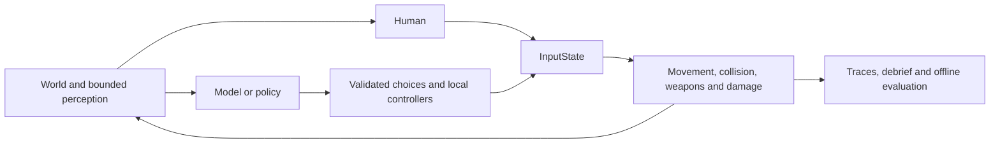

# Lop Nur Twin

**Explore the evidence. Take the controls. Follow the anomaly.**

Lop Nur Twin brings together a public-source reconstruction of a desert airfield,
a playable experiment in machine decision-making, and a hidden simulation of
downtown Bethesda, Maryland. Each asks a different question: **what do we know,
what did the agent choose, and what happened because of it?**

The boundary matters. Geography comes from documented sources; interpretation is
labelled; simulated lives and events are fiction. A model can propose an action.
The simulation decides its consequences.

[Explore Lop Nur](https://lop-nur-twin.vercel.app/) ·
[Play Blacksite](https://lop-nur-twin.vercel.app/play) ·
[Inspect the evidence](https://lop-nur-twin.vercel.app/analysis) ·
[Review an evaluation](https://lop-nur-twin.vercel.app/evaluation)


| Experience               | What you can do                                                                                                | What it establishes                                                                           |
| :----------------------- | :------------------------------------------------------------------------------------------------------------- | :-------------------------------------------------------------------------------------------- |
| **The analytical twin**  | Inspect structures, trace sources, measure the site, export data and compare revisions.                        | A reconstruction near Lop Nur (~40.77° N, 89.28° E), with explicit evidence and uncertainty.  |
| **Blacksite**            | Play the airfield yourself or give the same seat to Jev, a compatible LLM, a script or a seeded random policy. | How choices, controllers and environment interact under declared game rules.                  |
| **The Bethesda anomaly** | Discover a walkable city, introduce bounded scenarios and replay its decisions.                                | A separate city simulation grounded in mapped streets, building footprints and broad terrain. |

Blacksite shares the twin's geometry and cannot write to its evidence ledger.
Bethesda has its own geography and simulation; it does not share Blacksite's combat
physics.

[Quick start](#quick-start) · [The twin](#the-analytical-twin) ·
[Blacksite](#blacksite-one-seat-many-minds) · [Bethesda](#the-bethesda-anomaly) ·
[Experiments](#measure-it-yourself) · [Documentation](#documentation)

## Quick start

Use **Node.js 22.18 or newer** and npm, or Bun.

```sh
git clone https://github.com/topherchris420/lop-nur-twin.git
cd lop-nur-twin
npm ci
npm run dev
```

Open [localhost:5173](http://localhost:5173) for the twin, or
[localhost:5173/play](http://localhost:5173/play) for Blacksite. Bun users can run
`bun install` and `bun run dev`.

Exploration, human play, scripted policies and Bethesda's rules-only simulation
need no model credentials. To connect a model, copy [`.env.example`](.env.example)
to `.env.local`, configure the server-side provider, then restart the dev server:

| Model              | Configuration                                                                                | Entry point                                          |
| :----------------- | :------------------------------------------------------------------------------------------- | :--------------------------------------------------- |
| **TypeSafe Jev**   | `TYPESAFE_API_KEY`; optional `TYPESAFE_MODEL`                                                | `/play?brain=jev`, or enable **Jev** inside Bethesda |
| **Compatible LLM** | `LLM_PROVIDER`, `LLM_API_KEY`, `LLM_MODEL`; `LLM_BASE_URL` for an OpenAI-compatible endpoint | `/play?brain=llm`                                    |

The R.A.I.N. Lab inside Bethesda reaches a R.A.I.N. backend the same way:
`RAIN_BACKEND_URL` and an optional `RAIN_BACKEND_TOKEN`, on the server only (see
the [lab guide](docs/RAIN_LAB_BETHESDA.md#running-live)). The LLM adapter
supports Anthropic and OpenAI-compatible providers. Keys stay on
the server; never prefix them with `VITE_`. Enabling a live model can spend API
credit. Automated live runs require a separate opt-in; offline checks use test
doubles.

## The analytical twin

The twin makes its evidence inspectable. Select a structure to open its dossier,
follow the source, inspect dates and uncertainty, or move to the semantic table
at [`/analysis`](https://lop-nur-twin.vercel.app/analysis). Compare release
manifests at [`/compare`](https://lop-nur-twin.vercel.app/compare).


- **Claims carry a status:** observed, reported, interpreted or illustrative.
  The ledger is derived from the layout and source register. Build validation
  rejects unsupported classifications, missing citations and wording that
  presents interpretation as verification.
- **Unknown stays unknown.** Missing uncertainty is “not stated,” never zero.
  Site-event, evidence-publication and model-entry dates remain separate.
- **Measurements have a frame.** Distances and bearings use EPSG:32645, with
  WGS84 GeoJSON, CSV and JSON exports. Release manifests hash geometry and the
  evidence ledger so revisions can be compared.
- **The evidence works without WebGL.** Analysis and comparison have semantic
  interfaces, with browser checks for accessibility.

Facility identities include project hypotheses. Terrain is a seeded proxy, not
survey elevation; runway ends carry approximately 40 m of uncertainty; fences and
utilities are illustrative. Confidence scores are ordinal ranks, not probabilities.
The reconstruction is a way to inspect claims, not confirmation of the site's
purpose or activity.

Start with [data provenance](docs/DATA_PROVENANCE.md), the
[site model](docs/SITE_MODEL.md) and the
[uncertainty model](docs/UNCERTAINTY_MODEL.md).

## Blacksite: one seat, many minds

Blacksite turns the airfield into a fictional first-person game and an instrument
for examining decisions. Human and automated players use the same movement,
collision, weapons and damage pipeline. Every brain writes the `InputState`
that a keyboard and mouse would fill; none can award damage, move an actor
directly or invent a result.



```mermaid
flowchart LR
  World["World and bounded perception"] --> Human["Human"]
  World --> Brain["Model or policy"]
  Brain --> Controls["Validated choices and local controllers"]
  Human --> Input["InputState"]
  Controls --> Input
  Input --> Rules["Movement, collision, weapons and damage"]
  Rules --> World
  Rules --> Record["Traces, debrief and offline evaluation"]
```

| Seat     | URL setting                                     | Role                                                                 |
| :------- | :---------------------------------------------- | :------------------------------------------------------------------- |
| Human    | `?brain=human`                                  | Keyboard and mouse                                                   |
| Jev      | `?brain=jev`                                    | TypeSafe decisions through a server-built question                   |
| LLM      | `?brain=llm`                                    | A configured language model answering from the same question content |
| Scripted | `?brain=script&policy=marksman` or `skirmisher` | Legible reference strategies                                         |
| Random   | `?brain=random`                                 | Seeded choices among legal controls                                  |
| Replay   | `?brain=replay`                                 | A recorded control stream                                            |

Press **H** to take the seat back. See [controls](docs/CONTROLS.md) for the full
keyboard, touch and URL reference.

### Separate the decision from the execution

Under precision control, the brain chooses a visible target, an aim region and
whether to fire; a local motor controller executes at frame rate. With places
navigation, it chooses a destination from bounded observations and a navigator
walks there through the same movement inputs. Neither controller chooses the
target or destination.

Human field notes expose the same place facts: bearing, distance, cover from
known threats and sampled route exposure. Places must pass standing-clearance and
straight-route checks. The search is local, not general pathfinding, and “hidden”
does not mean safe from unseen enemies.

Shared perception rules constrain enemy information, but humans see pixels and
hear sounds while models receive structured observations. Jev and the LLM also
have different response formats and timing limits. Those differences belong in
the result, alongside the controller, navigation mode and seat rules.
`?seat=even` removes the default seat assistance for comparisons.

After a match, the debrief distinguishes deaths where an enemy was never seen,
seen but not engaged, or engaged in a lost exchange. It reads authoritative
outcomes after the action; it never feeds privileged information back to a model
mid-match.

### The result that changed the experiment

The first matched benchmark produced an impressive score: live Jev, aided by the
precision controller, killed 148 bots without dying or moving. Then the same
strategy was written as a small script and tested on the same seeds.

| Historical build · seeds 42–44 · 3 × 120 seconds | Kills / deaths | Distance moved | Mean engagement range |
| :----------------------------------------------- | -------------: | -------------: | --------------------: |
| Live Jev, precision control                      |        148 / 0 |            0 m |                 103 m |
| Scripted marksman, same controller               |        153 / 0 |            0 m |                 109 m |

**The script matched the model. The result exposed the environment:** distant,
stationary shooting was too effective against bots crossing open ground.

Heat shimmer, bot exposure behaviour and explicit seat rules followed. The
marksman's kill rate roughly halved, but it still survived those runs. That is
an unresolved limitation, not a solved benchmark. Later, offering Jev named
places instead of movement steps made it walk over a kilometre across three
episodes—and nearly stop fighting. Changing what a model can choose changes
what its score means.

These are small, historical experiments, not current performance promises or
general model rankings. Early hit counters counted body strikes rather than
unique rounds, so their accuracy percentages are omitted. See the
[archived caveats](docs/benchmarks/2026-09-27/README.md),
[full benchmark account](docs/JEV_BLACKSITE.md#benchmark-methodology-and-results)
and [place-clearance experiment](docs/benchmarks/2026-09-30/README.md).

## The Bethesda anomaly

Bethesda is the ordinary counterpoint to the desert: shopfronts, sidewalks,
traffic, parks and people going about their routines. It is an explorable
procedural reconstruction of downtown Bethesda, Maryland, with a separate
simulation beneath it.


_Street-level exploration in the running application. Buildings and street detail are procedural; mapped geography anchors the scene._


_Survey mode reveals the downtown layout and courtyard blocks. Both screenshots show the actual application with its interface and map attribution visible._

<details>
<summary><strong>Find Bethesda · discovery spoiler</strong></summary>

From the twin at `/`, press **backtick** (the key below Escape on a US keyboard).
Enter `38.9847,-77.0947` or `resolve bethesda`, then submit. Or open the **Site
Index** (`I`) and type Bethesda's coordinates into its search.

The anomaly transition unmounts the desert and loads the city. Bethesda has no
separate public route or main-menu mode button, and ordinary twin visits do not
load its geographic data. **Return to the desert** takes you back.

</details>

Walk with **WASD**, use **Shift** to move faster, and drag to look. **Survey**
offers orbit controls; **Pedestrian seat** follows an actor and lets you choose
from its permitted actions. Free walking is exploration, not a human-versus-model
comparison seat. Touch supports surveying; walking currently needs a keyboard.

Inside the city, open **~ telemetry** or press backtick to introduce a scenario.
A deterministic rule compiler (not a language model) turns the request into
typed events at real places — any mapped street, intersection, named building,
park, monument or storefront — and shows the compiled event before the world
reacts through generic effects (closures, hazards, attractions, shelter, dark
signals, dispatch):

| Try                                                        | What emerges                                                                   |
| :--------------------------------------------------------- | :----------------------------------------------------------------------------- |
| `Fire near Bethesda Row.`                                  | Responders from the mapped rescue squad, perimeter posts, detours, watchers    |
| `A thunderstorm suddenly rolls through downtown Bethesda.` | Rain, lightning, wet streets, slower traffic and shelter-seeking               |
| `The Metro station closes unexpectedly.`                   | Commuters waiting or re-routing to real bus stops                              |
| `A parade starts on Wisconsin Avenue.`                     | A moving procession and rolling closure along the mapped avenue                |
| `A strange unidentified object appears above Bethesda.`    | An overhead object, onlookers recording, a police response                     |
| `Car crash at Woodmont and Bethesda Ave`                   | A closure at the real intersection, an ambulance, queues and detours           |
| `Power outage downtown for 5 minutes`                      | Dark signals and all-way stops                                                 |
| `Flash flood near the Farm Women's Market`                 | Streets below a water level on the real bare-earth DTM close; people move away |

Twelve families in all, with intensity and duration modifiers. Places outside
the extract are refused, not relocated. None of this is a fire, weather,
flooding, crowd or public-safety model.

**Real geography, explicit approximation.** The bundled OpenStreetMap derivative
contains 1,166 building footprints, mapped roads and walking paths, parks,
crossings and Metro entrances across roughly 1.3 × 1.4 km. A separate
streetscape layer adds 370 storefront names, the Madonna of the Trail and public
art, bus stops and 17 bus routes (the Bethesda Circulator, Ride On and WMATA),
and the Purple Line works; buses drive those routes. A 65 × 65 crop of
Montgomery Planning's bare-earth elevation data provides broad slopes.
Façades, many heights, street furniture, people and traffic behaviour are
inferred or procedural. Terrain samples do not resolve curbs and stairs; there
are no surveyed interiors or claims of photorealism. Field notes expose sources,
limitations and downloads of the geographic data.

**Bounded decisions, verifiable replay.** Humans in the pedestrian seat and
optional Jev proposals pass through the city's permitted-action gate.
Deterministic code retains routing, collisions, traffic and event mechanics.
Jev is off by default; no live Jev Bethesda result is claimed. Export a replay
before leaving, then re-import it to verify checkpoints, decision history and
final simulation state without calling a model. This verifies state, not identical
rendered pixels.

**A lab behind a door.** Somewhere in the city is the R.A.I.N. Lab, where the
four perspectives of [R.A.I.N.](https://github.com/topherchris420/james_library)
investigate questions and their hypotheses become matched experiments on the
simulator. Its interior is fictional and its pictures are not evidence; every
run needs a person's authorization of the exact definition, runs on separate
simulators rather than the city you are in, and is recorded so it can be
re-simulated without contacting anything. Its results describe the simulator,
not Bethesda. It is OFFLINE until a R.A.I.N. backend is configured, and its DEMO
is labelled as a recording.

Read the [Bethesda guide](docs/BETHESDA_ANOMALY.md) for provenance, terrain,
scenario limits, model authority and replay compatibility, and the
[R.A.I.N. Lab guide](docs/RAIN_LAB_BETHESDA.md) for the lab.

## Measure it yourself

The central question is: **when a system performs well, how much of what you
observed came from its choices, its controllers or its environment?**

The evaluation harness records observations, legal options, decisions, validation,
execution and outcome windows. Versioned contracts score outcomes offline.
Confidence retains its source; unknown tokens, prices and confidence remain
`null`. Experiments declare their hypothesis, primary metric, seeds, arms and
controls before they run.

With the dev server running, use a second terminal:

```sh
# Validate a declared experiment without running it
node tools/experiment.mjs tools/experiments/exposure.json --dry-run

# Run offline arms on matched seeds
node tools/experiment.mjs tools/experiments/exposure.json
node tools/experiment.mjs tools/experiments/places.json
node tools/experiment.mjs tools/experiments/place-clearance.json

# Compare saved evaluations
node tools/experiment.mjs --compare before/evaluation.json after/evaluation.json

# Run a single reference policy
node tools/jev-benchmark.mjs --brain script --policy marksman --control precision
```

Read saved evaluations at [`/evaluation`](https://lop-nur-twin.vercel.app/evaluation).
Automated live Jev runs require `JEV_LIVE_TEST=1`; live LLM runs require
`LLM_LIVE_TEST=1` in the runner's environment, plus server credentials.
Unflagged live experiment arms remain pending.

Same seeds pair initial conditions, not identical Blacksite trajectories:
browser frame pacing makes matches diverge. Runs report individual episodes and
flag simulation lag. Three-seed runs are exploratory; the harness also offers
10- and 30-seed presets. A controller-assisted score is never the model's skill
alone, and a result here establishes nothing about real-world tactics or the
actual Lop Nur site.

Read [evaluation philosophy](docs/EVALUATION_PHILOSOPHY.md) before interpreting
a comparison, and [the seat and harness guide](docs/JEV_BLACKSITE.md) to reproduce
or extend one.

## Development and validation

Built with TypeScript, React, Three.js / React Three Fiber, Vite and TanStack
Router. Rendering, simulation state, evidence and remote decision endpoints have
separate responsibilities.

```sh
npm run build          # validate both geographies, manifest, bundle, types, secret scan
npm run format:check
npm run lint
npm run test:run
npm run test:evidence
npm run test:bethesda
```

With Bun, `bun run check` combines formatting, lint, unit tests, evidence tests and
the build. Browser suites cover gameplay, model test doubles, accessibility,
routes and Bethesda's discovery/scenario/replay flow. See
[validation](docs/VALIDATION.md) and the
[Bethesda verification guide](docs/BETHESDA_ANOMALY.md#replay-and-verification)
for server requirements and commands.

```text
src/lib/          Lop Nur layout, sources, evidence, coordinates and analysis
src/components/   Analytical scene and interface
src/game/         Blacksite simulation, player, bots, weapons and HUD
src/game/pilot/   Observations, decisions, controllers, navigation and debrief
src/game/eval/    Experiment definitions, outcome contracts and evaluation
src/bethesda/    City geography, terrain, simulation, scenarios and replay
src/bethesda/rain/  The R.A.I.N. Lab: protocol, experiments, records and rooms
server/, api/    Server-side Jev, LLM and R.A.I.N. endpoints
tools/           Browser checks, experiments, benchmarks and diagnostics
docs/            Methods, limitations, guides and archived evidence
```

Before contributing, read [AGENTS.md](AGENTS.md). Changes should preserve the
evidence boundary, bounded model authority and a working build. Gameplay changes
need matched experiments that show what changed.

## Documentation

| Start here                                                                                                                             | For                                              |
| :------------------------------------------------------------------------------------------------------------------------------------- | :----------------------------------------------- |
| [Blacksite](docs/BLACKSITE.md) · [Controls](docs/CONTROLS.md)                                                                          | Playing, mechanics and navigation                |
| [Jev, LLMs and the player seat](docs/JEV_BLACKSITE.md)                                                                                 | Providers, controllers, traces and benchmarks    |
| [Evaluation philosophy](docs/EVALUATION_PHILOSOPHY.md)                                                                                 | What a result can support—and how it can mislead |
| [The Bethesda anomaly](docs/BETHESDA_ANOMALY.md)                                                                                       | Discovery, city scenarios, geography and replay  |
| [The R.A.I.N. Lab](docs/RAIN_LAB_BETHESDA.md)                                                                                          | Meetings, experiments, authorization and replay  |
| [Data provenance](docs/DATA_PROVENANCE.md) · [Uncertainty](docs/UNCERTAINTY_MODEL.md)                                                  | Sources, classifications and limits              |
| [Spatial analysis](docs/SPATIAL_ANALYSIS.md) · [Temporal model](docs/TEMPORAL_MODEL.md) · [Model comparison](docs/MODEL_COMPARISON.md) | Measurements, dates, exports and revisions       |
| [Architecture](docs/SYSTEM_ARCHITECTURE.md) · [Validation](docs/VALIDATION.md)                                                         | Implementation and checks                        |
| [Deployment](docs/DEPLOYMENT.md) · [Threat model](docs/THREAT_MODEL.md) · [Security](SECURITY.md)                                      | Hosting, credentials and trust boundaries        |

## License and attribution

Source code and documentation are licensed under [Apache 2.0](LICENSE).
Referenced Lop Nur sources and their attribution are described in [NOTICE](NOTICE).

Bethesda's bundled geographic data has separate terms: **© OpenStreetMap
contributors**, distributed under ODbL 1.0; and **© Montgomery County Planning
Department, MNCPPC**, for the elevation crop under the publisher's attribution
terms. See the [geographic data license](src/bethesda/data/LICENSE.md),
[OSM source register](src/bethesda/data/source.json) and
[terrain source register](src/bethesda/data/terrain-source.json) and
[streetscape source register](src/bethesda/data/streetscape-source.json). Reference
photographs are not bundled imagery or achieved renders.
