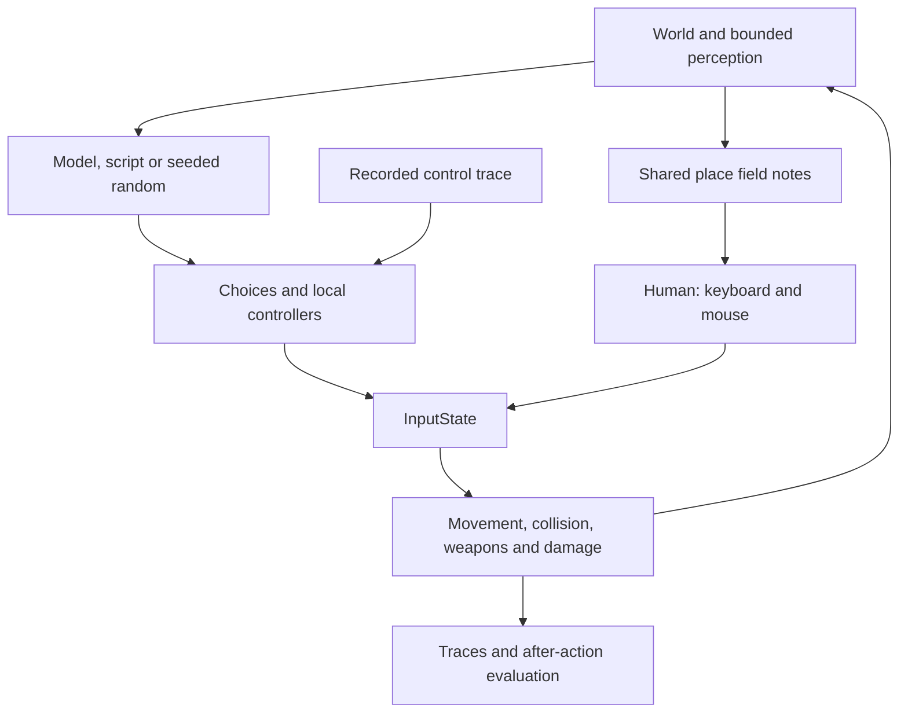
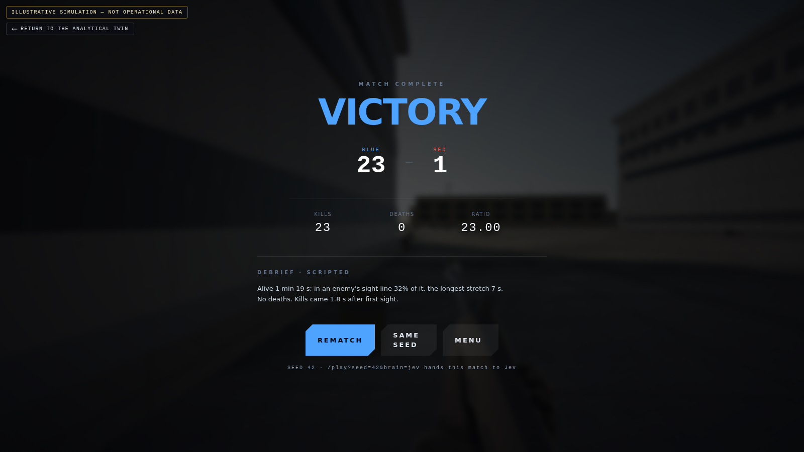

# Lop Nur Twin

One desert. Two ways to enter it.

**The twin** reconstructs an airfield near Lop Nur (~40.77° N, 89.28° E)
from cited public sources. Inspect a structure, follow its evidence, measure
the ground, or compare revisions.

**Blacksite** turns the same geometry into a playable experiment. Take the
controls yourself, give the seat to Jev or a compatible language model, or run
an offline policy. Each uses the same movement, weapons, collision and damage
rules. Choices leave traces; the world decides their consequences.

[Explore the twin](https://lop-nur-twin.vercel.app/) ·
[Enter Blacksite](https://lop-nur-twin.vercel.app/play) ·
[Read the evidence](https://lop-nur-twin.vercel.app/analysis)

[](https://lop-nur-twin.vercel.app/)
[](LICENSE)

|                 | **The twin** — `/`, `/analysis`, `/compare`                                                                             | **Blacksite** — `/play`                                                        |
| :-------------- | :---------------------------------------------------------------------------------------------------------------------- | :----------------------------------------------------------------------------- |
| What it is      | An analytical reconstruction. Every structure carries a derived, cited evidence record.                                 | A game and an experimental environment built on that reconstruction.           |
| What it claims  | Only what its sources support: _observed_, _reported_, _interpreted_ or _illustrative_ — and the build fails otherwise. | Nothing about the real site. Every soldier, weapon and engagement is invented. |
| What they share | Geometry, and only geometry. The ledger does not know `/play` exists; nothing in the game can write to it.              |                                                                                |


---

## What happened when a model played it

Blacksite lets a model sit in the player's seat. In the first matched benchmark
the model — TypeSafe's Jev, choosing targets and aim regions while a local
controller held the crosshair — went **148 kills to 0 deaths without moving
a metre**, engaging bots at about 100 m.

It would have been easy to publish that as a result about the model. Instead
the strategy was written down as a script of a few dozen lines — hold still, aim down the
sights, take the head beyond 40 m — and run offline on the same seeds:

| Historical run: 3 × 120 s, seeds 42–44 | Kills / deaths | Moved | Mean range |
| :------------------------------------- | -------------: | ----: | ---------: |
| Jev (live), precision control          |        148 / 0 |   0 m |      103 m |
| scripted marksman, same controller     |        153 / 0 |   0 m |      109 m |

These are historical builds, not current performance promises. Their early
hit counters counted body strikes rather than unique rounds, so the old
accuracy percentages are deliberately omitted. [Artifact caveats](docs/benchmarks/2026-09-27/README.md).

The script matched the model. **The finding was about the map**: on open
lakebed, at 100 m, nothing could touch a still shooter. A diagnostic
(`tools/kill-anatomy.mjs`, on the old build) showed why. In ninety seconds on
seed 42 all 32 victims could see the shooter and 30 of them were sprinting
across open ground at or around it; the bots fired 46 rounds back, with a
median aim error of 3.9° — about nine metres at the median range of 136 m.
So the world was changed, not the number:

- **Heat shimmer.** By day, beyond 45 m, a body is _seen_ displaced by a slow
  drift that grows with range — drawn that way for the person, reported that
  way to a model, aimed at that way by every controller and bot. Rounds go to
  the real body. A head at 130 m stops being a certainty for anyone.
- **Exposure cuts both ways.** Bots out of range stop charging across open
  ground; they bound between points hidden from the shooter or hold and return
  fire, and a steady bot converges on a still target in metres, not degrees.
  Standing still in the open is no longer safe at any range. Moving is.
- **Seat rules are a setting.** `?seat=even` removes the help the seat gets by
  default, so two brains — or a brain and a person — can be compared without
  the game helping one of them.

| Same seeds, 3 × 120 s         | Kills / deaths | Headshots | Damage taken | Time in a sight line |
| :---------------------------- | -------------: | --------: | -----------: | -------------------: |
| marksman, before              |        153 / 0 |       150 |           80 |         not measured |
| marksman, after               |         81 / 0 |        78 |           43 |                  35% |
| marksman, after, `?seat=even` |         78 / 0 |       104 |          108 |                  36% |

Halved, not solved: the still marksman now takes damage and kills half as
often, but in six minutes it was never killed. What remains is first-shot
lethality at range, and closing it would change what the benchmark measures;
it is written up as an open design question, with a change that was tried,
measured and removed. ([the full account](docs/JEV_BLACKSITE.md#the-marksman-exploit))

---

## One seat


```mermaid
flowchart TD
  World["World and bounded perception"] --> Notes["Shared place field notes"]
  Notes --> Human["Human: keyboard and mouse"]
  World --> Brain["Model, script or seeded random"]
  Brain --> Execute["Choices and local controllers"]
  Replay["Recorded control trace"] --> Execute
  Execute --> Input["InputState"]
  Human --> Input
  Input --> Rules["Movement, collision, weapons and damage"]
  Rules --> World
  Rules --> Evidence["Traces and after-action evaluation"]
```

Every brain writes the `InputState` a keyboard and mouse fill, and nothing
else. `PlayerRig` reads `pilot.frame(dt) ?? keyboard` — that one line is the
whole integration — and the controller, the weapon runtime, collision and the
damage resolver cannot tell who is playing. A test fails if any code between a
choice and the input queues damage, writes health, moves a body, fires a weapon
or touches the camera.

The split that makes a remote model playable is **cognition at the model's
cadence, motor control at the simulation's**. Jev answers in 130–260 ms: enough
to choose, far too slow to hold a crosshair through recoil. So it chooses — which
enemy, which part of it, whether to fire, and since v3 **where to go** — and two
deterministic local controllers execute at 60 Hz: a motor controller for the
crosshair and trigger, and a navigator for the feet. Neither ever chooses a
target or a destination. Every result says which controllers were in play, and
the random brain through the same controllers is always reported beside it,
because the controller alone is not the result.

| `?brain=` | Label    | What sits in the seat                                                       |
| :-------- | :------- | :-------------------------------------------------------------------------- |
| `human`   | HUMAN    | A person.                                                                   |
| `jev`     | LIVE JEV | TypeSafe's Jev, through a server that owns the key and writes the question. |
| `script`  | SCRIPTED | A hand-written reference policy: `&policy=marksman` or `skirmisher`.        |
| `random`  | RANDOM   | A seeded uniform policy over the legal controls.                            |
| `replay`  | REPLAY   | A recorded trace's control stream.                                          |

Press **H** at any time to take the seat back.


### Places: the feet get the same deal the crosshair got

The first benchmark's quietest number was the most telling: 0 m moved. The move
axis offered "forward" and "strafe left" and nothing about where cover was, so
there was no movement decision to make. Now each observation may list up to four
**places** — nearest cover from the enemies the observation knows about, a way
nearer, a way round, a way back, the objective — with facts: bearing, distance,
whether it is hidden from every _known_ threat, and how many metres of the walk
there stand in some known threat's sight. A brain names one; the navigator walks
it there by pressing the same keys a person would.

| Skirmisher policy, 3 × 120 s | Kills / deaths | Range at shot | Time in a sight line | Longest stretch in one |
| :--------------------------- | -------------: | ------------: | -------------------: | ---------------------: |
| walking by steps             |         97 / 0 |          75 m |                  44% |                 27.1 s |
| choosing places              |         93 / 0 |          60 m |                  36% |                 11.5 s |

The same configuration run twice gave 93 and 80 kills and 36 % and 43 %
exposure, so read the mean exposure as a hint and the longest stretch — cut by
more than half — as the finding.

And the live model, same seeds, same new build:

| Jev, live, 3 × 120 s | Kills / deaths |   Moved | Time in a sight line |
| :------------------- | -------------: | ------: | -------------------: |
| walking by steps     |         58 / 0 |     0 m |                  52% |
| choosing places      |          8 / 0 | 1 085 m |                  22% |

Offered places, the model that had never moved walked a kilometre, chose cover
190 times in 208, halved its exposure — and nearly stopped fighting. It picked
the first place listed every time, so the list was shuffled and the run
repeated: the slots spread, and 93 % of its choices were still cover. The
preference was for cover, not for the top of the list.

### One set of senses

A comparison between a person and a model means something only if they are told
the same things. The HUD used to draw brackets through walls, a drone camera and
a thermal view — none of it available to a model. It is gone. What a person is
shown about enemies is what a model is told: what is on screen, gunfire within
the 115 m a model hears, the direction of a hit, teammates within the radar's
145 m. A kill is confirmed under the crosshair with the name and the range —
nothing else. On this site, the distance is the story.

### The debrief

Every seat, the person's included, ends a match with the same after-action
record, kept by the same rule. This one is from a real match, the scripted
skirmisher on seed 42 (`node tools/shots.mjs --only debrief`):



Each death is classed — _never seen_, _seen, not engaged_, or _engaged,
exchange lost_ — with the range, whether any cover stood within 10 m, and the
nearest named place. A kill/death ratio says who won. The debrief says whether a loss was a failure to
_see_, a failure to _act_ on what was seen, or a fight lost fairly — different
failures, for a person and for a model, with different fixes. It reads what
really happened, and is never fed back to a model mid-match.

---

## Field notes for whoever holds the controls

The person can now read the same place facts the agent receives: cover,
advance, flank, withdrawal or a reachable objective, with bearing, distance
and sampled route exposure. Quiet text near the edge of the screen appears
only while there is something to report. It never moves the human or chooses
an action. With `?jevNav=steps`, the place layer is absent for both seats.

Every place must pass a standing capsule and body-width straight-route check.
A blocked objective is still shown as an objective, but is not offered as a
walkable place. The search is local (128 m maximum route), without pathfinding.
“Hidden” tests the standing eye against known threats; it does not promise
whole-body invisibility or safety from unseen enemies. Notes expire after
0.75 seconds of simulation time rather than silently presenting old safety
facts as current.

Observation v4 records that stricter meaning. Older observation traces are
rejected on replay; their archived evaluations remain readable. Navigation-only
traces now bind places even when no target is being tracked.

The [declared clearance experiment](tools/experiments/place-clearance.json)
compares the same scripted skirmisher on seeds 42–44 before and after these
checks, with steps navigation as the unchanged control. It measures blocked
and arrived travels alongside kills and exposure. This is an offline game
experiment, not a live Jev result. In the three 45-second candidate episodes,
all sixteen ended travels arrived, against thirteen blocked releases in the
baseline. Exposure barely changed, distance fell, and no candidate objective
trips were chosen. [Every seed, traces and source snapshots](docs/benchmarks/2026-09-30/README.md).

## Built for the next model, measured on this one

A brain declares what it can use — precision or direct control, places or
steps, how often it can decide, where it runs — and the host declares what it
accepts. The host accepts more than today's remote model can use at speed:
places, precision control, ten decisions a second. A faster model arrives into
an interface already waiting for it, and says so by declaration rather than by
a rewrite. (`src/game/pilot/capabilities.ts`)

That headroom is also an experiment. For local brains, `?latency=` holds each
answer back and `?cadence=` sets how often they decide, so the gain a faster
model would bring _here_ can be measured before that model exists:

| Same policy, answers delayed by | Kills / deaths | First sight to kill |
| :------------------------------ | -------------: | ------------------: |
| 0 ms                            |         80 / 0 |               2.6 s |
| 250 ms (today's Jev round trip) |         87 / 0 |               3.1 s |
| 600 ms                          |         63 / 1 |               5.8 s |

With aim and footwork executed locally, a quarter-second round trip costs
nothing measurable here; by 600 ms it costs a quarter of the kills. On this
game a model's speed is not the bottleneck — its choices are.

---

## Measure it yourself

```sh
bun install
bun run dev                                    # http://localhost:5173/play

# a matched experiment: several seats, the same seeds, one table
node tools/experiment.mjs tools/experiments/exposure.json
node tools/experiment.mjs tools/experiments/places.json
node tools/experiment.mjs tools/experiments/horizon.json
node tools/experiment.mjs tools/experiments/place-clearance.json
node tools/experiment.mjs --compare before/experiment.json after/experiment.json

# one seat, repeatable episodes
node tools/jev-benchmark.mjs --brain script --policy marksman --control precision
bun run benchmark:random:precision
JEV_LIVE_TEST=1 bun run benchmark:jev:precision   # live model; spends API credit

# what each victim was doing when the seat killed it
node tools/kill-anatomy.mjs --policy marksman
```

An experiment file states its hypothesis and its deciding metric before it
runs. Arms run one at a time, against any build (`--origin` points at a
worktree of an older commit), and an episode whose simulation fell behind real
time is flagged rather than silently compared. Same-seed episodes are not
replicas — frame pacing diverges the bots within seconds — so every table
prints every seed. Every number comes from the simulation: rounds the weapon
runtime fired, damage the resolver applied, metres the controller moved.
Nothing is estimated, and a statistic with no samples prints as _n/a_.

The model is only called when you say so: `bun run jev` runs its checks against
a fake endpoint installed inside the test browser, and anything that spends
credit refuses to start without `JEV_LIVE_TEST=1`. The key never reaches the
browser; the build scans its own output for it.

To give Jev the seat: `cp .env.example .env.local`, set `TYPESAFE_API_KEY`,
`bun run dev`, open `/play?brain=jev`. After any match, **Same seed** replays the
identical match — so a person can play the one the model just played.

---

## The analytical twin

The twin is the part of this repository that makes claims, and it is built to
make as few as the sources allow.


- **Every claim is classified**, and the classification is load-bearing:
  ◆ _observed_ in a cited scene, ■ _reported_ by a cited publication,
  ▲ _interpreted_ by this project, ○ _illustrative_. The evidence ledger is
  derived from the layout and the source register — never hand-written — and
  `bun run build` fails if an illustrative subject claims more, an observed one
  has no citable source, or interpreted wording asserts verification. The
  validator's own 35 rules are tested for firing.
- **Unknown stays unknown.** An uncertainty the sources do not state prints as
  "not stated", never as zero. Three dates — when something existed on the
  ground, when the evidence was published, when it entered this model — are
  three separate fields.
- **Measured in a public frame.** Distances and bearings in EPSG:32645;
  GeoJSON (WGS84), CSV and JSON exports; release manifests with SHA-256 hashes
  of the geometry and the evidence ledger, diffable at `/compare`.
- **Accessible without WebGL.** `/analysis` is the whole model as a semantic
  table, and every analytical capability has a representation there; `bun run
a11y` gates it on axe-core.

The twin's documentation: [data provenance](docs/DATA_PROVENANCE.md),
[uncertainty](docs/UNCERTAINTY_MODEL.md), [temporal model](docs/TEMPORAL_MODEL.md),
[spatial analysis](docs/SPATIAL_ANALYSIS.md), [model comparison](docs/MODEL_COMPARISON.md),
[site model](docs/SITE_MODEL.md).

---

## Run it

```sh
bun install          # or npm install, on Node 22.18+
bun run dev          # http://localhost:5173 — the twin; /play — Blacksite
bun run build        # validate data → manifest → bundle → strict typecheck → secret scan
bun run check        # format, lint, unit tests, evidence-rule tests, build
```

Browser suites, against the dev server: `bun run smoke` (the simulation),
`bun run engagement` (the match actually plays), `bun run gait` (the walk
cycle), `bun run audio`, `bun run jev` (the player seat, no API calls); and
against `bun run preview`: `bun run a11y` and `bun run routes`. What each one
proves is in [`docs/VALIDATION.md`](docs/VALIDATION.md).

`node tools/places.mjs` checks human field notes, shared observations,
navigation-only replay in direct and precision control, takeover and death
against staged offline fixtures. It calls no provider.

```text
src/lib/          layout (the single source of geometry), evidence ledger, CRS, URL parameters
src/components/   the twin's scene and analytical UI
src/game/         Blacksite: physics, weapons, characters, bots, audio, HUD
src/game/pilot/   the seat: contract, observation, executor, motor, navigator, debrief, brains
server/, api/     the Jev endpoint — the only code that holds the key
tools/            browser suites, benchmarks, experiments, diagnostics
docs/             how every part works, and what it does not do
```

---

## What it cannot tell you

- **About the real site:** facility names are this project's hypotheses;
  terrain is a seeded proxy, not survey elevation; runway ends carry ~40 m of
  uncertainty; utilities and fences are illustrative; confidence scores are
  ordinal ranks, not probabilities. The full list is rendered on `/analysis`.
- **About Blacksite's players:** the benchmarks are small (three two-minute
  episodes per arm) and headless; same-seed episodes diverge; the motor
  controller and navigator are hand-designed, so a precision result is the
  model's choices _and_ those controllers; the places finder offers straight
  walks only; what a model reads was written by hand and a different wording
  could change its choices. A live model result depends on its service, its
  latency and its version, which every trace records.
- **About anything real:** nothing in Blacksite is evidence about Lop Nur, its
  activity, or anyone's tactics. It is fiction standing on a reconstruction.

## Documentation

| Document                                                                     | What it covers                                                                 |
| :--------------------------------------------------------------------------- | :----------------------------------------------------------------------------- |
| [`docs/BLACKSITE.md`](docs/BLACKSITE.md)                                     | the game: ballistics, bots, heat, senses, seat rules, controls                 |
| [`docs/JEV_BLACKSITE.md`](docs/JEV_BLACKSITE.md)                             | the seat: contract, observation, controllers, places, debrief, every benchmark |
| [`docs/VALIDATION.md`](docs/VALIDATION.md)                                   | every check, what it proves and what it does not                               |
| [`docs/SYSTEM_ARCHITECTURE.md`](docs/SYSTEM_ARCHITECTURE.md)                 | rendering, stores, the frame loop                                              |
| [`docs/CONTROLS.md`](docs/CONTROLS.md)                                       | keys, touch, URL parameters                                                    |
| [`docs/DATA_PROVENANCE.md`](docs/DATA_PROVENANCE.md)                         | sources, classification, confidence                                            |
| [`docs/THREAT_MODEL.md`](docs/THREAT_MODEL.md), [`SECURITY.md`](SECURITY.md) | trust boundaries                                                               |
| [`docs/DEPLOYMENT.md`](docs/DEPLOYMENT.md)                                   | Vercel, Docker, the key                                                        |
| [`AGENTS.md`](AGENTS.md)                                                     | rules and recipes for anyone — or anything — changing the code                 |

## License

Code and documentation: [Apache License 2.0](LICENSE). Public data products
(Copernicus, ESA, DLR, Airbus Defence and Space, NASA POWER) are referenced and
attributed in [`NOTICE`](NOTICE); no third-party imagery is bundled.
