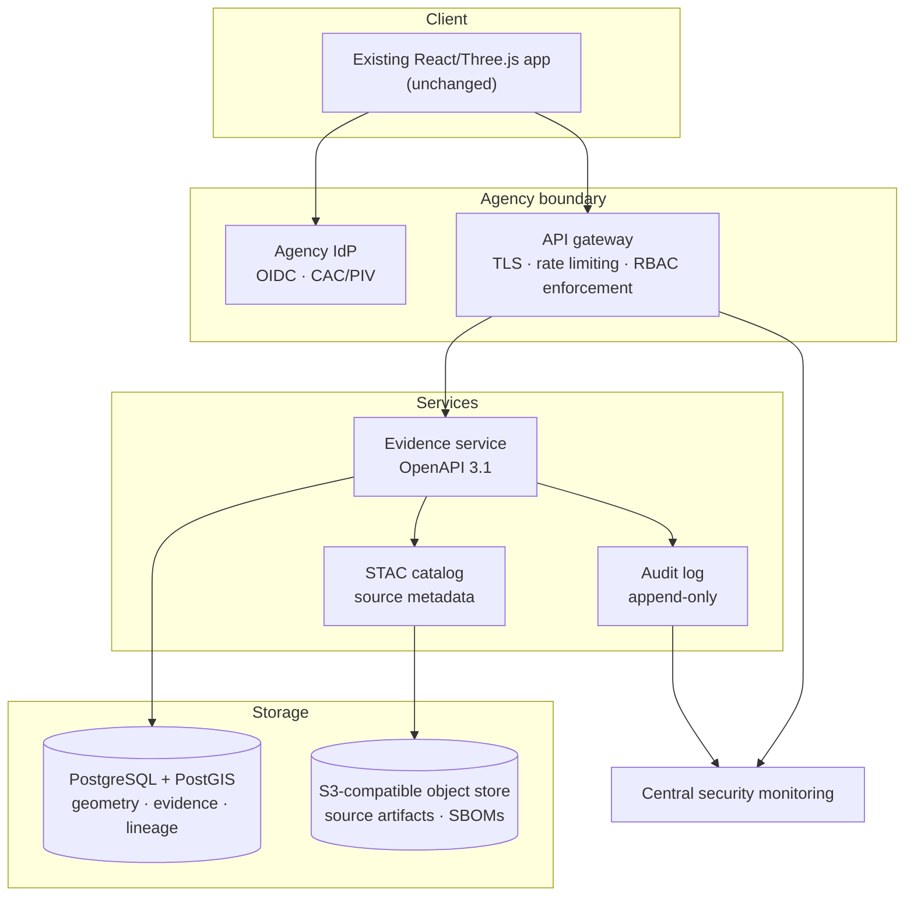

# Future backend architecture

Everything in this repository today runs in a browser from static files. That
is a deliberate choice: it makes a release reproducible, keeps the whole data
surface auditable, and means there is no server to compromise.

This document describes what an authenticated, server-backed deployment would
look like **if an agency pilot required one** — and is explicit about what is
built, what is scaffolded, and what is only a recommendation. Nothing described
in the "recommended" section exists in this repository. In particular:

> **There is no authentication in this system, and none is simulated.** A login
> form that does not authenticate is worse than no login form: it teaches users
> a false expectation and can be mistaken for a control during an assessment.
> If you find something in this repository that looks like access control,
> report it as a bug.

## Status of each component

| Component                                                                   | Status                                                       | Where                                                                  |
| :-------------------------------------------------------------------------- | :----------------------------------------------------------- | :--------------------------------------------------------------------- |
| Deterministic geometry and layout                                           | **Implemented**                                              | `src/lib/layout.ts`                                                    |
| Public source register                                                      | **Implemented**                                              | `src/lib/siteData.ts`                                                  |
| Evidence ledger with 0–1 confidence, CRS, uncertainty                       | **Implemented**                                              | `src/lib/evidence.ts`                                                  |
| Build-gating evidence validation + negative tests                           | **Implemented**                                              | `src/lib/evidenceValidation.ts`, `scripts/test-evidence-validation.ts` |
| Reproducible release manifest with SHA-256 hashes                           | **Implemented**                                              | `scripts/generate-manifest.ts`                                         |
| Accessible non-3D analytical view                                           | **Implemented**                                              | `src/routes/analysis.tsx`                                              |
| Security headers and CSP, verified against the real build                   | **Implemented**                                              | `vite.config.ts`, `vercel.json`, `deploy/nginx.conf`                   |
| CI: build, tests, CodeQL, Gitleaks, Trivy, SBOM, dependency review          | **Implemented**                                              | `.github/workflows/`                                                   |
| Container deployment (non-root nginx, SPA fallback, health path)            | **Implemented**                                              | `Dockerfile`, `deploy/nginx.conf`                                      |
| Evidence record schema shaped for a future API (`sourceHash`, `supersedes`) | **Scaffolded** — fields exist, deliberately unpopulated      | `src/lib/evidence.ts`                                                  |
| Machine-readable release identity for a future registry                     | **Scaffolded** — manifest is the artifact an API would serve | `public/model-manifest.json`                                           |
| PostGIS, object storage, evidence API, OIDC, RBAC, audit log, IaC           | **Recommended only — not built**                             | this document                                                          |

## Target architecture, if it is ever needed

### PostgreSQL with PostGIS

Move geometry and the evidence ledger from TypeScript modules into tables:
`structure`, `segment`, `apron` with `geometry(Geometry, 32645)` columns, and
`evidence_record` referencing them by id with a foreign key — the database
enforcing what `evidenceValidation.ts` enforces at build time today. Keep the
constraints as constraints: `CHECK (confidence BETWEEN 0 AND 1)`,
`CHECK (classification IN (...))`, and a trigger refusing an `observed` record
on a subject whose declared status is `illustrative`.

Temporal columns (`valid_from`, `valid_to`, `superseded_by`) turn the current
timeline slider into real bitemporal history.

The current static build should remain a supported export path: a nightly job
that renders the database to the same committed data shape keeps the offline,
no-server deployment working.

### STAC-compatible source metadata

The source register already carries most of a STAC Item: identifier, datetime,
publisher, licence/attribution, and a link. Publishing it as a STAC Catalog
with one Collection per source role (imagery, terrain, climate, reporting,
analysis) would let existing GEOINT tooling discover the inputs, and would give
each cited scene a stable, dereferenceable identifier instead of a URL that can
drift.

### S3-compatible object storage

For pinned source artifacts, generated SBOMs, signed manifests and release
bundles. This is where `sourceHash` finally gets populated: an ingestion job
fetches a source, stores it immutably, records the SHA-256 of what it actually
retrieved, and the evidence record cites that digest instead of relying on a
URL staying stable. Object-lock or versioning for retention.

### OpenAPI-based evidence service

A small read-mostly API — `GET /structures`, `GET /evidence?subjectId=`,
`GET /manifest`, `POST /evidence` behind write authorisation — specified in
OpenAPI 3.1, generated from the same TypeScript types the client uses. Server
responses would carry the same classification, confidence and uncertainty
fields the ledger publishes today, so the UI would need no conceptual change.

### OpenID Connect authentication

Authorization Code with PKCE against the agency identity provider. No password
handling, no session storage in the browser beyond a short-lived token, and no
identity data in the static bundle. The client remains a public client; all
authorisation decisions are made server-side.

### CAC/PIV integration

Through the agency IdP, not by the application. The browser presents the
certificate to the IdP, the IdP asserts identity and assurance level to the
gateway, and the application never touches a certificate. Any design where this
prototype validates a certificate itself should be rejected.

### Role-based access control

Enforced at the gateway and in the service, never in the UI. Plausible roles:
`viewer` (read published evidence), `analyst` (propose claims and revisions),
`reviewer` (approve a classification change), `admin`. Given this project's
subject matter, the interesting authorisation question is not who may _read_ —
it is who may promote a claim from `interpreted` to `observed`.

### Immutable audit logs

Append-only, hash-chained, covering every read of a restricted record and every
change to a claim: who, when, what changed, which source justified it, and the
previous value. The `supersedes` field is the schema hook for this. Ship to
central monitoring; retain per the agency's records schedule.

### Centralised security monitoring

Forward gateway, service and audit events to the agency SIEM. Alert on failed
authorisation, unusual export volume, and any change to a claim's
classification.

### Infrastructure as code

Terraform or OpenTofu for infrastructure, with policy-as-code (OPA/Conftest)
for the control baseline; the container image built here as the deployment
unit. Pin GitHub Actions to commit digests, produce SLSA provenance, sign
images and manifests with Sigstore, and verify signatures at deploy time.

### Government-cloud deployment

An accredited boundary (AWS GovCloud, Azure Government or an agency-operated
platform) with FIPS-validated cryptography, a system security plan, a control
baseline, continuous monitoring, and an ATO. None of that is a code change; all
of it is a programme.

## Kubernetes

**Not needed, and not recommended today.** The current deployment is a static
bundle behind a CDN or a single nginx container — a Kubernetes control plane
would add operational surface and no capability.

It becomes reasonable if and when the backend above exists: several services,
horizontal scaling, rolling deploys, and an agency platform that already runs
Kubernetes. At that point the container in this repository is already the unit
of deployment; add a Deployment, a Service, an Ingress with the same security
headers, a read-only root filesystem, a non-root `securityContext` (the image
already runs as uid 101), resource limits, and a liveness/readiness probe on
`/healthz`.

## Sequencing

If this prototype were taken forward, the order that keeps it honest at each
step:

1. **Pin the supply chain** — digest-pinned actions, signed artifacts, SBOM
   attestation. Cheap, and it makes everything after it verifiable.
2. **Move the ledger into PostGIS** behind a read-only API, keeping the static
   export. No authentication yet; nothing has changed about who may see what.
3. **Add the STAC catalog and object storage**, and start populating
   `sourceHash` from genuinely retrieved artifacts.
4. **Add OIDC and RBAC** only when there is content that genuinely differs by
   role — otherwise it is theatre.
5. **Add audit logging and monitoring** in the same change as write access.
   Never ship writes without an audit trail.
6. **Then, and only then**, pursue accreditation with a real system boundary.
