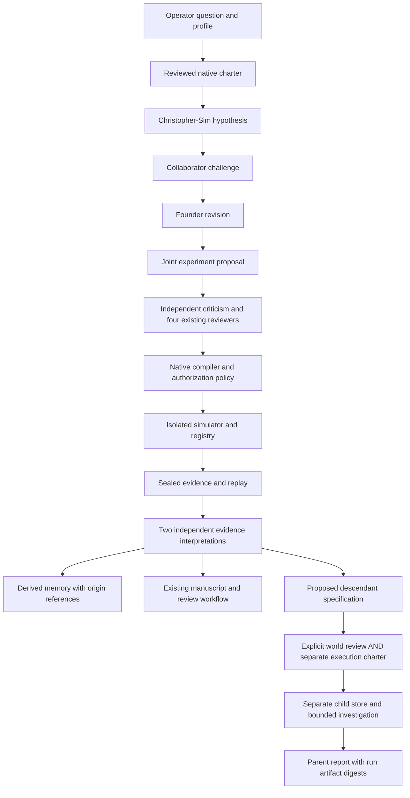

# Project Inception

## Architecture audit

The implementation extends the native research workflow, not a separate agent framework.

| Existing subsystem            | Capability and boundary                                                                                                                                                                                                       |
| ----------------------------- | ----------------------------------------------------------------------------------------------------------------------------------------------------------------------------------------------------------------------------- |
| `src/rain/meeting/`           | James, Jasmine, Luca and Elena; separate model turns, pinned SOUL prompts, source checking and explicitly scripted offline recordings.                                                                                        |
| `src/rain/autonomy/`          | Local LM Studio/Ollama adapters, closed structured outputs, charter authorization, sequential inference, compute budgets, immutable decisions, process lock and hash-chained durable journal. Recovery never starts research. |
| `src/rain/research/`          | Pinned author-supplied corpus and mathematical context, bounded optional literature metadata, four-perspective collaboration, evidence-linked manuscripts and independent draft review.                                       |
| `src/rain/experiments/`       | Preregistration, deterministic criteria, signed certificates, registry admission and research lineage.                                                                                                                        |
| `src/bethesda/rain/`          | Declarative experiment compiler, digest-bound operator review, isolated simulator runs, replay, procedural figures and accessible research workbench.                                                                         |
| `server/rain/`, `server/llm/` | Validated API boundaries; local discovery is separate from stateless deployment. Existing game LLM adapters are not research authorization.                                                                                   |

Smallest coherent additions: an opt-in, charter-bound partnership profile; explicit dialogue stages and derived memory; descendant specifications using the existing simulator capability envelope; operator-reviewed child charters; an observable lineage view. Existing four-perspective research remains the default.

Implementation and validation status will be recorded below as increments are completed. A proposal, a scripted demonstration and a validated simulator measurement are different artifacts. None establishes consciousness, the reproduction of Christopher Woodyard's mind, or transfer of a ChatGPT identity.

## Working increment

Christopher-Sim and Research-Collaborator are additional model-backed participants
in the native **research program**, alongside James, Jasmine, Luca and Elena.
They share the configured local model, with sequential inference and separate
memory namespaces. They do not replace the existing four-character meeting engine.

The founder profile is a versioned, operator-editable set of research methods,
not a biography or a measured psychological model. Its initial six methods come
from the Project Inception specification: synthesis, divergence, formalization,
artistic exploration, criticism and bounded project design. No private files,
chat histories or creative works are collected. The existing pinned corpus and
mathematical catalogue provide source context. A corpus assertion is not thereby
independently validated. Missing sources remain missing.



Every contribution contains a question, hypothesis, falsification criterion,
rationale, sources, replay-verified evidence references, disagreements,
mathematical assumptions and next experiment. The normal native designer and
critic then compile and assess actual experiment proposals; conversation prose
cannot authorize or execute them. Both post-result interpretations receive the
same pre-review context, without seeing one another's new interpretation. This
is inference separation, not proof of statistical independence when using one model.

## Memory and identity

Memory is derived from the existing hash-chained journal, not a second mutable
truth database. Foundational entries reference pinned sources. Episodic entries
retain prior questions, semantic entries retain explicitly tentative hypotheses,
creative entries retain proposed directions, and critical entries retain
disagreements or falsification criteria. Each item has a namespace, layer,
origin digest, source/run references and evidence status. None becomes a fact
about Christopher. Historical source or run references that are unavailable in
the current context are omitted from recalled memory.

Retrieval is deliberately inexpensive: the latest four matching turns per
participant, at most four source excerpts per participant, and bounded text
slices. Matching requires the same program, profile digest and memory epoch.
This is deterministic bounded extraction, not learned semantic consolidation.
Inspect these entries in **Inspect cognitive memory and uncertainty**. Edit the
profile in the founder interface and increment its version when revising it.
Review the resulting new charter. **Reset recalled memory** advances its epoch;
old entries remain in the scientific audit. Disable Project Inception to remove
the pair from the next reviewed program. Permanent deletion requires stopping
the service and deliberately removing its operator-owned research directory;
there is no UI that silently deletes scientific history.

## Local Qwen operation

Load one Qwen model in LM Studio and enable its local server. Use its exact
reported model identifier. On PowerShell, start this repository with:

```powershell
$env:RAIN_AUTONOMY_ENABLED = 'true'
$env:RAIN_MODEL_PROVIDER = 'lmstudio'
$env:RAIN_LMSTUDIO_URL = 'http://127.0.0.1:1234'
$env:RAIN_MODEL = 'your-loaded-model-identifier'
$env:RAIN_MAX_MODEL_CALLS = '60'
$env:RAIN_MODEL_MAX_TOKENS = '4096'
$env:RAIN_MAX_RUNTIME_MS = '1800000'
bun run dev
```

Follow [the Bethesda entrance instructions](BETHESDA_ANOMALY.md#discovery-spoiler),
then resolve `rain lab` inside Bethesda. In the research workbench:

1. **Ask:** enter a bounded scientific question and enable Project Inception.
2. Choose a mode and optionally edit the profile. Leave public literature off
   for a completely local workflow.
3. **Approve:** connect Qwen, review the actual scope, budgets and expiry, and
   type the first eight charter digest characters. Then start the session.
4. **Observe:** inspect contributions, source scope, disagreements, proposed
   versus executing experiments, provenance, evidence and manuscript drafts.
5. **Intervene:** pause after the current experiment or emergency-stop. To change
   the question, profile or scope, prepare and approve a new charter.
6. **Explore:** inspect proposed worlds in the Inception Observatory. Review a
   world's full specification and digest, approve it, then separately review and
   approve its child execution charter. Starting uses the ordinary start button.
7. **Compare / Archive:** inspect child report metrics and export the native
   evidence/manuscript artifacts. The durable journals and child reports remain
   under `.rain-research/`; no publication, push or deployment occurs.

Interactive mode supports operator questions and interventions at session
boundaries. Independent mode continues within one approved bounded session.
Reflection, creative and institution modes deliberate and produce proposals
without executing experiments. Institution mode records a world proposal.
There is no automatic scheduling of another session. A running local process
can finish its authorized work after the operator leaves the page. A process
restart restores records but never resumes work. An interrupted lock requires
explicit review and proof its owner exited. A completed or stopped child cannot
be started again; propose a new bounded investigation.

Configure context and inference timeout with the existing `RAIN_MODEL_CONTEXT`
and `RAIN_MODEL_TIMEOUT_MS` settings. LM Studio's actual context size is selected
when loading the model. Unknown token accounting remains unknown; an explicit
token ceiling stops execution when accounting is unavailable.

## Declarative descendants

Generation zero is `bethesda-rain`. Each child declares an identifier, parent,
generation, objective, simulator, assumptions, hypotheses, evaluation criteria,
inheritance references, versioned agent configuration, capability envelope,
compute/storage budget, maximum lifetime, tool vocabulary and termination rules.
The only simulator is `bethesda-native/v1`: the existing mapped terrain,
pedestrians, vehicles, buses, disruption vocabulary and native measurements.
No model-generated terrain, executable code, credentials or permissions are inherited.

Depth is limited to two descendant generations; at most two approved/running,
unexpired children per parent are allowed. IDs are immutable, self-parenting and
cycles are rejected, and children cannot outlive a registered parent or raise
its resource ceilings. Parent and child execution share the root process lock;
model calls are sequential. Each child has its own journal, registry, records,
research identity and experiment namespace. Its reviewed specialization varies
the last cognitive method and objective using the collaborator's proposed next
investigation. It is not automatically deemed an improvement.


The present execution path inherits source-context receipts and excerpts only.
The schema reserves simulated-result and hypothesis classifications, but the
runner refuses these inheritance kinds until an independent replay-validation
path is supplied. A child report returns exact world, session and run-artifact
references; its prose never changes parent authorization. Unsupported simulator
ideas must become conventional reviewed code changes: extend the native
capability/compiler/runner contracts, add deterministic tests and replay support,
and approve a new charter. There is no executable-extension tool for agents.

The store applies a byte ceiling to immutable writes and checks usage during
execution, including registry files. This is a host application limit, not an OS
disk quota: a registry write can cross it before the next check. Storage exhaustion
can prevent a final journal receipt; the persistent lock/child state remains
non-resumable automatically. Use filesystem quotas if a hard disk limit is required.

## Demonstration and evaluation

```bash
bun run rain:inception:demo
bun run rain:inception:test
```

The demo is fully offline. It uses an explicitly named scripted model and a
scripted operator attestation confined to that CLI fixture. It invokes the real
native charter, compiler, simulator, registry, replay and manuscript pipeline.
It starts with a question referencing Dynamic Resonance Rooting, produces two
parent experiments, authorizes a descendant separately, produces two child
experiments, verifies all four records, returns the child report and checks an
idle restart. Its unique output directory and report paths are printed. The
fixture's words are not evidence of autonomous reasoning, corpus entailment,
original discovery or empirical validation of Dynamic Resonance Rooting.

The end-to-end test checks those same boundaries, including preservation of
disagreement and script labels. Additional tests deny excessive depth, unknown
tools, false references, cycles, concurrent approval, excess active siblings,
expired parents, storage exhaustion and path traversal. Existing native tests
cover malformed inference, authorization tampering, cancellation and replay.

Descriptive evaluation reports valid admitted/replayed runs, nonduplicate
protocols, confirmatory runs, verdict counts, completeness of provenance,
model calls, reported tokens and valid runs per model call. Novelty is only
absence from the explicitly hashed comparison history. Independent replication,
resolved questions and useful cross-domain connections are left unknown rather
than inferred from persuasive text. A matched nonrecursive-control experiment
has **not** established improved research quality. The optional live Qwen path
is the workbench above and must be reviewed and run by the operator; it has not
been substituted with fixture responses.

## Limits and extension points

### Validation receipt

Validated on Windows with Node 24.19.0 and Bun 1.4.3 (Bun invoked through npm's
tool cache because it was not on PATH):

| Command                                               | Result                                                               |
| ----------------------------------------------------- | -------------------------------------------------------------------- |
| `bun run format:check`                                | Passed                                                               |
| `bun run lint`                                        | Passed; eight existing warnings in nested local worktrees, no errors |
| `bun run test:run --maxWorkers=2 --testTimeout=30000` | 1,651 tests passed in 128 files                                      |
| `bun run test:evidence`                               | All 37 documented validator rules passed                             |
| `bun run typecheck`                                   | Passed                                                               |
| `bun run rain:conformance`                            | Passed                                                               |
| `bun run build`                                       | Passed, including data/history validation and secret scan            |
| `bun run rain:inception:demo`                         | Two parent and two child experiments, replay and idle restart passed |

The initial unbounded-worker test invocation encountered three existing
five-second timeouts and a Windows symlink privilege error. The test fixture now
uses a directory junction on Windows to exercise the same ancestor-link refusal;
the final complete run used two workers and a thirty-second default timeout.
No test was disabled. Production Vite warnings about existing extensionless
imports and large chunks remain. No live Qwen run or browser screenshot was
claimed by this validation.

### Completed offline run

On 2026-10-10 the standalone demonstration completed in
`.rain-research/inception-demo-20261010T172607459Z/`. The parent session was
`DS-a83efcdf-e9a0-40ab-ace7-b162d377aacd`; its approved child was
`lab-6f4b5f147799499e`, with child session
`DS-0274c27c-58a8-4d84-b142-b8657c45aea0`. Both completed two native experiments,
produced research drafts for human review, and passed record replay. Restoring
the service returned `active: false`. The parent report is under `reports/`;
the child's is under `descendants/lab-6f4b5f147799499e/reports/` in that directory.
These local generated artifacts are intentionally not committed as new scientific
publications. Re-running the command generates its own recorded seed panels;
replaying a retained record reproduces that record's exact panel.

The parent's two exploratory protocols used 40 and 60 pedestrians with a
simulated fire at Bethesda Row. Their measured mean watching-count differences
were 7.44 and 6.11 respectively, and each met its own preregistered directional
criterion. Different seed panels prevent treating their difference as an
identified population effect. These values characterize illustrative simulator
rules and do not test a real-world resonance theory.

### Unimplemented capabilities

- No consciousness, personal identity, exact likeness or psychological fidelity
  is claimed. No new scientific law or real-world finding has been established.
- Both roles currently use the same approved local provider/model. The adapter
  boundary is the native `LocalModel` interface; different independent providers
  would require per-role charter binding and accounting. **OpenAI research
  inference is not implemented or configurable in this increment.** Existing
  game LLM or meeting provider settings do not enable it. Keep credentials out
  of browser code; a future adapter belongs server-side with explicit remote
  consent, credential injection, provider identity and tests.
- No durable automatic scheduler, automatic descendant birth, live conversational
  interruption during an inference, permanent per-memory erasure UI or autonomous
  simulator-code generation is implemented.
- The pair appears as research participants in the accessible workbench, not
  new 3D avatars. The Observatory is a 2D hierarchy; entering a child's live 3D
  world is not implemented. Existing Bethesda/Lop Nur/Blacksite scenes are unchanged.
- The scientific comparison is descriptive. A preregistered, budget-matched,
  nonrecursive control and blinded quality review remain required to answer the
  project's central research question.

No new screenshots are presented as if these unimplemented 3D capabilities exist.
