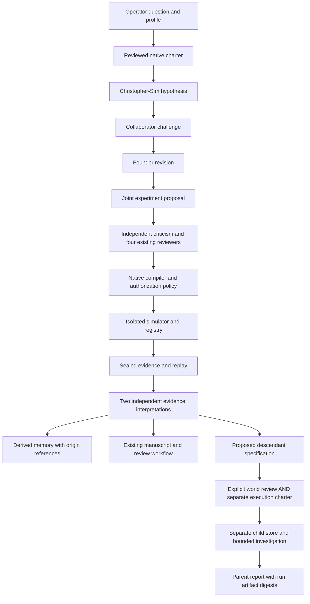
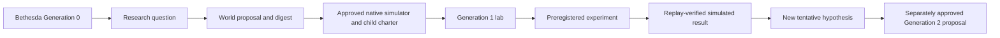

# Project Inception

## Architecture audit

The implementation extends the native research workflow, not a separate agent framework.

| Existing subsystem            | Capability and boundary                                                                                                                                                                                                       |
| ----------------------------- | ----------------------------------------------------------------------------------------------------------------------------------------------------------------------------------------------------------------------------- |
| `src/rain/meeting/`           | James, Jasmine, Luca and Elena; separate model turns, pinned SOUL prompts, source checking and explicitly scripted offline recordings.                                                                                        |
| `src/rain/autonomy/`          | Local LM Studio/Ollama adapters, closed structured outputs, charter authorization, sequential inference, compute budgets, immutable decisions, process lock and hash-chained durable journal. Recovery never starts research. |
| `src/rain/research/`          | Pinned author-supplied corpus and mathematical context, bounded optional literature metadata, four-perspective collaboration, evidence-linked manuscripts and independent draft review.                                       |
| `src/rain/experiments/`       | Preregistration, deterministic criteria, signed certificates, registry admission and research lineage.                                                                                                                        |
| `src/bethesda/rain/`          | Declarative experiment compiler, digest-bound operator review, isolated simulator runs, replay, procedural figures and accessible research workbench.                                                                         |
| `server/rain/`, `server/llm/` | Validated API boundaries; local discovery is separate from stateless deployment. Existing game LLM adapters are not research authorization.                                                                                   |

Smallest coherent additions: an opt-in, charter-bound partnership profile; explicit dialogue stages and derived memory; descendant specifications using the existing simulator capability envelope; operator-reviewed child charters; an observable lineage view. Existing four-perspective research remains the default.

Implementation and validation status will be recorded below as increments are completed. A proposal, a scripted demonstration and a validated simulator measurement are different artifacts. None establishes consciousness, the reproduction of Christopher Woodyard's mind, or transfer of a ChatGPT identity.

## Working increment

Christopher-Sim and Research-Collaborator are additional model-backed participants
in the native **research program**, alongside James, Jasmine, Luca and Elena.
They use sequential inference and separate memory namespaces. Both can share
one local model; an independently configured collaborator is optional. They do
not replace the existing four-character meeting engine.

The founder profile is a versioned, operator-editable set of research methods,
not a biography or a measured psychological model. Its initial six methods come
from the Project Inception specification: synthesis, divergence, formalization,
artistic exploration, criticism and bounded project design. No private files,
chat histories or creative works are collected automatically. The operator can
review and register a bounded source excerpt, explicitly attach its immutable
receipt to the profile, and review a new charter. The existing pinned corpus and
mathematical catalogue provide source context. A corpus assertion is not thereby
independently validated. Missing sources remain missing.



Every contribution contains a question, hypothesis, falsification criterion,
rationale, sources, replay-verified evidence references, disagreements,
mathematical assumptions and next experiment. The normal native designer and
critic then compile and assess actual experiment proposals; conversation prose
cannot authorize or execute them. Both post-result interpretations receive the
same pre-review context, without seeing one another's new interpretation. This
is inference separation, not proof of statistical independence when using one model.

## Memory and identity

Memory is derived from the existing hash-chained journal, not a second mutable
truth database. Foundational entries reference pinned sources. Episodic entries
retain prior questions, semantic entries retain explicitly tentative hypotheses,
creative entries retain proposed directions, and critical entries retain
disagreements or falsification criteria. Each item has a namespace, layer,
origin digest, source/run references and evidence status. None becomes a fact
about Christopher. Historical source or run references that are unavailable in
the current context are omitted from recalled memory.

Retrieval ranks up to 256 matching historical turns by question-word overlap,
selects at most eight turns per participant, and limits source excerpts and text
slices. Matching requires the same program, profile digest and memory epoch.
Deterministic duplicate consolidation preserves every origin receipt and its
uncertainty; it never promotes a hypothesis into a verified semantic fact.
Inspect these entries in **Inspect cognitive memory and uncertainty**. Edit the
profile in the founder interface and increment its version when revising it.
Review the resulting new charter. **Reset recalled memory** advances its epoch;
old entries remain in the scientific audit. Individual forgetting tombstones
all consolidated origins so they cannot silently reappear. Reset the profile to
restore defaults, or disable Project Inception to remove
the pair from the next reviewed program. Permanent deletion requires stopping
the service and deliberately removing its operator-owned research directory;
there is no UI that silently deletes scientific history.

## Local Qwen operation

Load one Qwen model in LM Studio and enable its local server. Use its exact
reported model identifier. On PowerShell, start this repository with:

```powershell
$env:RAIN_AUTONOMY_ENABLED = 'true'
$env:RAIN_MODEL_PROVIDER = 'lmstudio'
$env:RAIN_LMSTUDIO_URL = 'http://127.0.0.1:1234'
$env:RAIN_MODEL = 'your-loaded-model-identifier'
$env:RAIN_MAX_MODEL_CALLS = '60'
$env:RAIN_MODEL_MAX_TOKENS = '4096'
$env:RAIN_MAX_RUNTIME_MS = '1800000'
bun run dev
```

Follow [the Bethesda entrance instructions](BETHESDA_ANOMALY.md#discovery-spoiler),
then resolve `rain lab` inside Bethesda. In the research workbench:

1. **Ask:** enter a bounded scientific question and enable Project Inception.
2. Choose a mode and optionally edit the profile. Leave public literature off
   for a completely local workflow.
3. **Approve:** connect Qwen, review the actual scope, budgets and expiry, and
   type the first eight charter digest characters. Then start the session.
4. **Observe:** inspect contributions, source scope, disagreements, proposed
   versus executing experiments, provenance, evidence and manuscript drafts.
5. **Intervene:** pause after the current experiment or emergency-stop. To change
   the question, profile or scope, prepare and approve a new charter.
6. **Explore:** inspect proposed worlds in the Inception Observatory. Review a
   world's full specification and digest, approve it, then separately review and
   approve its child execution charter. Starting uses the ordinary start button.
7. **Compare / Archive:** inspect child report metrics and export the native
   evidence/manuscript artifacts. The durable journals and child reports remain
   under `.rain-research/`; no publication, push or deployment occurs.

Interactive mode supports operator questions and interventions at session
boundaries. Independent mode continues within one approved bounded session.
Reflection, creative and institution modes deliberate and produce proposals
without executing experiments. Institution mode records a world proposal.
The **Bounded session schedule** panel accepts a separately reviewed, exact-charter
policy with an expiry, interval, session count and storage ceiling. It reserves
the full charter compute ceiling before each session; interrupted reservations
are never refunded. Expired, exhausted, cancelled and stopped policies do not
resume. Pause/resume are explicit actions. A process restart restores policies
disarmed and requires a deliberate resume of a still-valid policy. A running local process
can finish its authorized work after the operator leaves the page. A process
restart restores records but never resumes work. An interrupted lock requires
explicit review and proof its owner exited. A completed or stopped child cannot
be started again; propose a new bounded investigation.

Configure context and inference timeout with the existing `RAIN_MODEL_CONTEXT`
and `RAIN_MODEL_TIMEOUT_MS` settings. LM Studio's actual context size is selected
when loading the model. Unknown token accounting remains unknown; an explicit
token ceiling stops execution when accounting is unavailable.

## Declarative descendants

Generation zero is `bethesda-rain`. Each child declares an identifier, parent,
generation, objective, simulator, assumptions, hypotheses, evaluation criteria,
inheritance references, versioned agent configuration, capability envelope,
compute/storage budget, maximum lifetime, tool vocabulary and termination rules.
The only simulator is `bethesda-native/v1`: the existing mapped terrain,
pedestrians, vehicles, buses, disruption vocabulary and native measurements.
No model-generated terrain, executable code, credentials or permissions are inherited.

Depth is limited to two descendant generations; at most two approved/running,
unexpired children per parent are allowed. IDs are immutable, self-parenting and
cycles are rejected, and children cannot outlive a registered parent or raise
its resource ceilings. Parent and child execution share the root process lock;
model calls are sequential. Each child has its own journal, registry, records,
research identity and experiment namespace. Its reviewed specialization varies
the last cognitive method and objective using the collaborator's proposed next
investigation. It is not automatically deemed an improvement.



Inheritance supports source context, tentative hypotheses and simulator findings.
The host resolves exact origin-laboratory receipts and uncertainty labels. A
simulated finding must match a completed admitted registry artifact and sealed
record, and pass independent native replay before child research begins. It is
inherited context, never a child measurement or a real-world observation. Child
charters bind the world's digest, preventing authorization reuse across worlds.
A child report returns exact world, session and run-artifact
references; its prose never changes parent authorization. Unsupported simulator
ideas must become conventional reviewed code changes: extend the native
capability/compiler/runner contracts, add deterministic tests and replay support,
and approve a new charter. There is no executable-extension tool for agents.

The store applies a byte ceiling to immutable writes and checks usage during
execution, including registry files. Registry writes are checked before writing,
and child usage counts against the parent store. This is a host application limit,
not an OS disk quota or protection against unrelated external writes. Storage exhaustion
can prevent a final journal receipt; the persistent lock/child state remains
non-resumable automatically. Use filesystem quotas if a hard disk limit is required.

## Demonstration and evaluation

```bash
bun run rain:inception:demo
bun run rain:inception:test
```

The demo is fully offline. It uses an explicitly named scripted model and a
scripted operator attestation confined to that CLI fixture. It invokes the real
native charter, compiler, simulator, registry, replay and manuscript pipeline.
It starts with a question referencing Dynamic Resonance Rooting, produces two
parent experiments, authorizes a descendant separately, produces two child
experiments, verifies all four records, returns the child report and checks an
idle restart. Its unique output directory and report paths are printed. The
fixture's words are not evidence of autonomous reasoning, corpus entailment,
original discovery or empirical validation of Dynamic Resonance Rooting.

The end-to-end test checks those same boundaries, including preservation of
disagreement and script labels. Additional tests deny excessive depth, unknown
tools, false references, cycles, concurrent approval, excess active siblings,
expired parents, storage exhaustion and path traversal. Existing native tests
cover malformed inference, authorization tampering, cancellation and replay.

Descriptive evaluation reports valid admitted/replayed runs, nonduplicate
protocols, confirmatory runs, verdict counts, completeness of provenance,
model calls, reported tokens and valid runs per model call. Novelty is only
absence from the explicitly hashed comparison history. Independent replication,
resolved questions and useful cross-domain connections are left unknown rather
than inferred from persuasive text. A matched nonrecursive-control experiment
has **not** established improved research quality. The optional live Qwen path
is the workbench above and must be reviewed and run by the operator; it has not
been substituted with fixture responses.

## Limits and extension points

### Validation receipt

Validated on Windows with Node 24.19.0 and Bun 1.4.3 (Bun invoked through npm's
tool cache because it was not on PATH):

| Command                                               | Result                                                               |
| ----------------------------------------------------- | -------------------------------------------------------------------- |
| `bun run format:check`                                | Passed                                                               |
| `bun run lint`                                        | Passed; eight existing warnings in nested local worktrees, no errors |
| `bun run test:run --maxWorkers=2 --testTimeout=30000` | 1,658 tests passed in 130 files                                      |
| `bun run test:evidence`                               | All 37 documented validator rules passed                             |
| `bun run typecheck`                                   | Passed                                                               |
| `bun run rain:conformance`                            | Passed                                                               |
| `bun run build`                                       | Passed, including data/history validation and secret scan            |
| `bun run rain:inception:demo`                         | Two parent and two child experiments, replay and idle restart passed |

The initial unbounded-worker test invocation encountered three existing
five-second timeouts and a Windows symlink privilege error. The test fixture now
uses a directory junction on Windows to exercise the same ancestor-link refusal;
the final complete run used two workers and a thirty-second default timeout.
No test was disabled. Production Vite warnings about existing extensionless
imports and large chunks remain. This full suite used offline fixtures; the
separate live check below exercises actual Qwen inference. The subsequent browser
inspection passed without JavaScript errors or serious/critical axe violations;
it checked archive contents and actual descendant reconstruction. Screenshots are
generated locally, rather than bundled as new scene assets.

### Completed offline run

On 2026-10-10 the standalone demonstration completed in
`.rain-research/inception-demo-20261010T172607459Z/`. The parent session was
`DS-a83efcdf-e9a0-40ab-ace7-b162d377aacd`; its approved child was
`lab-6f4b5f147799499e`, with child session
`DS-0274c27c-58a8-4d84-b142-b8657c45aea0`. Both completed two native experiments,
produced research drafts for human review, and passed record replay. Restoring
the service returned `active: false`. The parent report is under `reports/`;
the child's is under `descendants/lab-6f4b5f147799499e/reports/` in that directory.
These local generated artifacts are intentionally not committed as new scientific
publications. Re-running the command generates its own recorded seed panels;
replaying a retained record reproduces that record's exact panel.

The parent's two exploratory protocols used 40 and 60 pedestrians with a
simulated fire at Bethesda Row. Their measured mean watching-count differences
were 7.44 and 6.11 respectively, and each met its own preregistered directional
criterion. Different seed panels prevent treating their difference as an
identified population effect. These values characterize illustrative simulator
rules and do not test a real-world resonance theory.

### Live LM Studio check

With LM Studio serving a loaded model on localhost port 1234:

```bash
bun run rain:inception:live --model qwen/qwen3.5-9b
```

This command makes at most two sequential inference calls: a founder hypothesis
and a collaborator challenge. It uses the native role prompts, contribution
schema, pinned corpus and mathematical context, model adapter, journal and
derived-memory implementation. It limits each response to 1,024 generated
tokens, requests a concise answer, and sets a five-minute call deadline. It
creates no experiment authorization, executes no experiment, creates no child,
and imports no scripted model. Requests, original answers, usage, reported model
identity, source references and derived memory are retained in its printed
`.rain-research/inception-live-<timestamp>/` directory. Invalid, truncated or
wrong-model responses fail the check; there is no fixture fallback.

On 2026-10-10 this ran against the actually loaded `qwen/qwen3.5-9b` with a
4,096-token context and one inference at a time. Both runs produced two
schema-valid contributions with available source references and no invented
evidence-run IDs. Reloading each journal restored twelve memory entries. The
first run, `inception-live-20261010T174036864Z`, exposed a weak collaborator
challenge that largely repeated the founder. The challenge instruction was
revised to request an alternative mechanism, a distinguishing measurement and
explicit recognition of simulator limitations.

The retained second run, `inception-live-20261010T174250289Z`, proposed ordinary
threshold crossings caused by noisy timing as an alternative to resonance. Its
founder and collaborator calls respectively used 673/398 and 953/407 reported
prompt/completion tokens, and took 83,333/124,993 milliseconds. Both recognized
limitations of the current simulator. The collaborator nevertheless overstated
the founder's commitment to physical resonance; human scientific review remains
necessary. No experiment established either explanation. The report for each
run is `reports/live-inference.md` in that run's directory.

This is a compact inference-and-persistence check, not a live validation of the
entire experiment/descendant workflow. Larger research sessions require an
appropriately sized loaded context and separately reviewed execution charters.

### Remaining scientific and operational limits

- No consciousness, personal identity, exact likeness or psychological fidelity
  is claimed. No new scientific law or real-world finding has been established.
- OpenAI's adapter has offline contract tests; live external-provider inference
  has not been tested with an operator's paid credentials. The full live Qwen
  experiment/descendant sequence remains separately authorized operator work.
- Interventions enter the next bounded inference context. They do not rewrite
  an in-flight response. Cancellation cooperatively stops host work and aborts
  network requests; a provider may continue computing after disconnect.
- Permanent scientific audit erasure remains a deliberate filesystem operation
  with the service stopped. Forgetting removes recall, not immutable provenance.
- Only the existing Bethesda simulator is supported. Descendant entry is a
  read-only, bounded replay of an approved recorded investigation, with optional
  3D reconstruction and an accessible seed/history view. Cross-runtime state hashes
  can differ: the viewer exposes exact browser checks and, when needed, a separate
  bounded host replay receipt bound to the sealed record. A successful host replay
  does not relabel differing browser frames as exact verified playback. New terrain or simulator
  behavior requires a conventional reviewed code change.
- Scientific originality, researcher fidelity and institutional improvement
  remain unproven. Operator quality ratings are attestations, not authenticated
  independent reviews. Scripted comparisons exercise the machinery; real model
  comparisons and blinded scientific review are needed to answer the research question.

## Collaborator providers

The optional collaborator JSON is part of the reviewed charter, for example:

```json
{
  "provider": "lmstudio",
  "model": "qwen/qwen3.5-9b",
  "endpoint": "http://127.0.0.1:1234"
}
```

The adapter validates the actual model listing. No second simultaneously loaded
model is required. The default remains the same local model for both roles.
For optional OpenAI, explicitly configure the server environment:

```powershell
$env:RAIN_COLLABORATOR_PROVIDER = 'openai'
$env:RAIN_COLLABORATOR_MODEL = 'your-supported-model-id'
$env:RAIN_COLLABORATOR_REMOTE_ALLOWED = 'true'
$env:RAIN_OPENAI_API_KEY = 'your-own-key'
```

The reviewed collaborator configuration must exactly match that model and the
fixed `https://api.openai.com` configuration (the adapter calls `/v1/chat/completions`). This sends the selected
collaborator's research context to OpenAI. It uses strict structured output,
`store: false`, no tools, no redirects and no silent fallback. Credentials remain
server-side. Provider, model, prompt/configuration digests and generation kind
are retained in decisions; the real ChatGPT application and its memory are never imported.

## Founder interface, embodiment and archives

Two customizable procedural humanoids occupy additional Bethesda lab stations;
labels and contrasting colors identify them without asserting an exact likeness.
Their animation reflects host activity. Approach and press **E**, click their
station, or use **Inception Observatory / Researchers**. The panel shows the
question, latest contribution, uncertainty, source/evidence references and
disagreements. **Ask / Intervene / Approve / Explore / Compare / Archive** actions
use the native workbench. The observatory offers both a 3D genealogy display and
an accessible 2D hierarchy. Inspect a child to replay its retained simulator
record; this cannot start research or grant execution permission.

Archive downloads contain exact source manifests, hash-chained history, sealed
records, receipt-checked research artifacts and world specifications, with an
archive digest. Corrupt or quarantined evidence fails export. Export is local;
it does not publish, push or deploy.

## Full live operator workflow

`bun run rain:inception:operator -- --help` lists staged commands. `--prepare`
connects and prints a concrete charter, `--authorize <digest> --reviewed` records
operator review, and `--start` executes only that authorized scope. `--status`
inspects progress. World approval and `--child <id>` require separate explicit
reviews. There is no scripted fallback. Use a context large enough for structured
multi-turn research; the earlier compact 4,096-token Qwen check does not establish
that a full session fits that context. SIGINT performs emergency stop.

## Matched offline comparison

```bash
bun run rain:inception:compare
```

CI runs a preregistered comparison: two recursive sessions (parent and child)
against two nonrecursive sessions, with identical declared experiment/model-call/
runtime ceilings per session. Every completed experiment is admitted and replayed.
The report records distinct protocols, model calls, revisions, withheld-seed
simulator replications, provenance and proposal diversity. Human assessments can
record resolved questions and useful cross-domain connections; unrated quantities
remain unknown. Novelty is relative to the hashed comparison history only.

The completed 2026-10-10 run `inception-demo-20261010T192651347Z` produced four
recursive and four control experiments and restored idle after restart. The
recursive arm had 2 distinct protocols over 60 scripted calls; the control had
4 over 58. The primary-metric difference was -0.0356321839 distinct protocols
per call. This fixture provides no evidence that recursion improves research.
Its parent was `DS-da9f60c0-3c01-422f-9e35-c1790d4fbca3`, child
`lab-76f2c6aba4a6e8c7`. Reports remain in that local `.rain-research/` directory.

For browser inspection against retained evidence, run
`node tools/rain-inception-ui.mjs http://127.0.0.1:4191` with a local dev server
pointing at the retained research directory. It captures actual views under
`shots/rain-inception/`, checks native child replay, archive contents and serious
accessibility violations. It grants no authorization and starts no inference.

The completed inspection used `inception-demo-20261010T183258213Z`. Its archive
contained two parent records and nine research artifacts; the archive digest was
`0fbd31ac401eb2fcd191a3726a011b8a72c24a45b44bd0a1ff36eb227cbeb231`.
`researchers.png`, `descendant-replay.png` and `validation.json` are actual local
captures and receipts. The descendant screenshot shows the host-verified/browser-
approximate distinction explicitly. Browser replay did not reproduce every early
state hash for one seed, so no cross-runtime bitwise equivalence is claimed.
