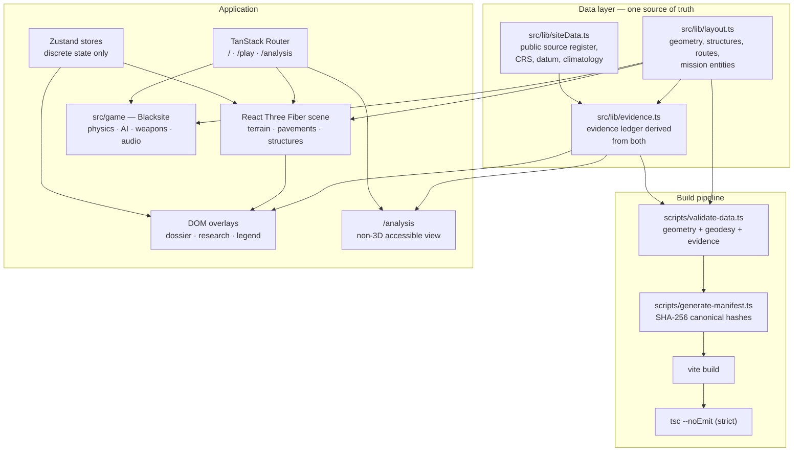
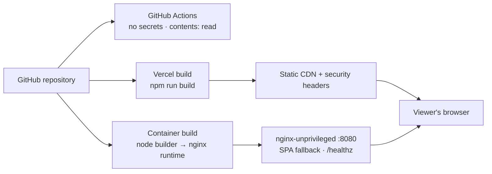

# System architecture

The Lop Nur Geospatial Simulation Testbed is a single-page web application with
no backend. Everything a viewer sees is computed in their browser from data
committed to this repository: there is no database, no API, no user account and
no runtime dependency on a third-party service.

That constraint is deliberate. It makes a release reproducible, makes the whole
data surface auditable, and keeps the deployment boundary small enough to
describe in one page.

## 1. Layers at a glance



## 2. Frontend — React, TypeScript, Vite

- **Vite 8** builds and serves. Output directory is `dist/`; assets are
  content-hashed and immutable. The TanStack Router plugin generates
  `src/routeTree.gen.ts` from the files in `src/routes/` and code-splits each
  route automatically.
- **React 19** with strict TypeScript: `strict`, `noUnusedLocals`,
  `noUnusedParameters`, `noUncheckedIndexedAccess`. `tsc --noEmit` runs as part
  of `npm run build`, so the build is not green until types are.
- **Tailwind CSS 4** through the Vite plugin, plus a small set of
  shadcn-style primitives in `src/components/ui/`.
- No runtime download of any kind is permitted (`AGENTS.md`): every texture,
  mesh, sound and animation is generated procedurally from a seed, which is why
  the repository contains no binary assets.

## 3. Routes (TanStack Router)

| Route | Purpose | Notes |
| :-- | :-- | :-- |
| `/` | The analytical digital twin: 3D scene, dossiers, evidence legend, measurement ruler, research panel | `validateSearch` accepts only `?structure=<known id>` |
| `/play` | **Blacksite** — the first-person simulation on the same geometry | Permanent "Illustrative simulation — not operational data" banner and a return link, both outside the game HUD |
| `/analysis` | Non-3D accessible analysis: searchable structure table, evidence legend, limitations, manifest | No canvas, no animation, no timers |
| *unknown* | Styled not-found view offering the real routes | `src/routes/__root.tsx` |

All three load directly and survive a refresh; the host rewrites unknown paths
to `index.html` while still serving real files as themselves.

## 4. Three.js and React Three Fiber

- One `<Canvas>` per 3D route, with `logarithmicDepthBuffer: true` — the site
  spans ~26 km of camera range while pavement decals sit 5 cm apart.
- `src/components/scene/` holds terrain, pavements, structures, atmosphere,
  camera rigs, adaptive quality and the illustrative living scene.
- `src/gfx/` holds the custom GLSL post stack (AgX tone mapping, anamorphic
  streaks, lens artifacts) and the procedural hard-surface material patching.
- **No React state on the frame loop.** Per-frame values move through mutable
  singletons (`src/lib/telemetry.ts`, `src/game/core/gameState.ts`) or refs
  mutated inside `useFrame`.
- `AdaptiveQuality` steps a four-tier ladder on a rolling FPS estimate;
  `prefers-reduced-motion` freezes automatic scene motion and disables
  promotion.

## 5. Zustand stores

Two stores, both for **discrete** state only:

- `src/lib/store.ts` — camera mode, selection, night, timeline year, quality
  tier, measurement points, panel toggles, reduced-motion preference.
- `src/game/core/gameStore.ts` — game screen, mode, loadout, killfeed,
  settings, match seed.

Anything that changes every frame is deliberately *not* here.

## 6. Shared digital-twin layout

`src/lib/layout.ts` is the single source of truth for placement: runway,
strips, taxiways, streets, roads, aprons, structures, flatten pads, cinematic
waypoints, ground zones, the flight circuit and the mission-entity registry.
The 3D scene, the minimap, the site index, the measurement ruler, the analysis
table and Blacksite's collision world are all projections of it. Coordinates
are metres, `+x` east, `+z` south, `y` up, registered to EPSG:32645 at the
public runway-centre reference.

Adding a structure there makes it appear in the world, the minimap, the site
index, the analysis table and the combat map at once — and gives it an evidence
record, because the ledger is derived from the same file.

## 7. Blacksite simulation layer

`src/game/` mounts the twin's `Terrain`, `Pavements`, `Structures` and
`Atmosphere` unchanged and **bakes its collision out of the rendered scene
graph**, so the playable map and the analytical model cannot drift apart. Under
it: an oriented-box collision world in a uniform grid, capsule collide-and-slide
movement, terminal ballistics with per-material penetration, a bot state
machine with shared contacts, procedural character rigs with two-bone IK, and
fully synthesised audio. None of it asserts anything about the real site; it
demonstrates that one geometry can serve both analysis and simulation.

## 8. Data-validation pipeline

`npm run validate:data` (`scripts/validate-data.ts`) runs before every build
and checks, among ~40 classes of assertion:

- geometry: unique ids across catalogs, finite coordinates, footprints inside
  the site bounds, positive dimensions;
- geodesy: runway length within 50 m and grid bearing within 0.5° of the
  documented figures, UTM registration of the runway centre, the measurement
  tool reproducing both from the same layout;
- flight path: minimum terrain clearance sampled at 20 000 points;
- sources: unique ids, HTTPS URLs, required attribution and access dates;
- timeline: bounds derived from dated records, visibility rules;
- quality tiers: monotonic budgets across the ladder;
- **evidence**: the full ledger, via `src/lib/evidenceValidation.ts`.

`npm run test:evidence` then feeds deliberately malformed records through the
validator and asserts each rule fires, so "the data is validated" is a
statement a reviewer can check.

## 9. Evidence ledger

`src/lib/evidence.ts` derives one `EvidenceRecord` per (subject, source) pair
from the layout and the source register: classification, 0–1 confidence,
source title, publisher, publication and access dates, CRS, stated measurement
uncertainty, analyst notes. Records are sorted by id so the ledger hash is
stable. Nothing is hand-maintained, so a record cannot describe a structure
that no longer exists — and `getEvidenceForSubject()` is the single accessor
the dossier, the research panel and `/analysis` all read.

See `docs/DATA_PROVENANCE.md`.

## 10. Model manifest

`scripts/generate-manifest.ts` writes `public/model-manifest.json` before every
build: model name and version, generation time, CRS, record and source counts,
per-classification counts, SHA-256 hashes of the canonicalised geometry and
ledger, validation status, an explicit `assurance` block of what this system is
**not** certified for, and the known-limitations list. Hash inputs are
canonicalised (recursively sorted keys) so repeated builds agree; setting
`SOURCE_DATE_EPOCH` makes the file byte-reproducible.

## 11. Build pipeline

```text
npm run build
  ├─ node scripts/run-ts.mjs scripts/validate-data.ts     # data + evidence gate
  ├─ node scripts/run-ts.mjs scripts/generate-manifest.ts # public/model-manifest.json
  ├─ vite build                                           # → dist/
  └─ tsc --noEmit                                         # strict types
```

`scripts/run-ts.mjs` runs those TypeScript scripts under **either** runtime:
Bun natively, or Node ≥ 22.18 using its built-in type stripping plus a
`module.registerHooks` resolver. Both produce byte-identical manifests, so an
evaluator with only Node installed can reproduce a release exactly.

## 12. Deployment boundary



Everything the host serves is static. The trust boundary is the origin: past
it, the viewer's browser holds the entire model and can be assumed hostile.
Security headers (CSP, `nosniff`, `Referrer-Policy`, `X-Frame-Options`,
`Cross-Origin-Opener-Policy`, `Permissions-Policy`, HSTS on the hosted demo)
are defined identically in `vite.config.ts` (preview), `vercel.json` and
`deploy/nginx.conf`, so a policy that would break production breaks
`npm run a11y` locally first.

## 13. Browser trust boundary

The browser executes the application, holds all of the data, and is outside the
project's control. Consequently:

- the application performs no authentication and stores nothing;
- every URL parameter is validated and clamped before use;
- every outbound link is scheme-checked and carries `noopener noreferrer`;
- the only runtime fetch is a same-origin request for `model-manifest.json`,
  made lazily when a manifest panel is opened;
- the only third-party request is the opt-in `?liveTraffic=1` ADS-B feed,
  which is off by default and confined by `connect-src`.
