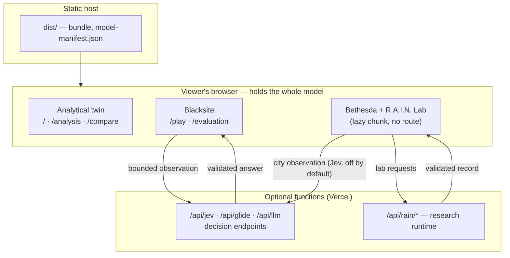
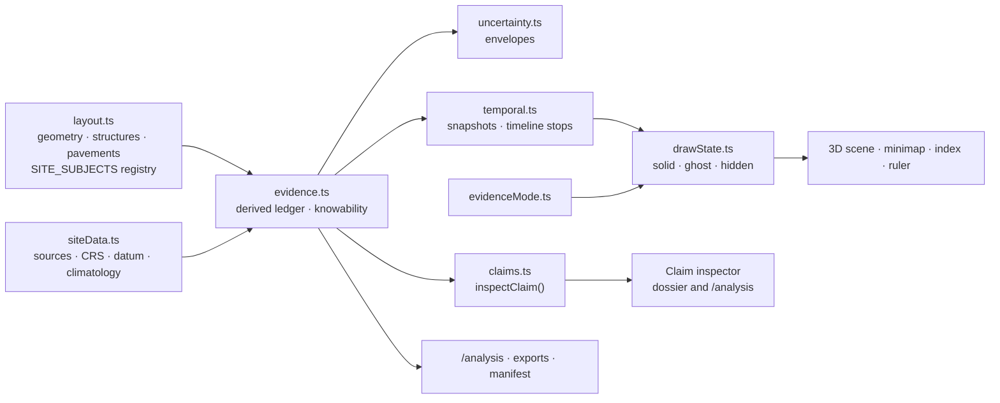
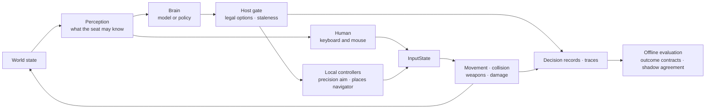
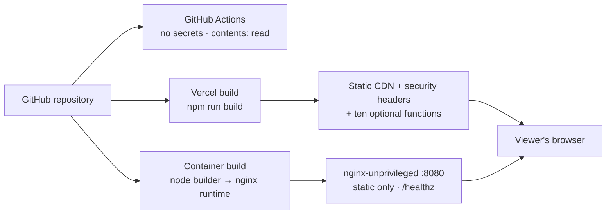

# System architecture

One repository, one build and one deployment hold three things that share a
discipline rather than a purpose:

- **The analytical twin** (`/`, `/analysis`, `/compare`) — a public-source
  reconstruction of a desert airfield in which every claim is derived from a
  source register and carries its classification, its uncertainty and the date
  it became knowable.
- **Blacksite** (`/play`, `/evaluation`) — a first-person decision environment
  built on the twin's geometry, where a person, a scripted policy or a remote
  model holds the same seat under the same rules, and every decision is
  recorded with the observation it was made from.
- **Bethesda and the R.A.I.N. Lab** — a hidden, lazily loaded city simulation
  on mapped geography, and a research lab inside it whose hypotheses become
  authorized, replayable experiments on that simulator.

The discipline they share is the boundary between what is observed, what is
inferred, what is decided and what happens next. The architecture exists to
keep those four apart and to make each one inspectable.

## 1. What runs where

Everything analytical runs in the viewer's browser from data committed to this
repository: there is no database, no user account and no runtime dependency on
a third-party service for the model. The server side is optional and never
touches the analytical model:

| Server side (Vercel Functions, declared in `vercel.json`) | What it does                                                                                                 | Holds                                   |
| :-------------------------------------------------------- | :----------------------------------------------------------------------------------------------------------- | :-------------------------------------- |
| `api/jev/decision.ts`                                     | Writes the question for TypeSafe Jev from a validated observation and returns a validated answer             | `TYPESAFE_API_KEY`                      |
| `api/glide/decision.ts`                                   | The same question, word for word, to Fastino Glide                                                           | `FASTINO_API_KEY`                       |
| `api/llm/decision.ts`                                     | The same question content to a configured Anthropic or OpenAI-compatible model                               | `LLM_API_KEY`                           |
| `api/rain/*.ts` (seven routes)                            | The R.A.I.N. research runtime, in process: status, meetings, bounded proposals, pre-registration, submission | `RAIN_LLM_API_KEY` (optional), registry |

Ten functions in all. None is a prompt proxy: the browser sends a bounded,
validated observation or request, and the server writes whatever reaches a
model. The decision endpoints store nothing. The R.A.I.N. runtime keeps an
experiment registry in a scratch directory unless `RAIN_REGISTRY_DIR` names one
(see the limitation in §9). In development, `vite.config.ts` serves the same
handlers as middleware.

The site works without any of them: a decision seat whose endpoint is missing
says `UNAVAILABLE`, and the lab says `OFFLINE`. The container image (§10) has
no functions at all and answers each `/api/` family the way its client reads
"not here".


```mermaid
flowchart TB
  subgraph browser["Viewer's browser — holds the whole model"]
    twin["Analytical twin<br/>/ · /analysis · /compare"]
    play["Blacksite<br/>/play · /evaluation"]
    city["Bethesda + R.A.I.N. Lab<br/>(lazy chunk, no route)"]
  end
  subgraph static["Static host"]
    dist["dist/ — bundle, model-manifest.json"]
  end
  subgraph fns["Optional functions (Vercel)"]
    dec["/api/jev · /api/glide · /api/llm<br/>decision endpoints"]
    rain["/api/rain/* — research runtime"]
  end
  dist --> browser
  play -- "bounded observation" --> dec
  city -- "city observation (Jev, off by default)" --> dec
  city -- "lab requests" --> rain
  dec -- "validated answer" --> play
  rain -- "validated record" --> city
```

## 2. The analytical twin

### One source of truth, everything derived


```mermaid
flowchart LR
  layout["layout.ts<br/>geometry · structures · pavements<br/>SITE_SUBJECTS registry"] --> ledger
  site["siteData.ts<br/>sources · CRS · datum · climatology"] --> ledger
  ledger["evidence.ts<br/>derived ledger · knowability"] --> unc["uncertainty.ts<br/>envelopes"]
  ledger --> temporal["temporal.ts<br/>snapshots · timeline stops"]
  ledger --> claims["claims.ts<br/>inspectClaim()"]
  temporal --> draw["drawState.ts<br/>solid · ghost · hidden"]
  mode["evidenceMode.ts"] --> draw
  draw --> scene["3D scene · minimap · index · ruler"]
  claims --> inspector["Claim inspector<br/>dossier and /analysis"]
  ledger --> analysis["/analysis · exports · manifest"]
```

- **`src/lib/layout.ts`** places everything: runway, taxiways, aprons,
  structures, flatten pads, routes, and `SITE_SUBJECTS`, the registry of every
  subject a claim can be about (site, terrain, environment, pavements,
  structures, aircraft, vehicles, sensors, routes) with their relationships.
  Each structure and pavement declares its evidence — status, attesting
  sources, method references, observation date — in the same place it is
  placed. Coordinates are metres, `+x` east, `+z` south, registered to
  EPSG:32645 at the public runway-centre reference.
- **`src/lib/siteData.ts`** owns the public source register, the local CRS and
  datum, and the climatology.
- **`src/lib/evidence.ts`** derives the ledger: one record per subject and
  attesting source. Nothing is hand-written, so a claim cannot outlive the thing
  it describes. Method references (a sensor handbook, say) explain how an
  observation was made and never become a record. `recordKnowability()` dates
  each record to the later of its source's publication and the observation its
  claim rests on: **a claim is knowable no earlier than its evidence.**
  `getEvidenceForSubject()` is the only accessor UI code uses.
- **`src/lib/evidenceValidation.ts`** enforces the classification contract at
  build time (an illustrative subject cannot get a non-illustrative record, an
  observed claim needs a citable source, a source cannot predate the
  observation it attests, and so on — 37 rules, each asserted to fire by
  `scripts/test-evidence-validation.ts`).

### Time is evidence time

The scene's only clock is `snapshotDate` in the twin store: `null` is "now",
and any other value is one of the dates on which the evidence changed
(`TIMELINE_STOPS`). `drawState.ts` answers, for any subject at any date, one
of three things:

- **solid** — publicly established by that date, on evidence knowable by then,
  and admitted by the current evidence mode;
- **ghost** — the model places it, but at that date it was not yet publicly
  established (including when no evidence of it existed yet), or its
  classification then is filtered out; drawn as an outline;
- **hidden** — withheld by the evidence mode at any date.

One predicate composes the timeline and the evidence mode; components ask
`useSubjectFilter()` / `useSubjectDrawState()` rather than comparing
classifications themselves. The legacy `?year=` URL parameter clamps to the
modeled years, maps the last one to "now", and any other to the last timeline
date on or before the end of that year.

### Claims are inspectable

`inspectClaim(subjectId, date)` (`src/lib/claims.ts`) assembles what one
subject's claim is: its classification and what that means, what the evidence
establishes, what is inferred, what is unknown, the separate dates (site event,
first publication, knowable from, and model entry with its last change, from the
recorded model history), supporting sources and method references,
relationships, and its standing at the selected date.

### The model has a history

`model-history/` records every change to what this model says since the first
manifest that digested each subject: the manifest each model-changing commit on
`main` produced, re-derived by running that commit's own generator and kept byte
for byte. The build refuses a model that is not its latest revision, CI
reproduces every one, the claim inspector answers "when did this enter the
model, and what has changed since", and `/compare` opens any two revisions
(`?before=r2&after=r3`). It is a record of the instrument, not evidence about
the site. The dossier and `/analysis` render the same
inspection through `ClaimInspector.tsx`.

### Accessible front doors

`/analysis` (searchable table, claim inspection inline, the snapshot table,
spatial queries and exports) and `/compare` (release manifests side by side)
work without WebGL, without animation and without timers. Every analytical
capability has a semantic representation there, and `bun run a11y` gates both
on serious or critical axe violations.

## 3. Blacksite: one seat, many minds


```mermaid
flowchart LR
  World["World state"] --> Perception["Perception<br/>what the seat may know"]
  Perception --> Human["Human<br/>keyboard and mouse"]
  Perception --> Brain["Brain<br/>model or policy"]
  Brain --> Gate["Host gate<br/>legal options · staleness"]
  Gate --> Controllers["Local controllers<br/>precision aim · places navigator"]
  Human --> Input["InputState"]
  Controllers --> Input
  Input --> Rules["Movement · collision<br/>weapons · damage"]
  Rules --> World
  Gate --> Records["Decision records · traces"]
  Rules --> Records
  Records --> Offline["Offline evaluation<br/>outcome contracts · shadow agreement"]
```

- **A brain writes `InputState` and nothing else.** The seam is one line in
  `PlayerRig.tsx`; movement, weapons, recoil, collision and damage then run
  exactly as they do for a human. `authority.test.ts` fails if any control-layer
  file queues damage, writes a collider, health or weapon state, moves a body,
  fires a weapon or touches the camera.
- **Perception is the player's** (`perception.ts`): an enemy is reported only
  inside the field of view, in range, with a clear line to the head or chest.
  Anything else arrives the way it reaches a human — a gunfire ping, a damage
  direction, a remembered position. The human HUD shows nothing the observation
  would not contain.
- **The host decides what an answer may do.** `contract.ts` is the vocabulary;
  `legalActionsFor` filters by mechanics only; the loop (`loop.ts`) refuses a
  frame that names an option the observation did not offer, and
  `staleness.ts` re-judges every frame against the world at execution. A late
  or superseded answer is dropped, never applied.
- **Every decision leaves a record** (`blacksite-decision/v1`): the
  observation, the legal options, the frame, the source (model, fallback,
  replay, script), confidence with its true source, accounting with unknowns as
  `null`, and an outcome window. **Save decisions** in the HUD exports an
  episode's records (`blacksite-episode-decisions/v1`).
- **Measuring is not judging.** Success is decided offline by versioned outcome
  contracts (`src/game/eval/outcomeContracts.ts`); experiments are declared
  before they run (`blacksite-experiment/v1`), with a primary metric from the
  registry. `/evaluation` reads archived runs and any saved file.
- **Same observations, other minds.** Matched seeds diverge after the first
  decision, so `src/game/eval/shadow.ts` replays each recorded observation to
  the scripted reference policies and reports per-axis agreement against the
  exact chance of a uniform chooser (`blacksite-shadow/v1`,
  `node tools/experiment.mjs --shadow <run>`). It is agreement on identical
  inputs, not a counterfactual outcome and not a skill score.

`src/game/` mounts the twin's `Terrain`, `Pavements`, `Structures` and
`Atmosphere` unchanged and bakes its collision out of the rendered scene graph,
so the playable map and the analytical model cannot drift apart. Nothing in it
writes to the evidence ledger, and nothing it does is evidence about the real
site.

## 4. Bethesda and the R.A.I.N. Lab

Bethesda is reached through `src/components/AnomalyGate.tsx` (the backtick
resolver, or Bethesda's coordinates in the Site Index) and loaded as a separate
chunk; ordinary visits never request its data. It must stay removable: outside
`src/bethesda/`, only the gate, the Site Index row, the city branch of the Jev
handler and the Bethesda scripts reference it.

- **Geography** comes from two hashed OpenStreetMap derivatives and a
  Montgomery Planning elevation crop, each with a source manifest checked by
  `scripts/validate-bethesda.ts` at build time.
- **The simulation** (`simulation.ts`) is deterministic, renderer-free and
  replayable. Scenarios are compiled by a rule compiler (not a language model)
  into typed events at gazetteer places; events declare effects in
  `EVENT_EFFECTS`, and agent rules read effects, never event names.
- **One gate for every chooser.** The rules, a person in the pedestrian seat
  and Jev (off by default) all pass the same legal-action gate, are recorded as
  commands, and get back what the gate did. An agent indoors takes no choice
  from anyone. A behaviour change bumps `SIM_VERSION`/`REPLAY_SCHEMA`, and
  traces from another revision are refused with an explanation.
- **The R.A.I.N. Lab** (`src/bethesda/rain/`) holds the live city read-only.
  Its runtime (`src/rain/`) runs server-side in `/api/rain/*`; the browser
  imports only its pure modules. R.A.I.N. chooses among host-defined options,
  the host writes the proposal, a person authorizes the exact definition's
  digest, runs execute on separate simulators, and every ending is a sealed
  record that is evidence only once replay re-simulates it. Imported records,
  and records this browser kept from earlier visits, wait in a quarantine until
  replay passes.

## 5. Frontend stack

- **Vite 8** builds and serves; assets are content-hashed and immutable. The
  TanStack Router plugin generates `src/routeTree.gen.ts` from `src/routes/`
  and code-splits each route.
- **React 19** with strict TypeScript (`strict`, `noUnusedLocals`,
  `noUnusedParameters`, `noUncheckedIndexedAccess`); `tsc --noEmit` runs inside
  the build.
- **Tailwind CSS 4** through the Vite plugin, plus a few shadcn-style
  primitives in `src/components/ui/`.
- **No runtime downloads.** Every texture, mesh, sound and animation is
  generated procedurally from a seed, which is why the repository contains no
  binary assets beyond documentation screenshots.

## 6. Routes

| Route         | Purpose                                                                                                  | Notes                                                                        |
| :------------ | :------------------------------------------------------------------------------------------------------- | :--------------------------------------------------------------------------- |
| `/`           | The analytical twin: 3D scene, claim inspector, evidence timeline and modes, measurement, research panel | Every URL parameter goes through `src/lib/params.ts`                         |
| `/analysis`   | The twin without WebGL: claims, snapshots, spatial queries, exports, manifest                            | No canvas, no animation, no timers                                           |
| `/compare`    | Two release manifests side by side                                                                       | This build's `model-manifest.json`, or files the viewer loads                |
| `/play`       | **Blacksite**, with `?brain=human\|jev\|glide\|llm\|random\|script\|replay`                              | Permanent "Illustrative simulation — not operational data" banner            |
| `/evaluation` | Archived and loaded evaluations, decision traces, shadow agreement                                       | Reads `docs/benchmarks/**` bundled at build time, or a file the viewer opens |
| _unknown_     | Styled not-found view offering the real routes                                                           | `src/routes/__root.tsx`                                                      |

Every route loads directly and survives a refresh; the host rewrites unknown
paths to `index.html` while still serving real files as themselves.
`tools/routes.mjs` throws hostile parameters at each one.

## 7. Rendering and state

- One `<Canvas>` per 3D surface, with `logarithmicDepthBuffer: true`; custom
  shader materials must include the log-depth chunks.
- `src/components/scene/` holds terrain, pavements, structures, evidence ghosts,
  atmosphere, camera rigs, adaptive quality and the illustrative living scene;
  `src/gfx/` holds the GLSL post stack and the hard-surface material patching.
  Tone mapping happens exactly once (`Atmosphere.tsx` decides where).
- **No React state on the frame loop.** Per-frame values move through mutable
  singletons (`src/lib/telemetry.ts`, `src/game/core/gameState.ts`) or refs
  mutated in `useFrame`. The zustand stores hold discrete state only:
  `src/lib/store.ts` (camera mode, selection, evidence mode, snapshot and
  comparison dates, uncertainty and panel toggles, measurement points,
  environment month, quality) and `src/game/core/gameStore.ts` (screens,
  loadout, killfeed, settings, match seed).
- `AdaptiveQuality` steps a four-tier ladder on a rolling frame-rate estimate;
  `prefers-reduced-motion` freezes automatic motion.

## 8. Build pipeline

```text
npm run build
  ├─ node scripts/run-ts.mjs scripts/validate-data.ts      # geometry, geodesy, evidence, timeline
  ├─ node scripts/run-ts.mjs scripts/validate-bethesda.ts  # city data, corpus and DEMO hashes
  ├─ node scripts/run-ts.mjs scripts/generate-manifest.ts  # public/model-manifest.json
  ├─ node scripts/run-ts.mjs scripts/validate-model-history.ts  # this model is its latest recorded revision
  ├─ vite build                                            # → dist/
  ├─ tsc --noEmit                                          # strict types
  └─ node tools/jev-secret-scan.mjs dist                   # no credential in the bundle
```

`scripts/run-ts.mjs` runs the TypeScript scripts under Bun natively or under
Node ≥ 22.18 with its built-in type stripping; both produce byte-identical
manifests. `validate-data.ts` checks, among other things, that nothing is drawn
solid before its earliest knowable date and that every dated subject is
publicly established at the last snapshot. The manifest hashes the canonical
geometry and evidence ledger (SHA-256 over recursively sorted keys), records
counts and validation status, and states in an `assurance` block what the
system is **not** certified for. `SOURCE_DATE_EPOCH` makes it byte-reproducible.

## 9. Known architectural limits

- **The R.A.I.N. registry's records are per instance.** Unset,
  `RAIN_REGISTRY_DIR` falls back to a scratch directory per server process, and
  a function deployment refuses a configured one. A pre-registration carries a
  certificate (an HMAC under `RAIN_REGISTRY_SECRET` over the definition), so a
  submission is judged against its registered definition on whichever instance
  it reaches; without the secret, Vercel reports the registry unavailable. What
  stays per instance is the run record and its number, which vanish with the
  instance: durable records need one process and `RAIN_REGISTRY_DIR`.
- **Model meetings need a long-lived process** and are refused in a function
  deployment.
- **The browser holds everything.** A viewer can read and alter any of it,
  including what it keeps in `localStorage`; nothing there is trusted (§11).

## 10. Deployment boundary


```mermaid
flowchart LR
  repo["GitHub repository"] --> ci["GitHub Actions<br/>no secrets · contents: read"]
  repo --> vercel["Vercel build<br/>npm run build"]
  repo --> docker["Container build<br/>node builder → nginx runtime"]
  vercel --> cdn["Static CDN + security headers<br/>+ ten optional functions"]
  docker --> nginx["nginx-unprivileged :8080<br/>static only · /healthz"]
  cdn --> browser["Viewer's browser"]
  nginx --> browser
```

Security headers (CSP, `nosniff`, `Referrer-Policy`, `X-Frame-Options`,
`Cross-Origin-Opener-Policy`, `Permissions-Policy`; HSTS on the hosted demo)
are defined in `vite.config.ts` (preview), `vercel.json` and
`deploy/security-headers.conf`, which `deploy/nginx.conf` includes in every
location that sets a header of its own — nginx drops all inherited headers in
such a location. `src/lib/deployHeaders.test.ts` holds the container's copy to
`vercel.json`'s, and `npm run a11y` fails on a CSP violation against the
preview server. The container serves static files only and answers `/api/`
with each family's "not configured" shape, so Blacksite's remote seats report
`UNAVAILABLE` and the lab reports `OFFLINE` there.

## 11. Browser trust boundary

The browser executes the application, holds all of its data and is outside the
project's control. Consequently:

- there is no authentication anywhere, and none is simulated;
- every URL parameter is parsed, bounded and clamped by `src/lib/params.ts`;
- every outbound link is scheme-checked and carries `noopener noreferrer`;
- same-origin requests are for `model-manifest.json` (on `/analysis` and
  `/compare`, and when the research panel opens), the decision endpoints (only
  when a remote seat is chosen, or Jev is switched on in Bethesda) and
  `/api/rain/*` (only inside the lab);
- the only third-party request is the opt-in `?liveTraffic=1` ADS-B feed, off
  by default and confined by `connect-src`;
- what the app keeps stays in this browser's `localStorage`: view bookmarks
  (`lop-nur-twin.bookmarks.v3`), the last Blacksite trace, and the lab's
  registry of experiment records. A stored lab record is re-verified by replay
  before it counts as evidence again;
- model output is untrusted text: answers are validated against the offered
  options on the server and again in the browser, and nothing a model writes is
  run, opened, fetched or linked.

See [`DEPLOYMENT.md`](DEPLOYMENT.md), [`THREAT_MODEL.md`](THREAT_MODEL.md) and
[`../SECURITY.md`](../SECURITY.md).
