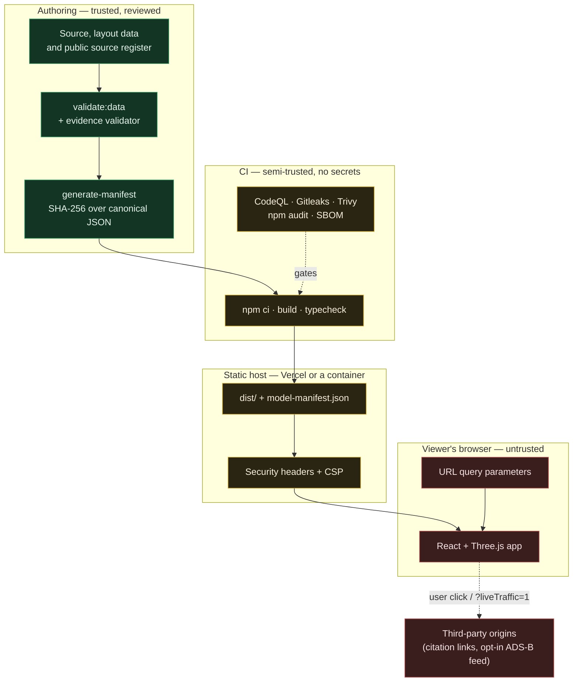

# Threat model

**System:** Lop Nur Geospatial Simulation Testbed — a static, client-side web
application serving a public-source geospatial reconstruction, an evidence
ledger, an accessible analysis view, and an illustrative first-person
simulation.

**Method:** assets → trust boundaries → actors → threats → mitigations →
residual risk. Written to be argued with. If a mitigation below is not visible
in the code, it is not a mitigation.

**Scope note.** The most consequential risk in this system is not technical. A
viewer treating an interpreted footprint or an illustrative building as
verified intelligence causes more harm than any cross-site scripting bug in a
static site would, and it is the threat the architecture spends the most effort
on. It is listed first.

---

## 1. Assets

| Asset | Why it matters | Where it lives |
| :-- | :-- | :-- |
| **Evidence integrity** — classification, confidence, citation and uncertainty attached to each claim | The project's only real product. If interpretation can be presented as observation, the model becomes misinformation with a professional finish. | `src/lib/evidence.ts`, `src/lib/layout.ts`, `src/lib/siteData.ts` |
| **Model geometry** | The measurable substrate everything else is projected from. | `src/lib/layout.ts` |
| **Release identity** — geometry and ledger hashes, counts, known limitations | Lets a reviewer prove which build they reviewed. | `public/model-manifest.json`, `scripts/generate-manifest.ts` |
| **Build pipeline integrity** | Everything reaches users through it; compromise here defeats every other control. | `package.json` scripts, `.github/workflows/`, lockfiles |
| **Viewer's browser session** | The application executes in it. Its origin must not be usable to attack the viewer. | Deployed origin |
| **Project reputation** | An OSINT artifact that is caught overstating its evidence is worthless afterwards. | The whole repository |

Explicitly **not** assets, because they do not exist: user accounts, personal
data, credentials, API keys, session tokens, non-public information of any
kind.

## 2. Trust boundaries

The boundaries that matter:

1. **Authoring → build.** Data becomes a release only by passing validation.
   The validator is the gate, so a weakened validator is a weakened boundary.
2. **CI → host.** CI runs without repository secrets and cannot write to the
   repository. Pull-request code therefore cannot obtain anything to steal.
3. **Host → browser.** Everything past this line is public and attacker-visible.
   No control on the browser side protects data; controls there protect the
   *viewer*.
4. **Browser → third parties.** Only two paths cross it: a link the viewer
   clicks, and one opt-in feed that is off by default.

## 3. Threat actors

| Actor | Capability | Motivation |
| :-- | :-- | :-- |
| **Anonymous public user** | Any URL, any query parameter, browser dev tools, unlimited requests | Curiosity, research, or probing for a bug |
| **Malicious link author** | Crafts a URL to a legitimate deployment and sends it to a target | Make the application render or do something misleading |
| **Compromised or malicious dependency** | Arbitrary code inside the build and inside the shipped bundle | Steal from viewers, or tamper with the model |
| **Malicious contributor** | Opens a pull request containing code and workflow changes | Get code into the build, or exfiltrate CI credentials |
| **Hostile network position** | Sees and can alter traffic on a non-HTTPS deployment | Tamper with the model or inject script |
| **Well-intentioned misreader** | Reads the model correctly and cites it incorrectly | None — this is the highest-likelihood harm in the system |

## 4. Threats and mitigations

### T1 — Simulated or interpreted content is mistaken for verified intelligence

*Most likely harm in this system.*

**Mitigations**

- Four-way classification (`observed` / `reported` / `interpreted` /
  `illustrative`) on every claim, in one shared schema
  (`src/lib/evidence.ts`), surfaced identically in the dossier, the research
  panel and `/analysis`.
- The build **fails** if an illustrative subject carries a non-illustrative
  record, if an interpreted subject is labelled observed, or if the wording of
  an interpreted or illustrative claim asserts verification
  (`src/lib/evidenceValidation.ts`; `scripts/test-evidence-validation.ts`
  proves each rule still fires).
- Status is never carried by colour alone: every badge pairs a glyph and a word.
- `/play` carries a permanent "Illustrative simulation — not operational data"
  banner outside the game HUD, so it cannot disappear between screens.
- `knownLimitations` ships inside `model-manifest.json`, so a machine consuming
  the data receives the caveats with it.
- Confidence is published as a documented ordinal rank, never as a measured
  probability.

**Residual risk.** A screenshot separates a label from its caveat. A determined
misreader can quote the model out of context. Nothing in the software prevents
this; the manifest and the labelled ledger only make the correction citable.

### T2 — Cross-site scripting and content injection

**Attack paths.** A `javascript:` or `data:` URL in a citation; HTML smuggled
into a structure description; a query parameter reflected into the DOM.

**Mitigations**

- No `dangerouslySetInnerHTML`, no `innerHTML` assignment, no `eval`, no
  `new Function` anywhere in `src/`. React escapes all interpolated text.
- Every external href passes `safeExternalHref()`
  (`src/lib/safeUrl.ts`), which parses the URL and returns it only if the
  scheme is `https:`. Anything else renders as plain text.
- `scripts/validate-data.ts` rejects a non-HTTPS or unparseable source URL at
  build time, and the evidence validator repeats the check on every record.
- Content-Security-Policy: `script-src 'self'`, `object-src 'none'`,
  `base-uri 'self'`, `frame-ancestors 'none'`. The production build emits no
  inline script, which is what makes `script-src 'self'` achievable.
- `X-Content-Type-Options: nosniff`; `X-Frame-Options: DENY`.

**Residual risk.** `style-src 'unsafe-inline'` is required by the framework, so
CSS-based exfiltration or UI redressing via injected styles is not blocked by
the policy. The mitigation for that is the absence of any injection point, not
the policy.

### T3 — Malicious or malformed URL parameters

**Attack paths.** `?quality=1e9`, `?at=1e308,0`, `?near=-0`, `?mode=<script>`,
`?structure=../../etc/passwd`, absurdly long values.

**Mitigations**

- One module parses every parameter (`src/lib/params.ts`): values over 64
  characters are ignored outright; numbers must be finite and are clamped to
  ranges derived from the model (`?at=` to the site extent, `?quality=` to
  0–3, `?near=` to 0.001–100 m); enums must match an allowlist; flags must be
  exactly `1` or `true`; ids must match `^[a-z0-9][a-z0-9-]{0,63}$` **and**
  name a structure that exists.
- Empty and partial values are rejected rather than coerced — `Number("")` is
  `0`, which is exactly the sort of accidental "valid" input that used to place
  a player at the origin.
- Route-level `validateSearch` on `/` and `/analysis` drops anything that does
  not name a real structure, so a bad link renders the normal page.
- Parsing never throws: a malformed parameter degrades to the default instead
  of a blank page.

**Residual risk.** Developer parameters (`?stage=`, `?ao=`, `?novm=`) remain
public. They change rendering only, and are bounded.

### T4 — Route manipulation and deep links

**Mitigations.** Unknown paths render a styled not-found view with links to the
two real views (`src/routes/__root.tsx`). SPA fallback is configured so
`/play` and `/analysis` load when opened directly and survive a refresh, while
real files are still served as themselves. `frame-ancestors 'none'` stops the
app being framed by another site.

**Residual risk.** None material; there is no privileged route to reach.

### T5 — Compromised dependency / supply-chain attack

**Mitigations.** Frozen-lockfile installs in CI and in the container build;
`--ignore-scripts` in the Docker builder so no dependency's postinstall runs
during an image build; Dependabot; `npm audit`; Trivy; CodeQL; dependency
review on pull requests; SBOM in CycloneDX and SPDX per run; no CDN or runtime
third-party script; a deliberately small runtime dependency set.

**Residual risk.** Substantial and irreducible for any npm project: a
dependency compromised between publication and audit ships. GitHub Actions are
pinned to major-version tags rather than commit digests, so a compromised tag
would be picked up. Digest pinning is recommended before any agency pilot
(`docs/FUTURE_BACKEND.md`).

### T6 — Malicious pull request targeting CI

**Mitigations.** The workflow's default is `permissions: contents: read`; only
the CodeQL job (`security-events: write`) and dependency review
(`pull-requests: read`) raise it, and neither runs pull-request code with
those permissions in a way that can write to the repository. No repository
secret is referenced anywhere in either workflow, so there is nothing for
untrusted code to exfiltrate. `pull_request_target` is not used.

**Residual risk.** A pull request can consume CI minutes.

### T7 — Untrusted source metadata and malicious citation URLs

**Mitigations.** Sources live in one reviewed register (`PUBLIC_SOURCES`), are
validated at build time for HTTPS and required fields, are filtered again at
render time, and open with `rel="noopener noreferrer"` plus a
`strict-origin-when-cross-origin` referrer policy so a third party learns
nothing about the reader's path.

**Residual risk.** A cited page can change after the access date recorded here.
That is a provenance limitation, documented in `docs/DATA_PROVENANCE.md`, not a
code defect — and it is why no source content hash is fabricated.

### T8 — Denial of service

**Mitigations.** The application is static: capacity is the host's. The heaviest
cost is client-side, and the adaptive quality ladder sheds work automatically;
`?quality=0..3` pins a tier. `client_max_body_size 1k` in the container config
means the server accepts no meaningful request body.

**Residual risk.** A viewer on old hardware may still find the 3D scene
unusable — which is one of the reasons `/analysis` exists.

### T9 — Browser storage

**Mitigations.** The shipped application writes nothing to `localStorage`,
`sessionStorage`, IndexedDB or cookies. The only code that touches
`localStorage` is in `src/game/_wip/`, which is excluded from `tsconfig.json`
and never bundled. No tracking, no analytics, no fingerprinting.

**Residual risk.** None while that holds. Any future persistence should be
reviewed against this line, because a public kiosk deployment would then leak
one visitor's state to the next.

### T10 — Accidental publication of sensitive information

*Structural risk for an OSINT project: the harm is committing something that
should not be public, not leaking something that already is.*

**Mitigations.** Every input is a cited public source, reviewed before merge.
No binary assets, no imagery and no DEM tiles are redistributed. Gitleaks scans
full history each run. `.gitignore` and `.dockerignore` exclude `.env*`, keys,
scanner output and capture output. The offline-by-design rule means the
deployed app never pulls data that has not been reviewed.

**Residual risk.** Human. A contributor can add a wrongly-sourced claim; the
mitigation is review and the correctability of an open model.

### T11 — Hostile network position

**Mitigations.** `Strict-Transport-Security` and `upgrade-insecure-requests`
on the hosted deployment; hashed, immutable asset filenames; a manifest whose
hashes let a reviewer detect a tampered model.

**Residual risk.** A plain-HTTP self-hosted deployment defeats all of this.
Serve over HTTPS. Subresource-integrity attributes are not emitted by the
build; same-origin `script-src` is the current compensating control.

## 5. Out of scope

- Hardening the viewer's browser, operating system or extensions.
- Availability guarantees, rate limiting and capacity — properties of the host.
- Correctness disputes about the model's content: those are issues and pull
  requests, and the project treats them as the desired outcome.
- Anything requiring physical access to a viewer's machine.
- Multi-tenant, authenticated or classified-data scenarios. This system does
  not implement authentication and deliberately contains no simulated access
  control that could be mistaken for one. See `docs/FUTURE_BACKEND.md` for what
  a real deployment of that kind would require.

## 6. Assumptions

1. The deployment is served over HTTPS from an origin the operator controls.
2. Everything in the repository and the bundle is public by design.
3. Maintainers review data changes for sourcing as carefully as code changes
   for correctness.
4. CI is not granted repository secrets or write permissions.
5. No non-public information is ever added to this system or a fork of it.
