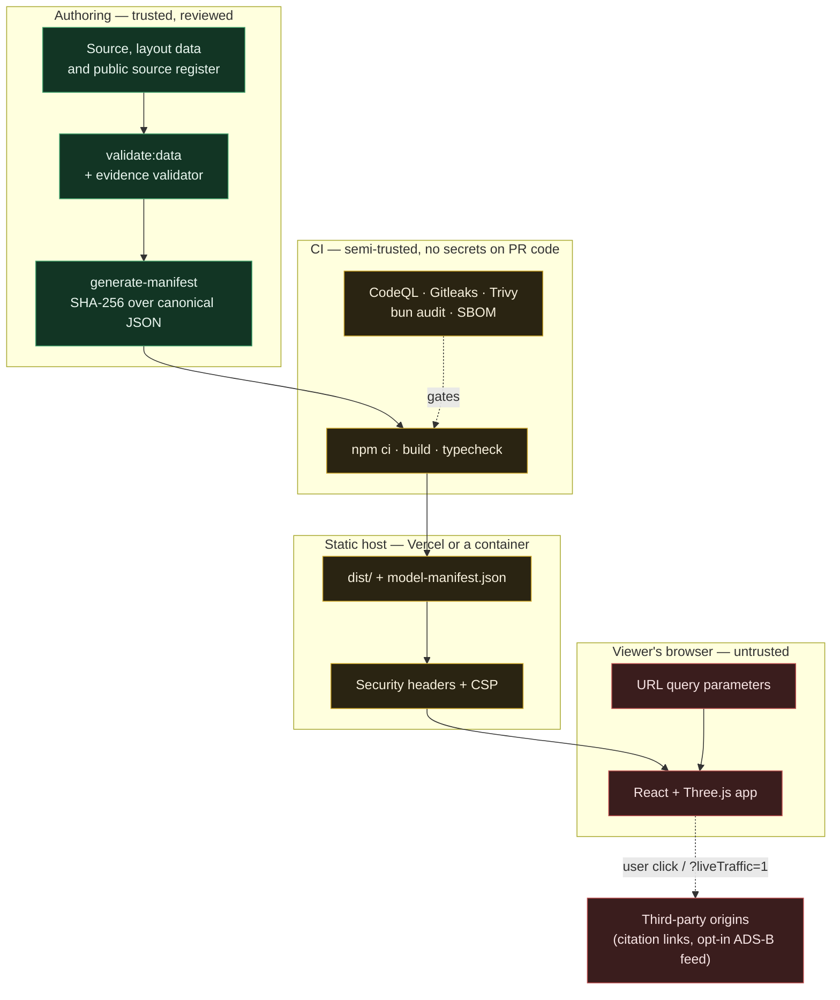

# Threat model

**System:** Lop Nur Twin — a static, client-side web
application serving a public-source geospatial reconstruction, an evidence
ledger, an accessible analysis view, and an illustrative first-person
simulation, plus optional serverless functions: the decision endpoints that let
a model control the simulation's player (T12), and the route behind which the
Bethesda R.A.I.N. Lab's research runtime runs (T13).

**Method:** assets → trust boundaries → actors → threats → mitigations →
residual risk. Written to be argued with. If a mitigation below is not visible
in the code, it is not a mitigation.

**Scope note.** The most consequential risk in this system is not technical. A
viewer treating an interpreted footprint or an illustrative building as
verified intelligence causes more harm than any cross-site scripting bug in a
static site would, and it is the threat the architecture spends the most effort
on. It is listed first.

---

## 1. Assets

| Asset                                                                                                | Why it matters                                                                                                                                   | Where it lives                                                    |
| :--------------------------------------------------------------------------------------------------- | :----------------------------------------------------------------------------------------------------------------------------------------------- | :---------------------------------------------------------------- |
| **Evidence integrity** — classification, confidence, citation and uncertainty attached to each claim | The project's only real product. If interpretation can be presented as observation, the model becomes misinformation with a professional finish. | `src/lib/evidence.ts`, `src/lib/layout.ts`, `src/lib/siteData.ts` |
| **Model geometry**                                                                                   | The measurable substrate everything else is projected from.                                                                                      | `src/lib/layout.ts`                                               |
| **Release identity** — geometry and ledger hashes, counts, known limitations                         | Lets a reviewer prove which build they reviewed.                                                                                                 | `public/model-manifest.json`, `scripts/generate-manifest.ts`      |
| **Build pipeline integrity**                                                                         | Everything reaches users through it; compromise here defeats every other control.                                                                | `package.json` scripts, `.github/workflows/`, lockfiles           |
| **Viewer's browser session**                                                                         | The application executes in it. Its origin must not be usable to attack the viewer.                                                              | Deployed origin                                                   |
| **Project reputation**                                                                               | An OSINT artifact that is caught overstating its evidence is worthless afterwards.                                                               | The whole repository                                              |

Explicitly **not** assets, because they do not exist: user accounts, personal
data, session tokens, non-public information of any kind. The only credentials
are server-side and optional: the model providers' keys and the R.A.I.N.
runtime's model-server token (T12, T13).

## 2. Trust boundaries

```mermaid
flowchart TB
  subgraph authoring["Authoring — trusted, reviewed"]
    src["Source, layout data<br/>and public source register"]
    validate["validate:data<br/>+ evidence validator"]
    manifest["generate-manifest<br/>SHA-256 over canonical JSON"]
  end

  subgraph ci["CI — semi-trusted, no secrets on PR code"]
    build["npm ci · build · typecheck"]
    scan["CodeQL · Gitleaks · Trivy<br/>bun audit · SBOM"]
  end

  subgraph host["Static host — Vercel or a container"]
    dist["dist/ + model-manifest.json"]
    headers["Security headers + CSP"]
  end

  subgraph browser["Viewer's browser — untrusted"]
    app["React + Three.js app"]
    params["URL query parameters"]
  end

  third["Third-party origins<br/>(citation links, opt-in ADS-B feed)"]

  src --> validate --> manifest --> build --> dist
  scan -.gates.-> build
  dist --> headers --> app
  params --> app
  app -. "user click / ?liveTraffic=1" .-> third

  classDef trusted fill:#123524,stroke:#3fa06a,color:#e8f5ee
  classDef semi fill:#2a2412,stroke:#c9a227,color:#f7f0dd
  classDef untrusted fill:#3a1d1d,stroke:#c05353,color:#f7e4e4
  class src,validate,manifest trusted
  class build,scan,dist,headers semi
  class app,params,third untrusted
```

The boundaries that matter:

1. **Authoring → build.** Data becomes a release only by passing validation.
   The validator is the gate, so a weakened validator is a weakened boundary.
2. **CI → host.** The checks that run pull-request code have no repository
   secrets and cannot write to the repository, so pull-request code cannot
   obtain anything to steal. One workflow, `deploy-production.yml`, holds the
   Vercel deployment token; it runs only on a push to `main` or by hand, never
   on a pull request.
3. **Host → browser.** Everything past this line is public and attacker-visible.
   No control on the browser side protects data; controls there protect the
   _viewer_.
4. **Browser → third parties.** Only two paths cross it: a link the viewer
   clicks, and one opt-in feed that is off by default.
5. **Browser → a decision function → its provider.** Opt-in, same-origin. The
   Jev, Glide and LLM functions each hold one provider credential; the browser
   sends only a bounded observation, and the function decides what the
   provider is asked (T12).
6. **Browser → the R.A.I.N. route → the research runtime.** Same-origin; the
   runtime runs inside the function. It holds the model server's address and
   token and the TypeSafe key, if any, composes every outbound request itself
   and validates every answer before the browser validates it again (T13).

## 3. Threat actors

| Actor                                   | Capability                                                          | Motivation                                               |
| :-------------------------------------- | :------------------------------------------------------------------ | :------------------------------------------------------- |
| **Anonymous public user**               | Any URL, any query parameter, browser dev tools, unlimited requests | Curiosity, research, or probing for a bug                |
| **Malicious link author**               | Crafts a URL to a legitimate deployment and sends it to a target    | Make the application render or do something misleading   |
| **Compromised or malicious dependency** | Arbitrary code inside the build and inside the shipped bundle       | Steal from viewers, or tamper with the model             |
| **Malicious contributor**               | Opens a pull request containing code and workflow changes           | Get code into the build, or exfiltrate CI credentials    |
| **Hostile network position**            | Sees and can alter traffic on a non-HTTPS deployment                | Tamper with the model or inject script                   |
| **Well-intentioned misreader**          | Reads the model correctly and cites it incorrectly                  | None — this is the highest-likelihood harm in the system |

## 4. Threats and mitigations

### T1 — Simulated or interpreted content is mistaken for verified intelligence

_Most likely harm in this system._

**Mitigations**

- Four-way classification (`observed` / `reported` / `interpreted` /
  `illustrative`) on every claim, in one shared schema
  (`src/lib/evidence.ts`), surfaced identically in the dossier, the research
  panel and `/analysis`.
- The build **fails** if an illustrative subject carries a non-illustrative
  record, if an interpreted subject is labelled observed, or if the wording of
  an interpreted or illustrative claim asserts verification
  (`src/lib/evidenceValidation.ts`; `scripts/test-evidence-validation.ts`
  proves each rule still fires).
- Status is never carried by colour alone: every badge pairs a glyph and a word.
- `/play` carries a permanent "Illustrative simulation — not operational data"
  banner outside the game HUD, so it cannot disappear between screens.
- `knownLimitations` ships inside `model-manifest.json`, so a machine consuming
  the data receives the caveats with it.
- Confidence is published as a documented ordinal rank, never as a measured
  probability.

**Residual risk.** A screenshot separates a label from its caveat. A determined
misreader can quote the model out of context. Nothing in the software prevents
this; the manifest and the labelled ledger only make the correction citable.

### T2 — Cross-site scripting and content injection

**Attack paths.** A `javascript:` or `data:` URL in a citation; HTML smuggled
into a structure description; a query parameter reflected into the DOM.

**Mitigations**

- No `dangerouslySetInnerHTML`, no `innerHTML` assignment, no `eval`, no
  `new Function` anywhere in `src/`. React escapes all interpolated text.
- Every external href passes `safeExternalHref()`
  (`src/lib/safeUrl.ts`), which parses the URL and returns it only if the
  scheme is `https:`. Anything else renders as plain text.
- `scripts/validate-data.ts` rejects a non-HTTPS or unparseable source URL at
  build time, and the evidence validator repeats the check on every record.
- Content-Security-Policy: `script-src 'self'`, `object-src 'none'`,
  `base-uri 'self'`, `frame-ancestors 'none'`. The production build emits no
  inline script, which is what makes `script-src 'self'` achievable.
- `X-Content-Type-Options: nosniff`; `X-Frame-Options: DENY`.

**Residual risk.** `style-src 'unsafe-inline'` is required by the framework, so
CSS-based exfiltration or UI redressing via injected styles is not blocked by
the policy. The mitigation for that is the absence of any injection point, not
the policy.

### T3 — Malicious or malformed URL parameters

**Attack paths.** `?quality=1e9`, `?at=1e308,0`, `?near=-0`, `?mode=<script>`,
`?structure=../../etc/passwd`, absurdly long values.

**Mitigations**

- One module parses every parameter (`src/lib/params.ts`): values over 64
  characters are ignored outright; numbers must be finite and are clamped to
  ranges derived from the model (`?at=` to the site extent, `?quality=` to
  0–3, `?near=` to 0.001–100 m); enums must match an allowlist; flags must be
  exactly `1` or `true`; ids must match `^[a-z0-9][a-z0-9-]{0,63}$` **and**
  name a structure that exists.
- Empty and partial values are rejected rather than coerced — `Number("")` is
  `0`, which is exactly the sort of accidental "valid" input that used to place
  a player at the origin.
- Route-level `validateSearch` on `/` and `/analysis` drops anything that does
  not name a real structure, so a bad link renders the normal page.
- Parsing never throws: a malformed parameter degrades to the default instead
  of a blank page.
- `tools/routes.mjs` throws hostile values at every documented parameter, reads
  the store to check what the state parameters actually set, and proves the
  one third-party switch, `?liveTraffic=`, makes its request for `1` or `true`
  and for nothing else (answering it locally, so the check itself never
  contacts the third party).

**Residual risk.** Developer parameters (`?stage=`, `?ao=`, `?novm=`) remain
public. They change rendering only, and are bounded.

### T4 — Route manipulation and deep links

**Mitigations.** Unknown paths render a styled not-found view with links to
every real view (`src/routes/__root.tsx`). SPA fallback is configured so every
route loads when opened directly and survives a refresh, while
real files are still served as themselves. `frame-ancestors 'none'` stops the
app being framed by another site.

**Residual risk.** None material; there is no privileged route to reach.

### T5 — Compromised dependency / supply-chain attack

**Mitigations.** Frozen-lockfile installs in CI and in the container build;
`--ignore-scripts` in the Docker builder so no dependency's postinstall runs
during an image build; Dependabot; `bun audit --prod`; Trivy; CodeQL; dependency
review on pull requests; SBOM in CycloneDX and SPDX per run; no CDN or runtime
third-party script; a deliberately small runtime dependency set.

**Residual risk.** Substantial and irreducible for any npm project: a
dependency compromised between publication and audit ships. GitHub Actions are
pinned to major-version tags rather than commit digests, so a compromised tag
would be picked up. Digest pinning is recommended before any agency pilot
(`docs/FUTURE_BACKEND.md`).

### T6 — Malicious pull request targeting CI

**Mitigations.** The workflow's default is `permissions: contents: read`; only
the CodeQL job (`security-events: write`), secret scanning and dependency
review (`pull-requests: read`) raise it, and none runs pull-request code with
those permissions in a way that can write to the repository. **No user-defined
repository secret is referenced by any workflow that runs pull-request code.**
The deployment workflow (`deploy-production.yml`) references the Vercel token
and project ids, and runs only on a push to `main` or by hand. One token is:
`secrets.GITHUB_TOKEN`, which GitHub mints per run and scopes by the job's
`permissions` block — the secret-scanning job needs it because Gitleaks reads
the pull request through the API. It is read-only there, and GitHub issues a
read-only token to fork pull requests regardless, so there is nothing for
untrusted code to exfiltrate. `pull_request_target` is not used.

**Residual risk.** A pull request can consume CI minutes.

### T7 — Untrusted source metadata and malicious citation URLs

**Mitigations.** Sources live in one reviewed register (`PUBLIC_SOURCES`), are
validated at build time for HTTPS and required fields, are filtered again at
render time, and open with `rel="noopener noreferrer"` plus a
`strict-origin-when-cross-origin` referrer policy so a third party learns
nothing about the reader's path.

**Residual risk.** A cited page can change after the access date recorded here.
That is a provenance limitation, documented in `docs/DATA_PROVENANCE.md`, not a
code defect — and it is why no source content hash is fabricated.

### T12 — The decision endpoints

`/api/jev/decision`, `/api/glide/decision` and `/api/llm/decision` are the
decision seats' server side; with the R.A.I.N. route (T13) they are the only
places a credential exists. They share one boundary: the threats and
mitigations below apply to all three, with `FASTINO_API_KEY` or `LLM_API_KEY`
in place of the TypeSafe key. Glide speaks Jev's protocol through the same
handler (`createSystemOneDecisionHandler`), with a 7.5 s upstream timeout in
place of Jev's 1.8 s. The LLM endpoint adds three: its provider base URL
is operator configuration and must be `https` (or `http` to localhost), so a
misconfiguration cannot send the key over plain HTTP to a remote host; its
answers are validated against the offered options exactly as Jev's are, and a
malformed answer is refused, never repaired; and it enables no provider-side
fallback to a different model, so an answer's model is the one recorded.

**Threats.** (a) The TypeSafe key leaks — into the bundle, a response, a log or
a trace. (b) The endpoint becomes a general prompt proxy that forwards whatever
a caller sends. (c) A caller exhausts the account's credit or rate limit. (d) A
model answer is treated as authority over game state.

**Mitigations.** (a) Each key is read only by its entry point under `api/` and
the Vite middleware (the TypeSafe key also by `api/rain/_config.ts`, for the
lab's optional bounded decisions); a unit test fails if any other file reads a
key or browser code mentions one; the build
fails if `dist/` contains its name, a key-shaped string or its value; the
handler never echoes upstream bodies or error messages, and its tests assert no
response, header or log line carries the key. (b) The request must be a
same-origin JSON body under 8 KiB holding a session id and an observation that
passes a strict validator — every field typed, bounded and from a closed
vocabulary, unknown fields rejected — and the server recomputes the legal
options and writes every word of the question itself. (c) Per-client token
bucket, per-session minimum interval, per-instance budget and concurrency cap,
and a 1.8 s upstream timeout. (d) Answers are validated against the options
offered, then become ordinary input: the rig, controller, weapon runtime and
damage resolver decide every consequence, exactly as for a keyboard.

**Residual risk.** The rate limits live in one function instance and reset on a
cold start; a caller spreading requests across addresses and instances is slowed,
not stopped. Durable limits need the host's firewall or a shared store. The
observation is game state, not personal data, and nothing is persisted.

### T13 — The R.A.I.N. Lab route and its experiments

`/api/rain/*` is the lab's only route to its research runtime, which runs in
the same server process (`src/rain/`): the offline meeting engine, model
meetings against an OpenAI-compatible server when the operator configures one,
R.A.I.N.'s bounded decision router (Jev only when the operator allows it), and
the experiment registry that pre-registers and admits the lab's runs, and the
mathematical substrate, a pinned read-only index of `openai/math`. See
`docs/RAIN_LAB_BETHESDA.md` and `docs/RAIN_MIGRATION.md`.

**Threats.** (a) The model server's token or the TypeSafe key leaks into the
bundle, a response or a log. (b) The route becomes an open proxy: the browser
chooses a model endpoint, a path, a file or the body of an outbound request.
(c) A hostile or compromised model server returns script, invisible or
bidirectional characters, an enormous payload, a forged identity, or an answer
to a different request. (d) A proposal changes the live city, or an experiment
runs without a person's approval. (e) Recorded or fabricated content is
presented as LIVE, or a record claims a provenance it does not have. (f) A
tampered record passes as verified. (g) A caller exhausts the runtime or the
browser with requests, meetings or experiment size. (h) A model's words are
passed off as scripted or a script's as a model's, or a grade or verdict is
invented for a model meeting. (i) A request or something a model writes reaches
a subprocess, a path or the environment, or is executed; a model meeting leaves
the machine under a local privacy rule. (j) An engine's answer R.A.I.N. did not
act on becomes a R.A.I.N. proposal, or the question leaves the machine for a
remote engine nobody allowed. (k) A run is admitted against a pre-registration
the registry never made, one changed after it was made, or another experiment
that carries the same ID on the instance the report reaches. (l) Mathematics is
laundered into evidence or authority: a manuscript, a Lean formalization or a
reasoning summary is presented as establishing a simulated outcome, a relation
is inferred from word overlap, an unformalized result is labelled formalized, a
reasoning summary is cited as a proof, or a cited result's substrate revision
changes after a person authorized it. (m) The substrate becomes a way in: a
request names a URL, a path or a repository to read, an index is tampered with,
or something the runtime serves is used to change what it serves.

**Mitigations.** (a) Only `api/rain/_config.ts` and the Vite middleware read
`RAIN_LLM_API_KEY`, `RAIN_REGISTRY_SECRET` and `TYPESAFE_API_KEY`; each is
passed to the runtime by value, `src/rain/` names no credential and reads no environment itself (a test
asserts it), the secret boundary test and the build's scan cover the names and
values, and a bearer token is sent to the configured model server and nowhere
else. (b) The model endpoint comes from server environment only (`http(s)`, no
credentials), the runtime composes every outbound body, and requests from the
browser must be same-origin, closed-field JSON under a per-route cap; nothing in
a request names a path, URL, module, command or code. (c) Model output is
bounded (one completion at a time, a read timeout, a size cap), re-verified
quote by quote against the bundled corpus, cleaned of control, bidirectional
and zero-width characters, and validated by the shared validators on the server
and again in the browser: bound to the request that asked, the four
perspectives only, quotes consistent with their audit, text rendered as text and
never as HTML, no link followed. (d) A proposal is a closed object of vocabulary
ids compiled by the city's own scenario compiler; it cannot carry a coordinate,
command, code, URL or path. A run needs an authorization record bound to the
definition's SHA-256 and runs on simulators the runner builds;
`authority.test.ts` fails if any other lab module calls a simulator's mutating
methods. (e) The R.A.I.N. client cannot import the DEMO recording, a failure is
shown as a failure, DEMO is labelled `PRERECORDED`, a hand-written proposal
cannot claim R.A.I.N.'s authorship, and provenance a source did not report is
`null`. (f) A record is sealed by a SHA-256 and verified by re-simulating every
arm from its commands; an import with a wrong digest is refused, and one with a
matching digest is quarantined — kept out of the registry, the Evidence Library
and the tools — until replay passes, so a re-sealed edit that fails replay never
becomes evidence. The experiment worker refuses any message that names an
origin: a dedicated worker's own page sends none. (g) Experiments are bounded
(at most five seeds and 36,000 simulated ticks); per session, minimum intervals
and caps per operation (12 meetings per 120-minute session, a job checked at
most every 2 s), and because the browser mints session ids, three sessions'
worth per client address in the same window however many ids it presents,
tracked in bounded maps that forget the least recently used entry rather than
everything at once; a per-client token bucket, a 25 s cap on any runtime call, at
most 60 minutes waiting on one meeting, one model meeting at a time per server
process, and a scratch registry capped at 1,000 experiments. (h) A meeting and
each turn say who wrote it (`generation`); a model meeting must name its model
and the runtime's session artifact by SHA-256 and may carry no grade or verdict,
and a scripted meeting may carry no model turn — the shared validator refuses
either relabelling. (i) The runtime starts no subprocess but `git`, for its own
revision; a model's words only ever come back as text through `fetch`, a model
id must be a name and never a URL, job ids are 128-bit and bound to their
request, and under `RAIN_MEETING_PRIVACY=local` (the default) an endpoint that
is not loopback or private-network, or an Ollama `:cloud` model, is refused
before the runtime starts. (j) Every attempt is kept as R.A.I.N.'s router
returned it and shown as not acted on; only a person can adopt a handed-back
pick, as their own proposal; Jev is consulted only when the operator sets
`RAIN_DECISION_MODE=jev` and `RAIN_DECISION_REMOTE_ALLOWED=true`, and acted on
only with a calibration profile the operator supplies. (k) Each
pre-registration carries an HMAC-SHA256 certificate under the registry key over
the definition as registered, `created_at` and ID included. An instance that
did not register it rebuilds the definition from the returned draft, compares
the certificate in constant time, and admits the run against exactly that
definition, held in a scratch registry of its own; an ID alone never selects a
definition. The key is `RAIN_REGISTRY_SECRET`, read only by the entry points;
without it a function deployment takes no pre-registration, and a configured
registry admits only what it holds. A certificate proves only that a server
holding the key issued it — it is not a public signature. (l) Statuses follow
from what the repository holds at the pinned commit and are checked wherever an
answer is read (a manuscript is formalized only if its family's Lean scope page
lists it); a relation is always a person's or the host rule's, which may say
only `insufficient_context` or `related_but_not_applicable`; a connecting
relation needs stated assumptions; a reasoning summary cannot carry a relation
that leans on established mathematics; the basis is hashed into the definition
a person authorizes, checked against the runtime's own index at
pre-registration (another commit, index, status or path is refused) and against
the proposal at replay; nothing in a run reads it, the evidence library lists
none of it, and the suite asserts that a run's outcome is identical with and
without it. (m) The index is bundled data, checked (`indexErrors`, its content
hash included) and deep-frozen before it is served; every answer is a new
object; the substrate has no operation that writes, reads no file, imports no
network module and starts no process (a test asserts each); a request is closed
— a query, a discipline from the index's own list, a filter, a limit of one to
eight, a mode and a hypothesis; or a three-digit family — and no request names a
path, URL or repository; paths reach the browser as text, never as links, and
nothing they name is opened or fetched.

**Residual risk.** Quote verification is the runtime's, against the corpus
bundled in `src/rain/data`; the browser checks that a meeting's citation audit
is consistent but does not hold the corpus. The research question is free text
the person typed; it should not contain personal data, and with a model
meeting it goes, with corpus excerpts, to the model server the operator
configured — local unless the operator chose `hybrid` — and with Jev allowed,
to TypeSafe. A model's prose may be wrong, persuasive or off-topic; the lab
labels it INTERPRETATION and nothing more. A model meeting runs with the
server's privileges and against a server the operator chose, so the operator is
trusting that server's answers to be text. Rate limits are per instance, as in
T12.

### T8 — Denial of service

**Mitigations.** The application is static: capacity is the host's. The heaviest
cost is client-side, and the adaptive quality ladder sheds work automatically;
`?quality=0..3` pins a tier. `client_max_body_size 1k` in the container config
means the server accepts no meaningful request body; its `/api/` stubs raise
the cap only so a POST reaches their fixed "not configured" answer, and never
read the body.

**Residual risk.** A viewer on old hardware may still find the 3D scene
unusable — which is one of the reasons `/analysis` exists.

### T9 — Browser storage

**Mitigations.** The application writes to `localStorage` in three places,
each under a single versioned key: the bookmark store (`src/lib/bookmarks.ts`),
which holds saved view settings and whatever short note the user typed; the
last Blacksite trace (`src/game/pilot/traceStorage.ts`), a convenience copy of
a downloadable file; and the Bethesda R.A.I.N. Lab's registry
(`src/bethesda/rain/store.ts`), the 24 most recent experiment records with
their question, hypothesis, operator role label and measurements. Records read
back are dropped unless their digest matches — and a digest anyone can
recompute proves nothing about origin, so a stored record waits in the lab's
quarantine until replay re-simulates it, exactly like an import, and is not
evidence until then. Nothing else touches
`localStorage`, `sessionStorage`, IndexedDB or cookies, and there is no
tracking, no analytics and no fingerprinting.

Two boundaries keep that contained. A bookmark never leaves the browser except
as a file the user explicitly exports; there is no account and no sync. And a
_shareable link_ carries view settings only — the analyst note, the tags and the
measurement path are excluded by construction, because a link gets pasted into
chats, logged by proxies and kept in histories.

Reads are defensive: an imported or stored bookmark is untrusted input, bounded
and rejected field by field, and storage that throws (Safari in private mode)
falls back to memory rather than taking the page down.

**Residual risk.** A public kiosk deployment would leak one visitor's saved
bookmarks, including their notes, to the next visitor. Nothing in the
application clears them between sessions. A kiosk deployment should clear
site data between users, or serve the site with storage disabled — the
application degrades to an in-memory bookmark store and keeps working.

### T10 — Accidental publication of sensitive information

_Structural risk for an OSINT project: the harm is committing something that
should not be public, not leaking something that already is._

**Mitigations.** Every input is a cited public source, reviewed before merge.
No binary assets, no imagery and no DEM tiles are redistributed. Gitleaks scans
full history each run. `.gitignore` and `.dockerignore` exclude `.env*`, keys,
scanner output and capture output. The offline-by-design rule means the
deployed app never pulls data that has not been reviewed.

**Residual risk.** Human. A contributor can add a wrongly-sourced claim; the
mitigation is review and the correctability of an open model.

### T11 — Hostile network position

**Mitigations.** `Strict-Transport-Security` and `upgrade-insecure-requests`
on the hosted deployment; hashed, immutable asset filenames; a manifest whose
hashes let a reviewer detect a tampered model.

**Residual risk.** A plain-HTTP self-hosted deployment defeats all of this.
Serve over HTTPS. Subresource-integrity attributes are not emitted by the
build; same-origin `script-src` is the current compensating control.

## 5. Out of scope

- Hardening the viewer's browser, operating system or extensions.
- Availability guarantees, rate limiting and capacity — properties of the host,
  except the decision endpoints' own limits (T12) and the R.A.I.N. route's (T13).
- Correctness disputes about the model's content: those are issues and pull
  requests, and the project treats them as the desired outcome.
- Anything requiring physical access to a viewer's machine.
- Multi-tenant, authenticated or classified-data scenarios. This system does
  not implement authentication and deliberately contains no simulated access
  control that could be mistaken for one. See `docs/FUTURE_BACKEND.md` for what
  a real deployment of that kind would require.

## 6. Assumptions

1. The deployment is served over HTTPS from an origin the operator controls.
2. Everything in the repository and the bundle is public by design.
3. Maintainers review data changes for sourcing as carefully as code changes
   for correctness.
4. CI jobs that run pull-request code are granted no repository secrets and no
   write permissions; only the deployment workflow, which never runs on a pull
   request, holds the Vercel token. The TypeSafe key
   and the R.A.I.N. runtime's model-server token live only in the host's
   environment; nothing in CI calls TypeSafe or a model server — the lab's
   model-meeting checks run against a stand-in on loopback.
5. No non-public information is ever added to this system or a fork of it.
